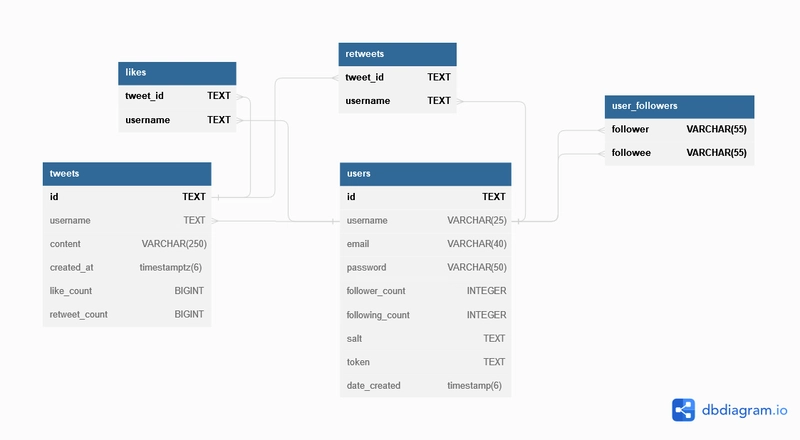
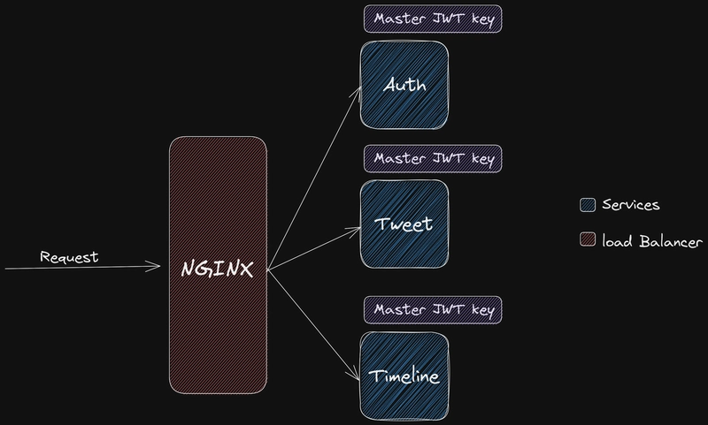
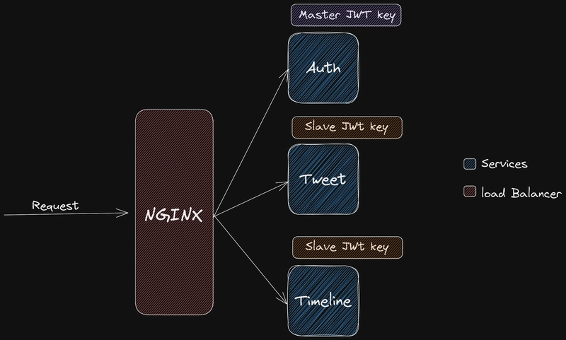
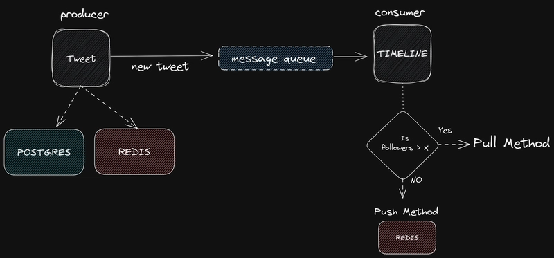
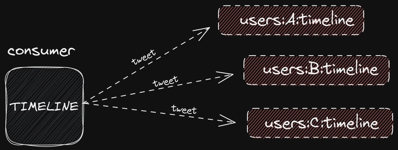
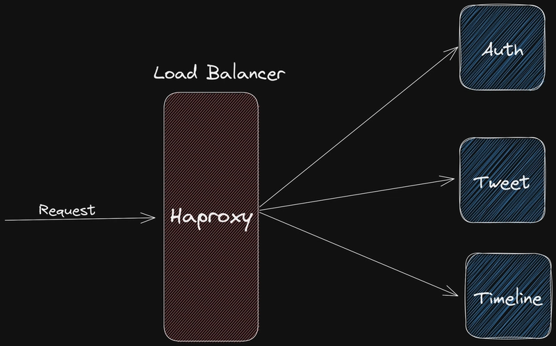

## Summary
Leo Antony presents an educational, partly implemented Twitter-like backend organized around Auth, Tweet, and Timeline services. The design combines RSA-signed JWTs, PostgreSQL, [[Redis]], RabbitMQ, [[HAProxy]], and Consul, with [[HybridTimelineFanout]] choosing between precomputed follower timelines and read-time celebrity merging.

The article is useful as a compact architecture walkthrough rather than evidence of Twitter's production system or a benchmark. Its throughput figure, scalability claims, follower threshold, and operational guarantees are asserted without measurements, and several security and reliability details remain unspecified.

## Key Claims
- A read-heavy social feed can reduce repeated database work by caching tweets and per-user sorted timelines in [[Redis]], while keeping tweet records in [[PostgreSQL]].

- Sharing one symmetric JWT secret with every service expands signing authority and blast radius; the proposed alternative keeps the RSA private signing key in Auth and distributes only the public verification key.

- The Tweet service stores a new tweet in PostgreSQL and Redis, then publishes it through RabbitMQ for asynchronous Timeline processing; this introduces a bounded visibility delay that the design accepts but does not quantify.
- [[HybridTimelineFanout]] pushes ordinary authors' posts into follower timelines but switches high-follower authors to read-time pulling and merging so inactive followers do not all receive precomputed copies.

- [[HAProxy]] routes incoming requests to the three services, while Consul registration and ten-second endpoint probes provide a basic service-discovery and failure-detection loop.

- Docker packages the example stack for repeatable local startup, but packaging alone does not establish production readiness.

## Key Quotes
> “When the number of followers exceeds x, the Pull method is more efficient” — the design's threshold rule for switching celebrity posts from write-time fan-out to read-time merging.

> “When a tweet is tweeted it is send to queue so it might take a bit to show up on user's Home Page” — an explicit acknowledgement of eventual visibility.

## Connections
- [[HybridTimelineFanout]] - central strategy balancing write amplification against read-time merging.
- [[AuthenticationInfrastructure]] - asymmetric signatures separate token issuance from distributed verification.
- [[HAProxy]] - directs external requests to Auth, Tweet, and Timeline services.
- [[Redis]] - stores cached tweets, interaction data, author tweet sets, and precomputed home timelines.
- [[PostgreSQL]] - durable relational store for users, tweets, likes, retweets, and follows.
- [[Twitter]] - inspiration for the educational clone, not verified documentation of Twitter's production architecture.
- [[TaskQueueDesign]] - RabbitMQ decouples tweet creation from downstream timeline processing.

## Contradictions
- The article describes asymmetric JWTs as encrypting and decrypting with different keys, but its code actually signs with an RSA private key and verifies the signature with the public key; JWT confidentiality would require a separate encryption design.
- The diagrams label private and public material as “master” and “slave” JWT keys. The security boundary is more precisely signing authority versus verification-only public material.
- The cited 5,800 tweets per second, claim that the design follows Twitter engineers' implementation, follower cutoff `x`, and “real-time” processing are not sourced or measured in the article.
- Push/pull selection by follower count alone omits active-follower rate, posting rate, read frequency, celebrity-list maintenance, merge cost, ordering, deduplication, delivery retries, idempotency, queue backpressure, cache loss, and reconciliation with PostgreSQL.
- Ten-second endpoint polling detects some failures but does not prove that a service can complete representative work, and Dockerization does not supply deployment, secret rotation, observability, backup, or recovery controls.
