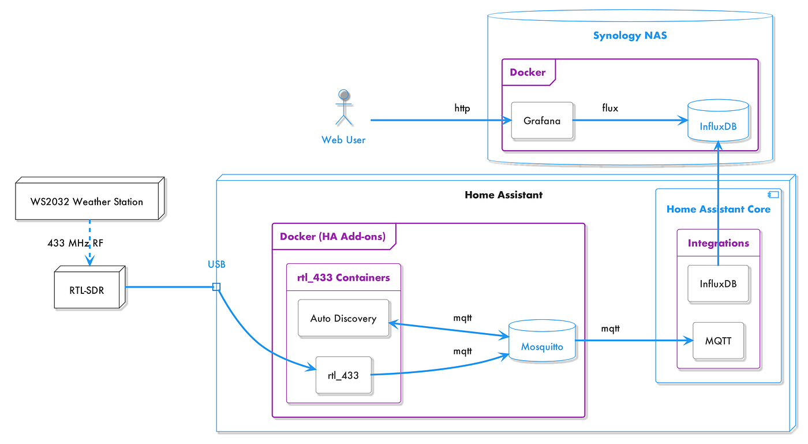
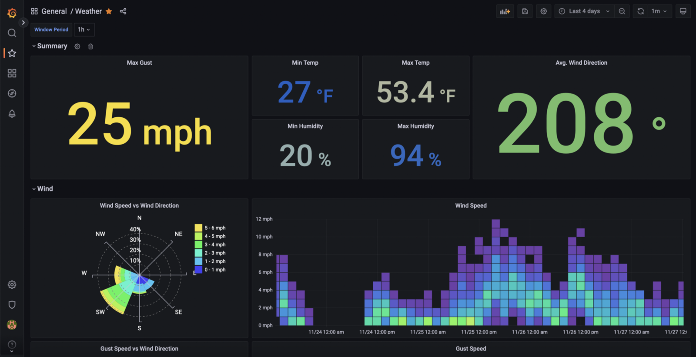
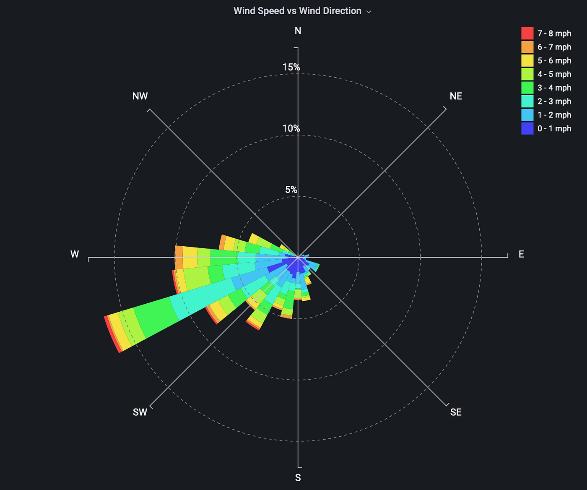
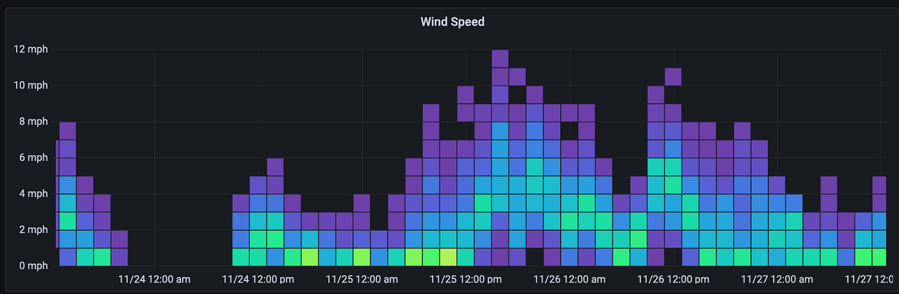
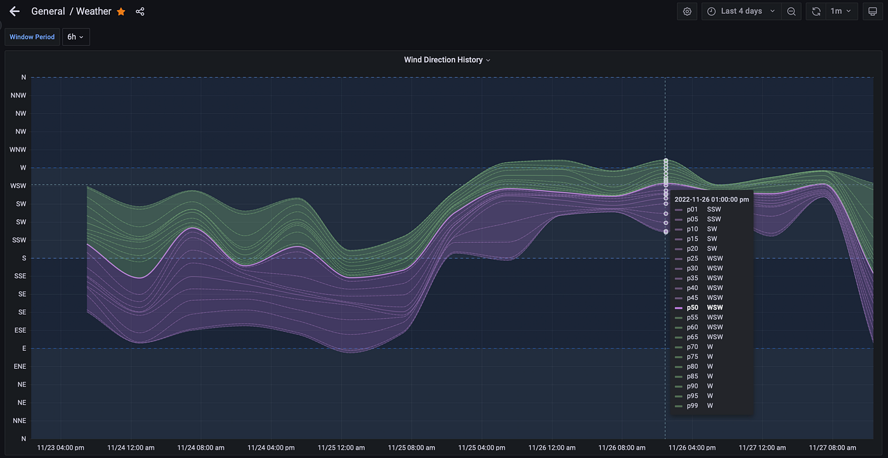

## Summary
[[BrianRJackson]] describes a personal telemetry pipeline that receives a WS2032 weather station's 433 MHz broadcasts through an RTL-SDR receiver and [[Rtl433]], publishes decoded readings over MQTT, and auto-discovers them in [[HomeAssistant]]. Home Assistant forwards its events to [[InfluxDB]], while [[Grafana]] uses Flux queries, window controls, a wind-rose plugin, heatmaps, and percentile bands to explore long-lived weather history. The project is a practical learning system rather than a reliability, security, or comparative product evaluation.

## Key Claims
- Cheap radio sensors that lack Wi-Fi or modern smart-home protocols can become useful data sources when a software-defined radio and a protocol decoder translate their broadcasts into MQTT messages.
- MQTT discovery separates signal decoding from device registration: `rtl_433` publishes decoded observations, an auto-discovery add-on publishes Home Assistant discovery messages, and Home Assistant creates entities from the broker traffic.
- A durable personal telemetry path can split responsibilities across acquisition, normalization, storage, query, and presentation instead of expecting one home-automation interface to do every job.

- [[InfluxDB]] provides historical storage beyond Home Assistant's dashboarding needs, while [[Grafana]] exposes the source database's Flux language rather than hiding it behind one generic query abstraction.
- Time-window aggregation, exact timestamp alignment, unit conversion, and field reshaping are part of visualization design, not merely backend preparation.
- Different views answer different questions: a wind rose groups speed by direction, a heatmap makes the distribution of noisy speeds visible, and percentile bands show spread around a median direction.

## Key Quotes
> “Keep the data forever for analyzing some long-term trends.” — motivation for adding a dedicated time-series store.

> “I use a lot of these home automation projects as a testbed for learning something new for my day job.” — the project's learning purpose.

## Connections
- [[BrianRJackson]] — author and builder of the weather telemetry stack.
- [[Rtl433]] — decodes the WS2032's 433 MHz radio messages and publishes observations to MQTT.
- [[HomeAssistant]] — discovers, names, converts, displays, and forwards the weather entities.
- [[InfluxDB]] — stores the Home Assistant event history and serves Flux queries.
- [[Grafana]] — presents current values, distributions, aggregates, wind roses, and percentile views.
- [[PersonalTelemetryPipeline]] — the end-to-end acquisition, normalization, retention, analysis, and visualization pattern demonstrated by the project.
- [[TimeSeriesDatabase]] — supplies windowing, alignment, and historical analysis over sensor observations.

## Contradictions
- The architecture and screenshots demonstrate a working personal setup, not measured reliability, completeness, radio range, security, recovery, query cost, or long-term retention under failure.
- The wind-rose query keeps only direction and speed records that align after windowing; unmatched observations can be discarded, so the result depends on sampling and aggregation choices.
- Linear percentiles over direction angles can mislead when observations cross the north boundary at 0/360 degrees because direction is circular rather than ordinal on a straight axis.
- One Flux comment reverses the unit-conversion description: multiplying km/h by about 0.621371 converts to mph, not “km/s from mph”; a later heatmap uses the rougher factor 0.618.
- Product versions, add-on behavior, plugin compatibility, configuration fields, and installation paths are historical to the author's 2022–2023 environment.
