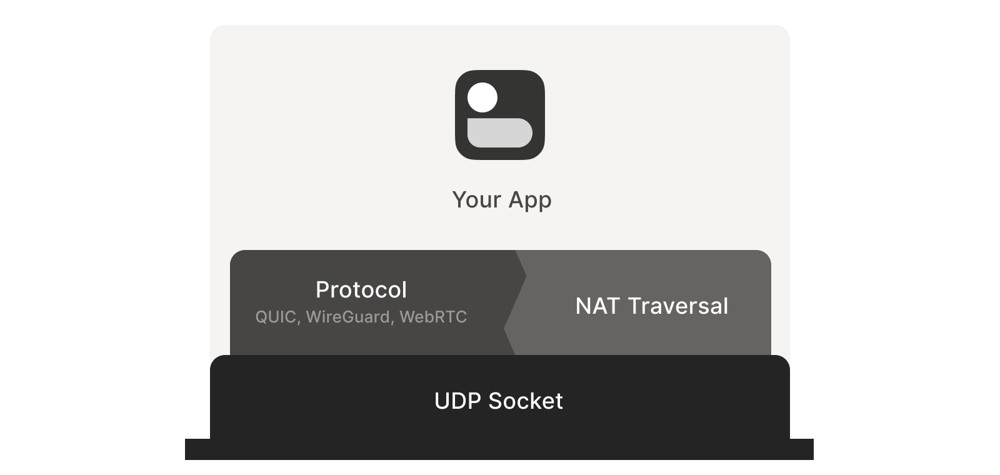
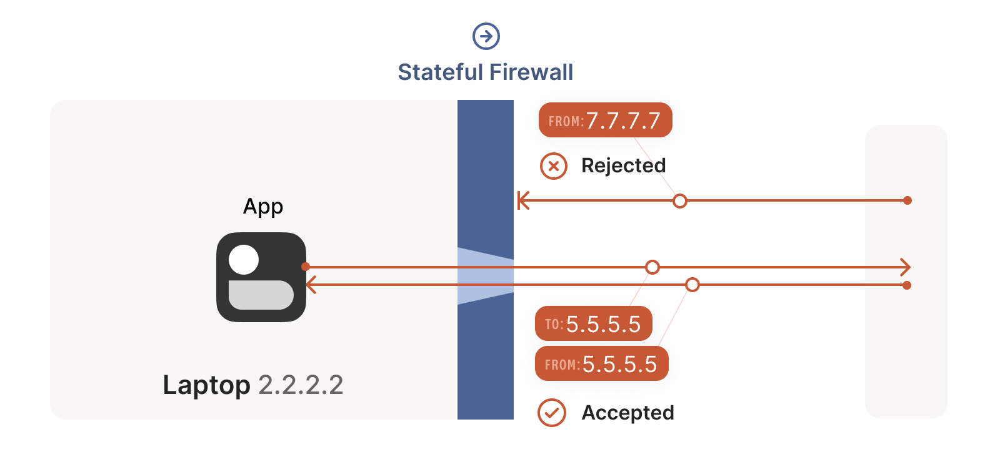
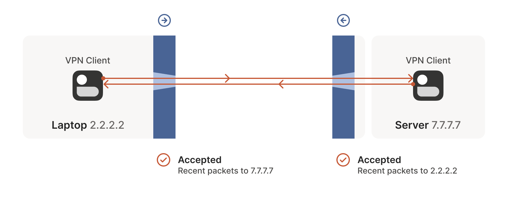
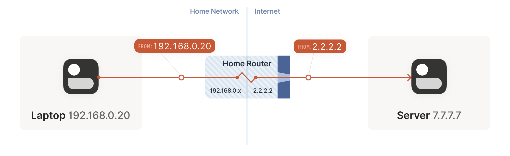
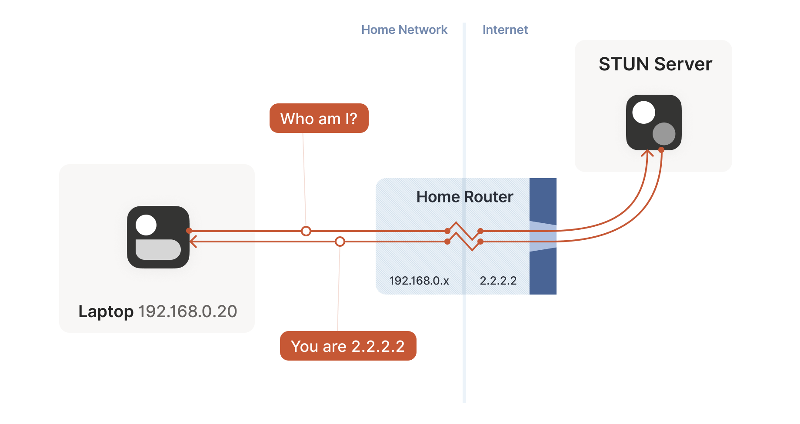
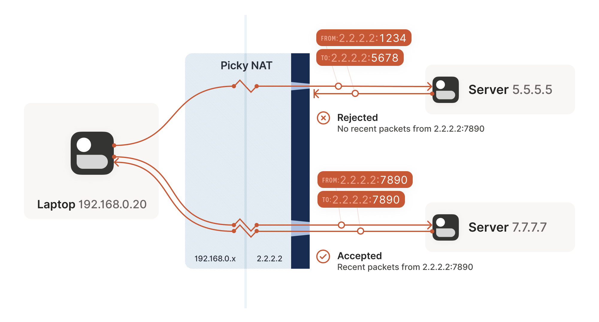
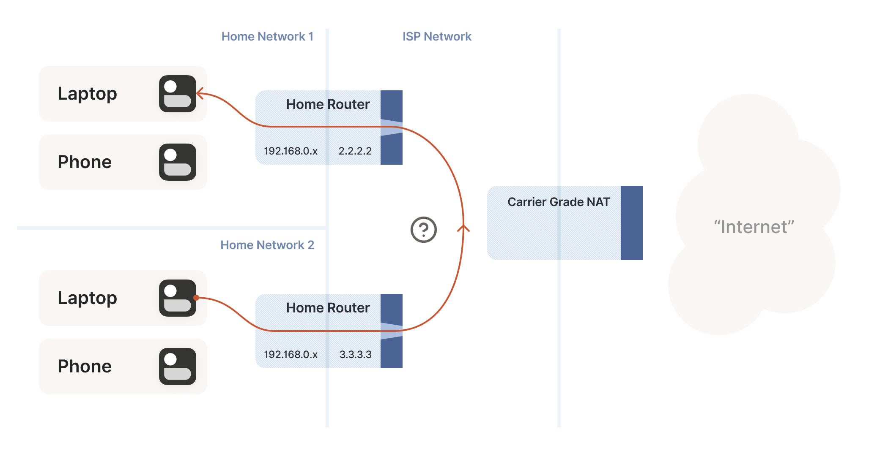
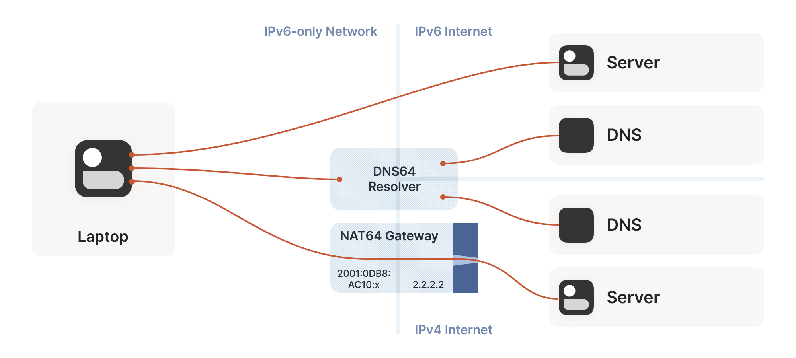

## Summary
This Tailscale technical article builds [[NATTraversal]] from first principles: UDP peers use a shared application socket, a side channel, simultaneous outbound traffic, endpoint discovery, port mapping, and candidate probing to establish a direct path through stateful firewalls and address translators. It then covers the limits imposed by endpoint-dependent NAT, blocked UDP, double NAT, CGNAT hairpinning, and NAT64, arguing that robust systems should start through an encrypted relay, race all plausible paths in an ICE-like process, upgrade when a better direct route appears, and fall back again when it fails. [[Tailscale]] is the running implementation example, with DERP serving both as coordination path and encrypted relay.

## Key Claims
- UDP is the practical substrate for NAT traversal, and the traversal logic must share the exact socket used by the application protocol because NAT mappings are socket-specific; stream semantics can be supplied above UDP by [[QUIC]].
- Stateful firewalls commonly admit return UDP only after seeing a matching outbound packet, so peers can traverse opposing firewalls by coordinating and sending toward each other at roughly the same time.

- Source NAT creates a public `ip:port` mapping for a private socket and rewrites packets in both directions; STUN reveals the public endpoint observed by an internet server.

- Endpoint-independent mappings are comparatively easy to reuse, while endpoint-dependent mappings allocate different public ports for different destinations and can invalidate the endpoint learned from STUN.

- Relays are a required reliability layer when direct traversal fails or outbound UDP is blocked; Tailscale's DERP uses HTTP reachability and relays already encrypted payloads, while TURN fills a similar role in standardized stacks.
- UPnP IGD, NAT-PMP, and PCP can request friendly public mappings, but availability and policy vary; double NAT makes them act on the nearest translator rather than necessarily the internet-facing one.
- CGNAT behaves like another NAT layer, but peers behind the same carrier translator may require hairpin support; without hairpinning or a usable mapped port, relaying is the dependable route.

- IPv6 removes address translation but not stateful-firewall coordination, while NAT64/DNS64 and systems without CLAT reintroduce explicit translation and endpoint-discovery work.

- ICE's durable strategy is to gather LAN, IPv6, STUN-derived, mapped, and operator-provided candidates, probe them in parallel, select the best working path, keep fallbacks available, and authenticate traffic end to end rather than trust changing IP paths.

## Key Quotes
> "packets must flow out before packets can flow back in." - the stateful-firewall rule that enables simultaneous UDP traversal.

> "try everything at once, and pick the best thing that works." - the article's reduction of the ICE connectivity algorithm.

> "Make sure everything is encrypted and authenticated end-to-end." - the security requirement once paths can change dynamically.

## Connections
- [[NATTraversal]] - the article provides a layered direct-connect, relay, discovery, recovery, and security model beyond simple port forwarding.
- [[Tailscale]] - running implementation example using coordination, DERP fallback, WireGuard tunnels, and dynamic path upgrades.
- [[QUIC]] - recommended when an application needs reliable streams while retaining UDP's traversal properties.
- [[RemoteAdministrationExposure]] - contrasts authenticated overlay connectivity with directly exposing private service ports.
- [[SystemReliability]] - relay-first startup, continuous probing, path upgrade, and fallback treat connectivity as a recoverable service state.

## Contradictions
- No direct contradiction was found. The source broadens the existing FRP-based [[NATTraversal]] page: a server-initiated tunnel remains a valid relay pattern, while direct peer connectivity requires endpoint discovery, coordinated probing, and fallback.
- The article is a first-party 2020 Tailscale explanation, not a representative interoperability study. Its stated direct-connect estimate above 90%, IPv6 adoption snapshot, device behavior, and implementation preferences are historical and source-scoped.
- Birthday-paradox port probing improves the one-hard-NAT case probabilistically but can resemble scanning and can overload session tables; two hard NATs make the search operationally impractical.
- All 21 local diagrams were opened. Eight evidence-bearing diagrams were retained at their semantic positions; sequential firewall frames and repeated easy/hard/double-NAT topologies were omitted as redundant with the retained diagrams and prose.
