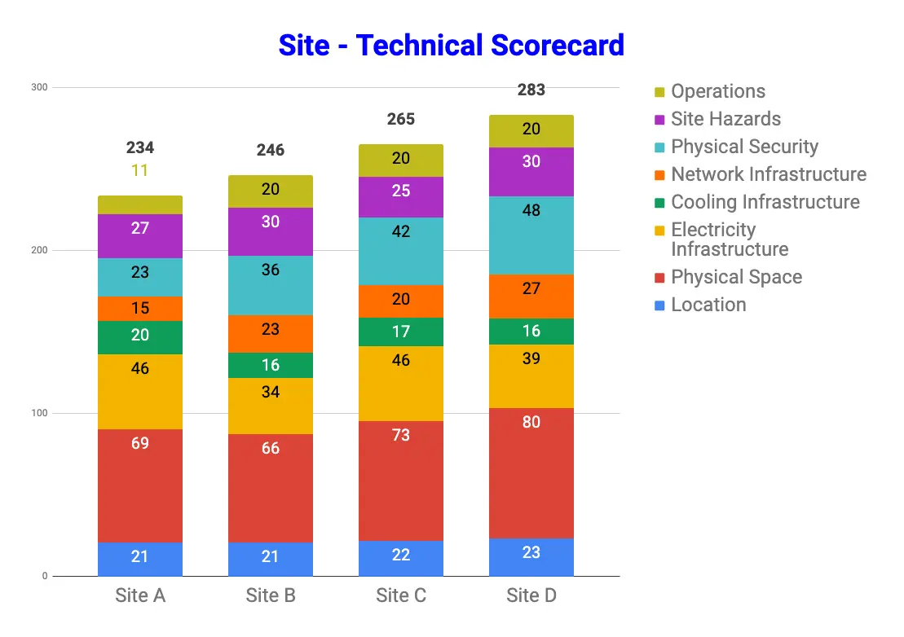

## Summary
This first-party account describes how [[Dropbox]] turns forecast capacity into a competitive [[DataCenterSiteSelection]] process spanning market screening, a facility RFP, technical questionnaires, site walks, weighted scoring, fiber-route review, counterproposals, and lease negotiation. The process treats power, space, and delivery time as entry constraints, then compares physical design, redundancy, monitoring, environmental risk, security, logistics, network-path independence, efficiency, and commercial terms. Its strongest general lesson is that provider claims and nominal redundancy require documentary and physical verification, while its “best in class” cost and reliability outcome remains self-reported and unquantified.

## Key Claims
- Capacity engineering should quantify required services and cabinet counts before data-center engineering translates them into power, space, and online-date constraints used to screen markets and providers.
- A full RFP should expose facility-level requirements and deviations, including Tier III-oriented cooling, power, maintenance, and fault-tolerance design; floor loading; network ingress, egress, carriers, and redundancy; and early commercial terms.
- Power usage effectiveness (PUE) joins cost and environmental governance: a lower multiplier indicates less facility overhead beyond IT load, but contractual targets depend on facility design and tenant practices such as airflow containment and consumption thresholds.
- Bid leveling and a detailed questionnaire should test power, cooling, network, historical operations, environmental risk, security, staffing, and monitoring rather than compare headline rent alone.
- Site walks are a distinct verification control because questionnaires can miss construction delays, delivery constraints, exposed fiber, poor building conditions, or a mismatch between promised and installed equipment.
- Weighted scoring should reflect nonnegotiable requirements across location, space, electricity, cooling, networking, security, hazards, operations, and logistics rather than treat every attribute as equally substitutable.

- Carrier diversity is not path diversity: two nominally separate circuits may share a route or converge at one point, so proposed and delivered fiber paths must be reviewed for shared fate and single points of failure.
- Lease negotiation can combine rental and utility rates, annual escalation, capacity ramp-up or ramp-down, PUE, abatement, improvement allowances, and support space to align contracted cost with expected production use.

## Key Quotes
> "Identify what you need early." - the first step in Dropbox's five-part recap.

> "Physically verify each proposal." - the source's distinction between documentary diligence and site-level validation.

## Connections
- [[Dropbox]] - company describing the in-house process used for its exabyte-scale, multi-metro hybrid infrastructure.
- [[DataCenterSiteSelection]] - integrated capacity, technical diligence, physical verification, scoring, path-risk, and commercial decision framework.
- [[SystemReliability]] - redundancy, fault tolerance, monitoring, alerting, staffing, and site hazards are evaluated before capacity is committed.
- [[ReliabilityInvestment]] - the process prices resilience and efficiency alongside rent rather than treating reliability as a post-lease operating concern.
- [[FailureInformedVendorSelection]] - questionnaires and site walks search for failure modes hidden by a nominally compliant proposal.
- [[PrivateCloudStrategy]] - provides an operating example of the owned or leased physical capability whose strategic justification that concept asks organizations to test.

## Contradictions
- No direct contradiction was found. The source adds a facility-acquisition layer beneath the wiki's broader infrastructure, reliability, and private-cloud strategy material.
- This is a Dropbox-authored 2023 process description, not a comparative study or independent audit. It does not identify candidate markets or providers, disclose weights or formulas, quantify the claimed “best in class” rates and reliability, or report rejected and later-performing sites.
- Tier III alignment, questionnaire answers, numerical scoring, and contractual PUE do not by themselves prove delivered uptime, route independence, environmental benefit, or total lifecycle cost; construction, operations, tenant behavior, energy mix, water use, and later changes still matter.
- The retained scorecard is an example summary rather than a decision record: Site D has the highest displayed total at 283, followed by C at 265, B at 246, and A at 234, but the chart does not disclose score definitions, weights, thresholds, uncertainty, or the selected site.
- Both effective local image references were inspected. The technical scorecard was retained at its semantic position; the tiny “New” SVG attached to a Dropbox Dash promotion was omitted as decorative.
