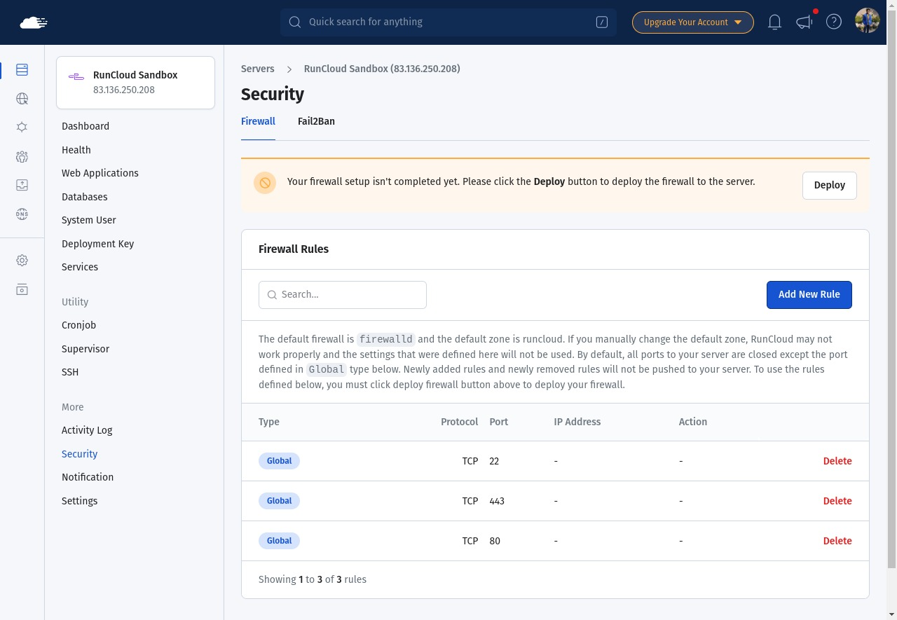
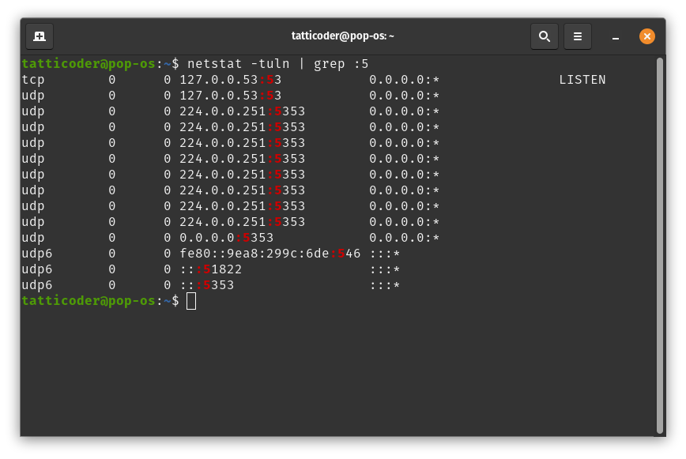
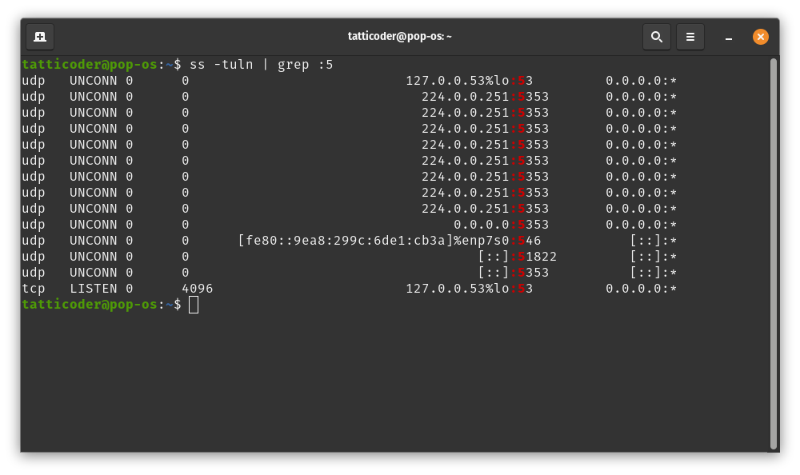
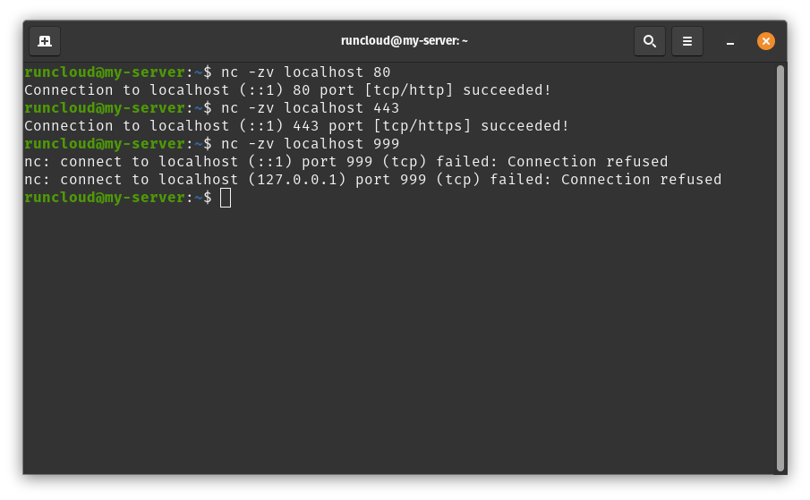
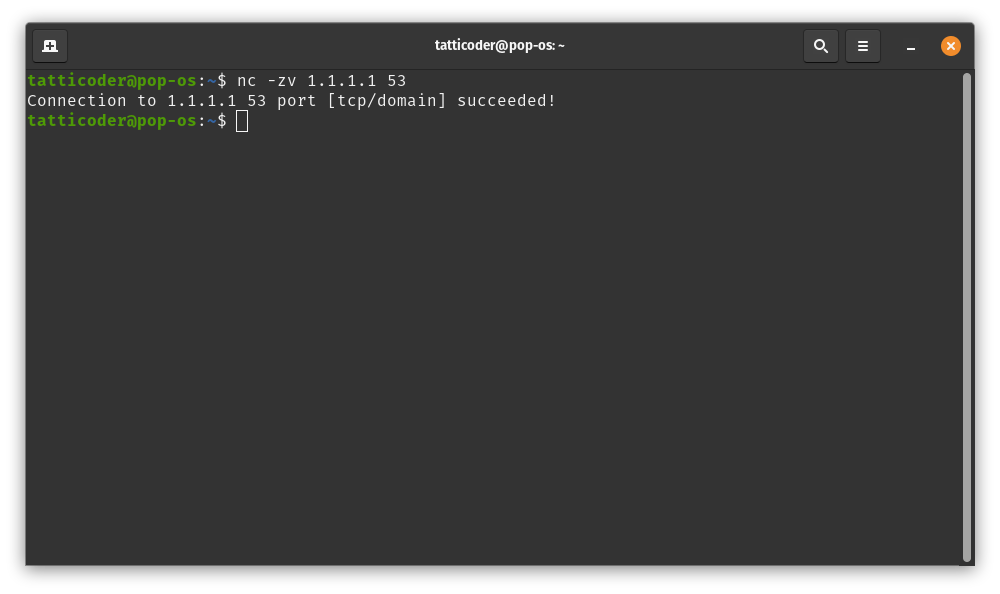
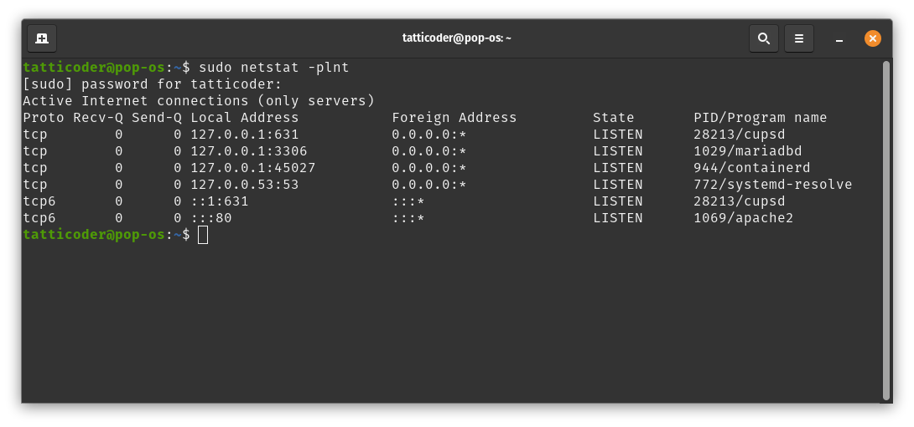

## Summary
RunCloud's practical Linux networking guide distinguishes port numbers from host addresses, contrasts TCP with UDP, and demonstrates three layers of port inspection: local socket inventory with `ss` or `netstat`, active connection attempts with `nc`, and firewall-rule management. Its strongest operational contribution to [[DefensivePortTriage]] is the combination of listener state, process ownership, and endpoint testing; its simplified language about a port being "open," "closed," or "in use" needs qualification because local binding, firewall policy, network reachability, protocol, and address family are separate facts.

## Key Claims
- A port is a numbered transport endpoint associated with a service on a host; the guide highlights 21/FTP, 22/SSH and SFTP, 80/HTTP, 443/HTTPS, and 3306/MySQL as conventional examples.
- `ss -tuln` and the older `netstat -tuln` inventory listening TCP and UDP sockets, while `sudo netstat -plnt` adds PID/program information for listening TCP sockets.
- `nc -zv HOST PORT` makes an active TCP connection attempt and can distinguish a successful connection from an explicit refusal at that endpoint.
- Local listener state is not the same as remote reachability: interface binding, IPv4 versus IPv6, intervening network policy, and firewall deployment can change what another machine observes.
- The source recommends minimizing unnecessary exposure, while [[RunCloud]] presents a dashboard for defining and deploying firewall rules.

The firewall screenshot adds a deployment-state distinction that the prose only partly emphasizes: rules can exist in the dashboard without having been pushed to the server.

The paired terminal captures show broadly comparable `netstat` and `ss` results, including TCP `LISTEN` and UDP `UNCONN` states. They also reveal that `grep :5` is only a textual prefix match and returns ports such as 53, 5353, 546, and 51822 rather than one exact port.

The `nc` captures demonstrate endpoint-specific observations: localhost accepts TCP connections on 80 and 443 but refuses 999, while the shown remote address accepts TCP on 53 at the time of the capture.

The process-aware listing connects sockets to `cupsd`, `mariadbd`, `containerd`, `systemd-resolve`, and `apache2`, and shows why bind address matters: loopback-only listeners differ from an IPv6 wildcard listener such as `:::80`.

## Key Quotes
> "the IP address is used to identify the host in a network, the port number identifies a specific process or service"

> "only one program can listen on a port at one time"

> "close unnecessary ports and only keep those open that are required by your applications"

## Connections
- [[RunCloud]] - Publisher and server-management product whose firewall UI is used as the article's configuration example.
- [[DefensivePortTriage]] - Listener inventory and connection tests provide the observation layer before service risk is assessed.
- [[RemoteAdministrationExposure]] - SSH on port 22 is presented as a conventional remote-administration service that should be deliberately exposed.
- [[CleartextProtocolExposure]] - The guide contrasts HTTP on port 80 with TLS-protected HTTPS on port 443 and mentions FTP on port 21.
- [[DatabaseServiceExposure]] - MySQL on port 3306 illustrates a database listener whose necessity and exposure should be checked.
- [[NATTraversal]] - Remote test results depend on the network path and cannot be inferred from local listener state alone.

## Contradictions
- The article sometimes collapses "not in use," "not open," and "closed," but those are not equivalent observations: a service may listen locally while a firewall drops remote traffic, or a remote failure may reflect routing, filtering, address-family choice, or timeout rather than an unused local port.
- Its statement that only one program can listen on a port omits binding scope and socket options: separate processes can sometimes use the same numeric port on different local addresses, protocols, or address families, and controlled reuse mechanisms also exist.
- The shown `grep :PORT` pattern is not an exact port filter; the screenshots themselves demonstrate prefix matches across several different port numbers.
