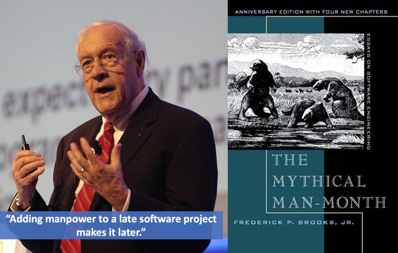
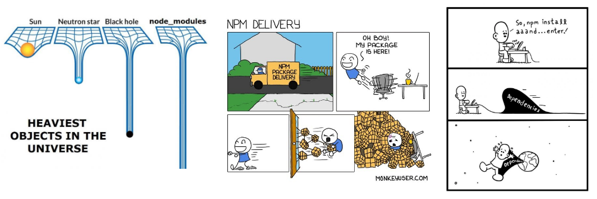

## Summary
[[Hutusi]] surveys the history of [[SoftwareEngineering]] from early programmable-machine ideas through structured programming, open source, agile development, cloud computing, and DevOps, using Fred Brooks's distinction between essential and accidental work as the organizing problem. A small [[ChatGPT]] and Next.js exercise then supports a deliberately strong forecast: large language models may become a software-development "silver bullet" by translating requirements more directly into runnable code. The article's own iterative debugging record also supplies the main qualification, because successful delivery still required requirement refinement, local context, copied-code correction, and human verification.

## Key Claims
- [[SoftwareEngineering]] exists to deliver working software with higher quality, shorter lead time, and lower cost, while controlling complexity, change, and coordination.
- Brooks's [[EssentialAndAccidentalComplexity]] distinction explains why languages, build systems, CI/CD, containers, and cloud platforms can reduce implementation friction without automatically solving requirement and domain reasoning.
- Programming paradigms, reusable components, open-source collaboration, agile development, and DevOps progressively improved abstraction, feedback, and delivery, but also created new dependency and coordination costs.
- Software-development methods should be reconsidered from first principles in the LLM era rather than treating AI only as another efficiency layer over inherited workflows.
- In the author's practical example, [[ChatGPT]] generated and explained a Next.js interaction, translated it to TypeScript, and helped diagnose two type errors until the feature ran.
- The author calls the post-LLM mode "intelligent software engineering" and predicts that models can compress or reorganize analysis, design, coding, and debugging around direct task-to-code delivery.
- Human creative direction remains necessary: the source closes with the pilot/copilot distinction, where people still decide what should be built.

## Key Quotes
> "软件工程就是为了更高质量、更快效率、更低成本的构建‘可以运行的软件’。" - the author's working definition.

> "我大胆预测大模型是软件开发的银弹。" - the article's deliberately strong forecast.

> "我们需要有创造力的Pilot决定做什么。" - the retained human role in AI-assisted development.

## Connections
- [[Hutusi]] - author of the historical survey and the ChatGPT coding exercise.
- [[SoftwareEngineering]] - the article's historical and analytical subject.
- [[EssentialAndAccidentalComplexity]] - Brooks's distinction structures the argument about where productivity gains do and do not occur.
- [[AICodingPractice]] - the practical example and silver-bullet forecast add an early task-to-code case plus a strong claim requiring later qualification.
- [[ChatGPT]] - generated, explained, translated, and debugged the example frontend code through dialogue.
- [[AgileSoftwareDevelopment]] - presented as an adaptive response to web-era demand change and rapid iteration.
- [[OpenSourceProjectMaintenance]] - the free-software and bazaar-development history frames distributed collaboration and reuse.

## Contradictions
- The silver-bullet prediction tensions the wiki's later [[AICodingPractice]] evidence: faster generation can move bottlenecks into requirements, context, review, verification, maintainability, and ownership rather than remove them.
- The claim that models can bypass analysis, design, coding, and debugging is qualified by the source's own example, which needed progressively refined requirements, two debugging exchanges, corrected local omissions, and a human decision that the result worked.
- The historical account is a broad practitioner synthesis rather than primary historiography; precise attribution claims and institutional details should be independently checked before being treated as settled history.
