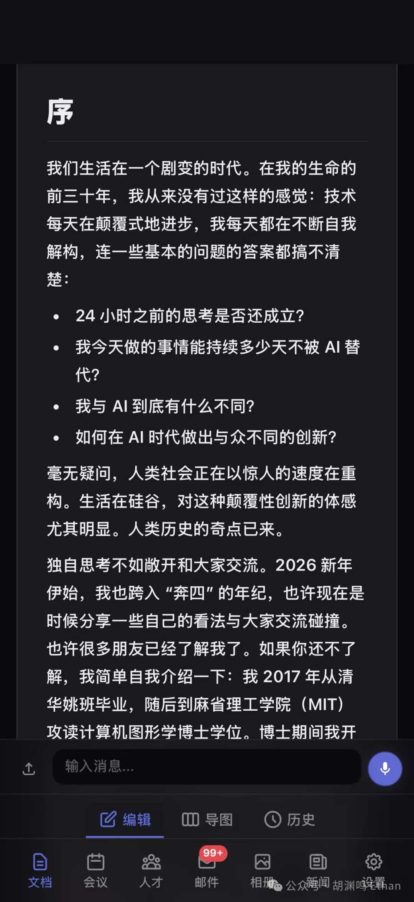
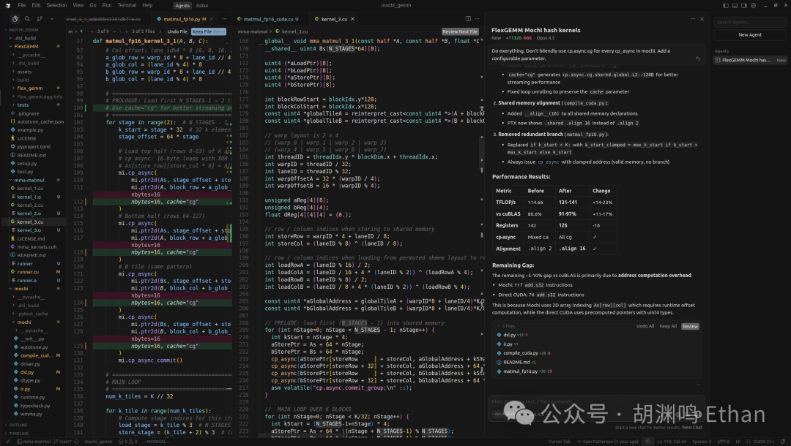
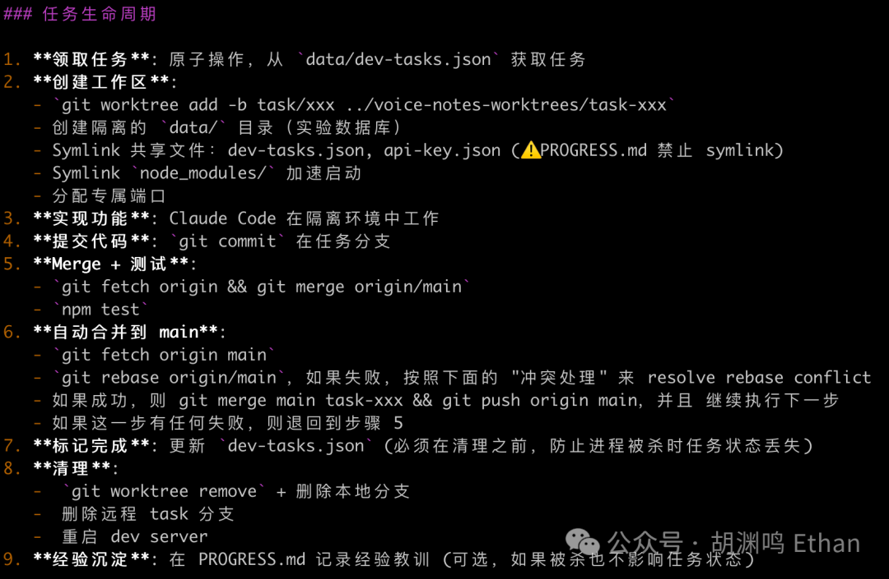
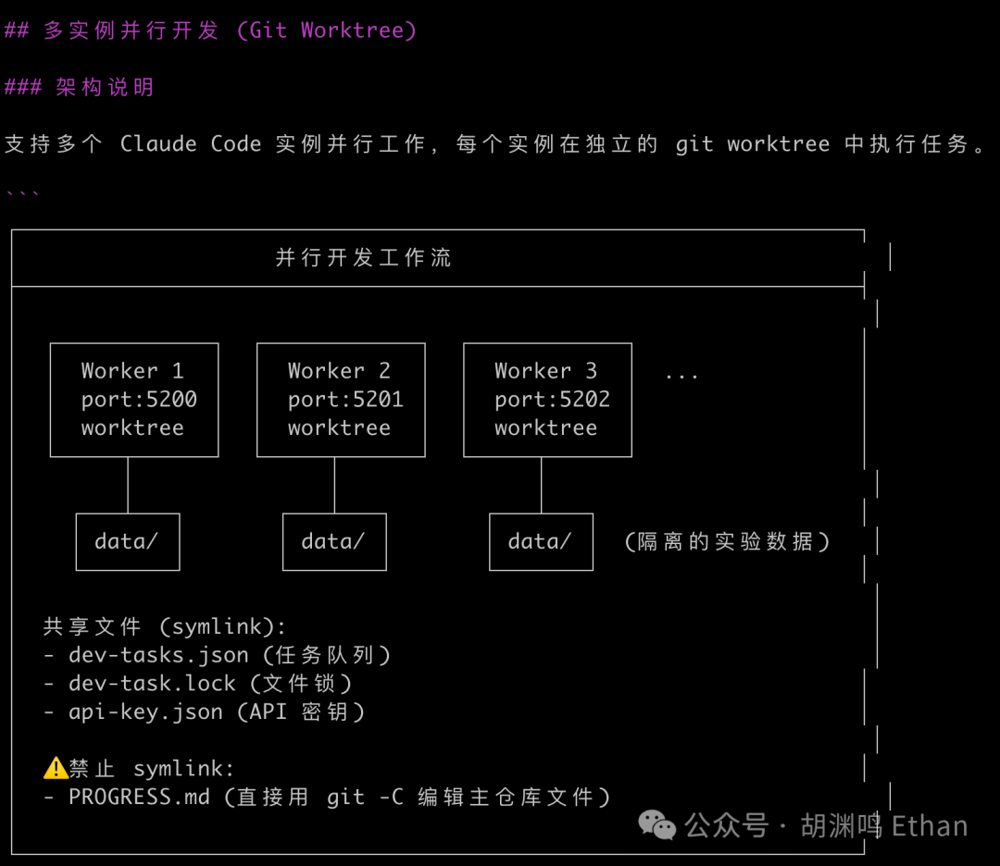
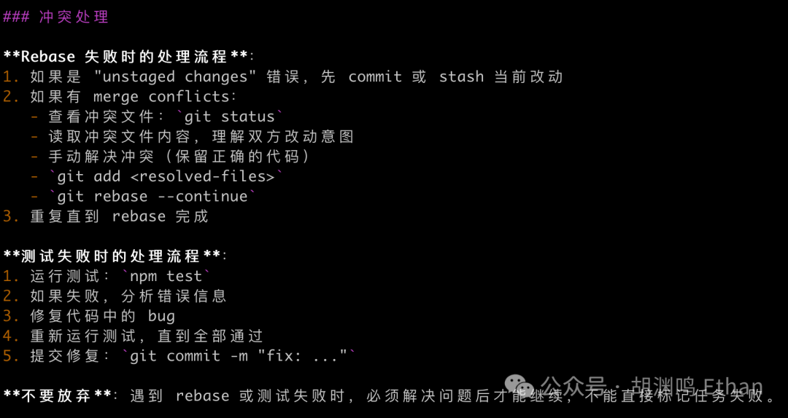
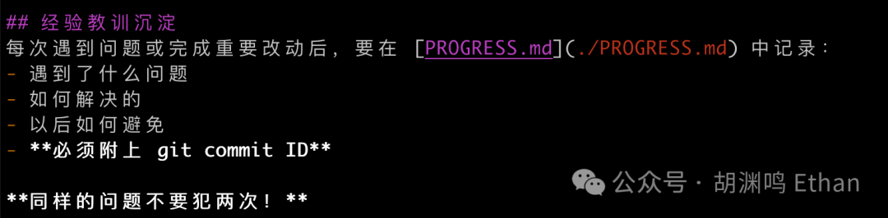
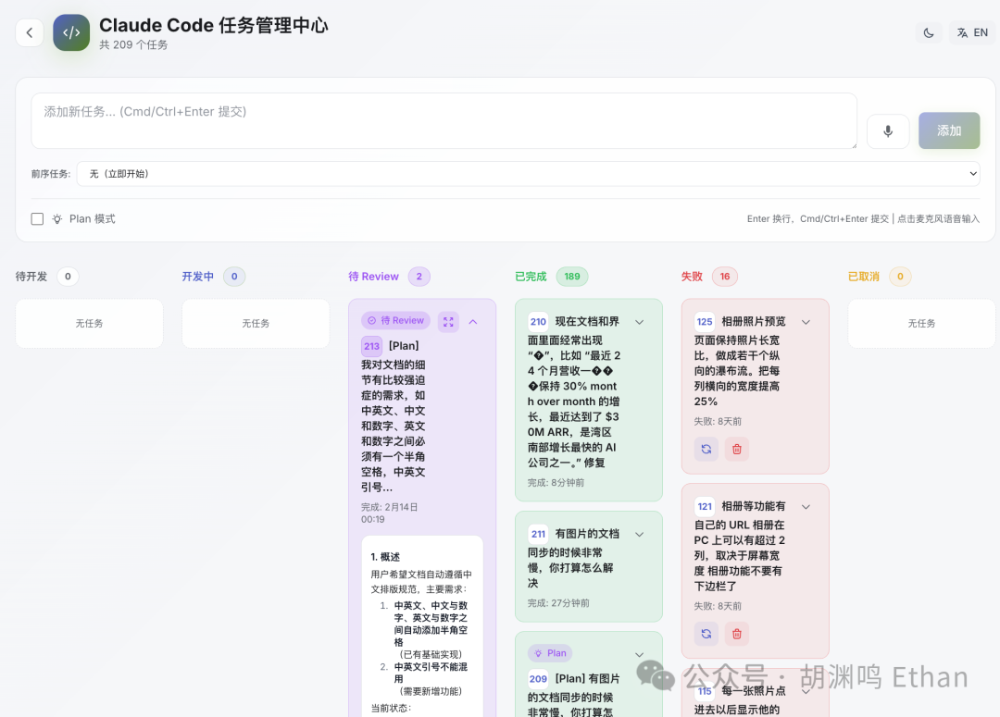
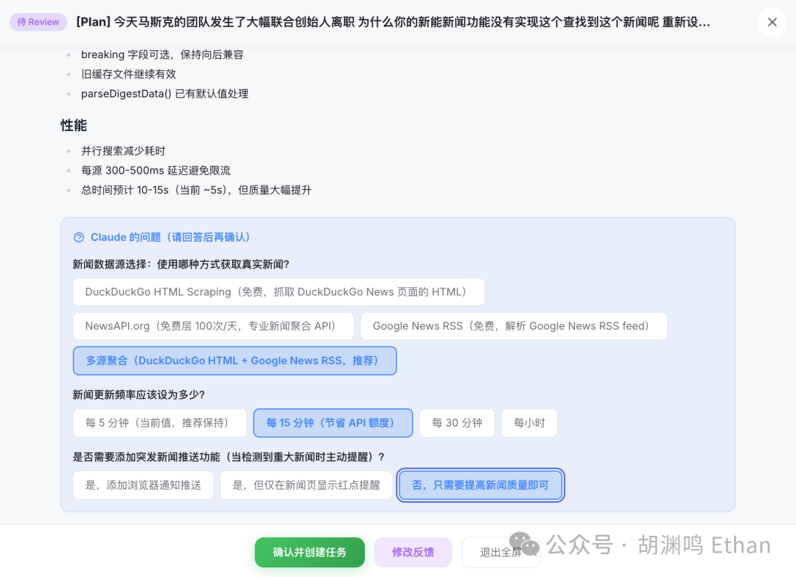
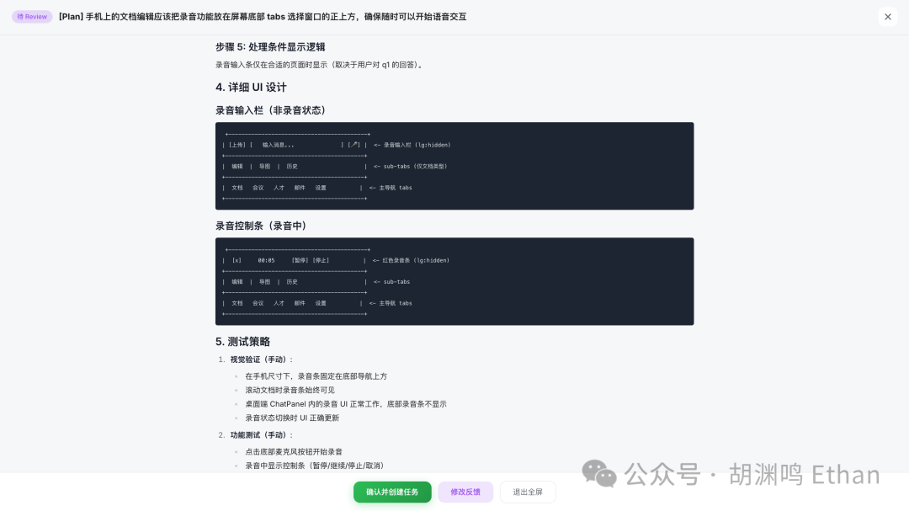

## Summary
[[HuYuanming]] describes building a private mobile-first CEO support system by turning [[ClaudeCode]] from an interactive terminal tool into a queue-driven, web-managed pool of parallel coding workers. The workflow combines an isolated EC2 environment, permissive execution, task queues, git worktrees, `CLAUDE.md`, `PROGRESS.md`, streamed logs, voice input, and batched Plan Mode review; the author reports that this made his own ideas and Claude subscription credits the limiting resources. The essay extends that experience into a speculative argument for [[PersonalSoftware]] and a redefinition of engineering and management, while its no-code-review stance and self-reported throughput leave important safety, quality, and generalizability questions open.

## Key Claims
- A command-line agent reachable from an iPhone can expand coding-agent availability beyond desk hours, and a purpose-built web manager can make task submission and review easier than SSH or tmux on a small screen.
- The author reports that [[Cursor]] redesigned a GPU DSL and produced a BF16 GEMM reaching roughly 80-90% of cuBLAS performance in about three hours, using this as an anecdotal example of expert-plus-agent leverage rather than a controlled benchmark.

- A Ralph-style task loop can repeatedly launch fresh Claude Code sessions against a shared queue, while `claude -p`, streamed JSON logs, and a manager process make the workers observable and restartable.
- Parallel worktrees isolate task branches and experimental data; a documented lifecycle covers task pickup, implementation, commit, merge, testing, automatic integration, cleanup, and durable lesson capture.

- Recovery rules require resolving rebase conflicts and failed tests before continuing, while `PROGRESS.md` records the problem, cause, avoidance rule, and relevant commit so later agents can reuse operational lessons.

- The task center externalizes queue state, failures, and review, while Plan Mode batches clarification before implementation and shows concrete choices, UI sketches, and test plans for human approval.

- Voice input reduces capture friction for ideas and coding instructions, but the article itself acknowledges distraction risk when issuing commands while moving or driving.
- The essay predicts that cheap agentic development will shift engineers toward environment, framework, feedback, and verification design and may weaken standardized software economics in favor of software built for one user's exact workflow.

## Key Quotes
> “Context, not control” — on replacing line-level supervision with clearer goals and constraints.

> “我如何给 AI 打工才能让 AI 工作效率更高？” — on treating human effort as agent enablement.

> “我就想一个人用” — on avoiding multi-user requirements in personal software.

## Connections
- [[HuYuanming]] — author and practitioner describing the workflow.
- [[ClaudeCode]] — the coding agent launched, queued, observed, and parallelized.
- [[Cursor]] — earlier editor agent used for the GPU DSL experiment.
- [[VibeCoding]] — the author's broad name for agent-driven software creation without routine code reading.
- [[BottleneckAwareAICoding]] — the workflow moves the limiting factor from typing toward ideas, review, credits, integration, and verification.
- [[MobileAgentDevelopment]] — the iPhone, SSH fallback, web manager, and voice interface form the human control surface.
- [[AIVoiceInput]] — speech captures documents and development tasks when typing is inconvenient.
- [[PersonalSoftware]] — the CEO support system is intentionally optimized for one user rather than a scalable customer base.
- [[MeshyAI]] — company and product context for the author's CEO role.
- [[TaichiProgrammingLanguage]] — earlier language and compiler project cited as the author's engineering background.
- [[SoftwareVerification]] — merges and tests appear in the task lifecycle, though the article says no person routinely reviews generated code.

## Contradictions
- The workflow tensions [[HumanCodeResponsibility]] and the narrow original definition of [[VibeCoding]] by deliberately avoiding code review while still relying on automated merge and test rules; the article reports productivity and dispatch success, not long-term defect, security, or maintenance outcomes.
- The use of `--dangerously-skip-permissions` is partly bounded by EC2 isolation and backups, but the source does not describe least-privilege credentials, production separation, audit controls, or recovery results in enough detail to establish safety.
- Commit frequency and the reported rise from roughly 20% to 95% task-dispatch success are local activity measures, not evidence that ten concurrent agents improve delivered product value or total engineering throughput.
- The forecast that software development cost approaches zero and standardized software loses its purpose is speculative and omits discovery, verification, security, operations, compliance, distribution, support, and maintenance costs.
