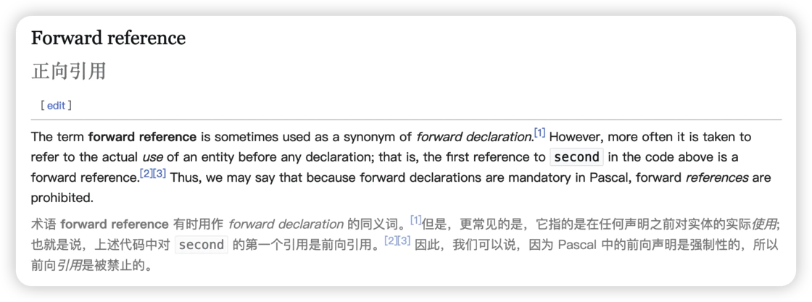

## Summary
[[HuLaTuDeHouHuaYuan|胡拉图的后花园]]把编程中的 forward reference 类比到非线性学习：学习者经常必须先使用尚未正式解释的术语、概念或方法，陌生感不一定意味着前文没学好。文章建议先完成全局接触，再通过跳读、预读注释、标记陌生项和多轮复习逐步建立理解；它为 [[ForwardReferenceLearning|前置引用式学习]] 提供了实用框架，但没有比较这些方法的学习成效。

## Key Claims
- [[ForwardReferenceLearning|前置引用式学习]]源于知识结构的非线性：为推进学习，教材有时必须先使用后面才会完整解释的概念。
- 陌生术语引发的卡顿不必然证明基础不牢或前文有遗漏；接受暂时模糊，可以避免无效地反复重学熟悉部分。
- 多轮学习应先有一次完整接触，再用跳读或略读绕过已熟悉内容，把注意力集中在仍然陌生的节点。
- 预读注释和参考资料可以提前建立术语熟悉度，降低正式阅读时的中断感。
- 暂时记住或标记尚未理解的概念，可以为后续重遇提供识别线索；文章进一步主张重复记忆可能帮助理解，但未提供比较证据。
- 入门材料往往通过减少、弱化或具体化前置引用来改善第一次阅读的连贯性，专业材料则更常要求读者容忍未闭合的概念依赖。

## Key Quotes
> “越长大，发现几乎很少有东西可以等我们准备好之后才可以开始，而是带着不确定和模糊开始，渐渐才会清晰。” — 作者对非线性学习的概括

> “不懂的地方放过它，等到后面还会看到的。” — 作者对第一轮阅读的建议

## Connections
- [[HuLaTuDeHouHuaYuan]] - 文章作者。
- [[ForwardReferenceLearning]] - 文章提出的核心学习模式与应对方法。
- [[LearningHowToLearn]] - 把陌生感诊断、学习顺序和复习策略纳入元学习能力。
- [[SystematicLearning]] - 解释系统性知识为何仍可能无法按严格先修顺序线性呈现。
- [[FocusedReading]] - 跳读、注释预读和后续重点复习都是选择性分配阅读注意力的方法。
- [[MetacognitiveFeedback]] - 标记尚未理解的概念，把卡顿转化为后续复习信号。

## Contradictions
- 文章把程序设计中“声明前使用实体”的 forward reference 扩展为学习隐喻；这是一种有解释力的类比，不是文中验证过的教育学术语或因果模型。
- “先死记下来”可能建立熟悉度和后续检索线索，但原文没有区分机械重复、检索练习、间隔学习与理解性复习，也没有证明记忆力强必然意味着理解或迁移能力强。
- 多轮阅读、预读注释和外部查阅都会增加时间与认知成本；在参考资料质量差、概念依赖过深或需要即时安全操作时，暂时跳过也可能累积误解。
