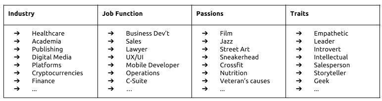
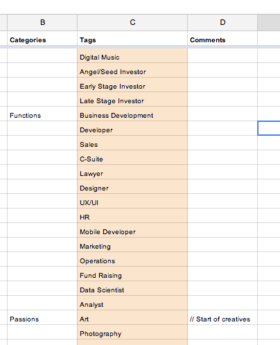
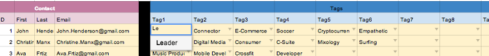
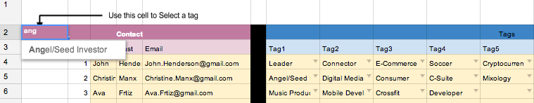
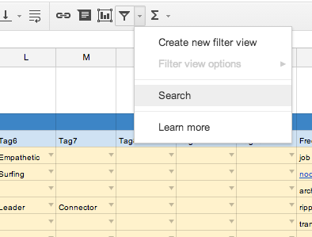
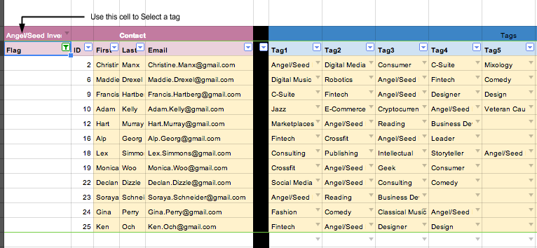

## Summary
[[KheHy]] describes a spreadsheet-based [[PersonalCRM]] built to retrieve people by expertise, interests, and personal qualities rather than to manage a sales pipeline. The Google Sheets design combines a controlled four-part tag vocabulary, typeahead-backed data validation, up to ten tags per contact, a free-form notes escape hatch, and a filter-driven search; it is a concrete [[EndUserComputing]] case in which familiar spreadsheet primitives become a small personal database.

## Key Claims
- Conventional social networks and business CRMs did not fit the author's goal of sustaining a large personal network through introductions, targeted sharing, and event invitations.
- The system describes contacts through four tag families: industry or sub-industry, job function, passions, and personal attributes.
- Hard-coded tags trade expressive freedom for consistent retrieval, avoiding synonyms and variants such as “Crossfit” and “Xfit.”
- The tag vocabulary should reflect the user's network, remain coarse outside the user's main domains, and grow only after candidate tags have spent time in a free-form notes field.
- Google Sheets supplies cloud access, customization, typeahead, validation, and filtering without requiring database expertise.
- The author reports using the sheet several times daily with about 500 contacts, but offers no comparison of recall, relationship quality, maintenance burden, or outcomes against other systems.

The taxonomy screenshot makes the retrieval model concrete: occupational descriptors such as finance and UX/UI sit alongside interests such as jazz and CrossFit and traits such as empathy, leadership, and storytelling.

The Tags tab stores the allowed values in one validation column and uses comments to clarify ambiguous or overlapping categories.

Each contact row combines identifying fields with ten dropdown-backed tag slots, making the sheet both the data store and its editing interface.

Together, the search screenshots show the operational loop: select a validated tag in cell A1, activate the named filter view, and retrieve matching contacts across any of their tag columns.

## Key Quotes
> “most of these queries revolve simple tags that span a person’s industry/job function/passions/attributes.”

> “people connect more deeply over their personal commonalities than the information on their business cards.”

## Connections
- [[KheHy]] - Author presenting the spreadsheet and his personal-network practice.
- [[PersonalCRM]] - Central relationship-retrieval system described and illustrated by the source.
- [[EndUserComputing]] - Google Sheets lets a non-specialist assemble validation, controlled vocabulary, notes, and filters into a task-specific application.
- [[DeliberateNetworkBuilding]] - The sheet operationalizes introductions, targeted sharing, and event invitations across a growing personal network.
- [[NoCodeWorkflowAutomation]] - The design uses built-in spreadsheet behavior instead of custom application code, while leaving macros and forms as future extensions.

## Contradictions
- The claim that the sheet helps the author “surpass Dunbar’s Number” is a personal interpretation, not evidence that a contact index expands the cognitive or social limits described by Dunbar's hypothesis.
- Hard-coded tags improve consistency but do not make categories mutually exclusive, neutral, complete, or current; the author explicitly acknowledges overlap among traits and retains free-form notes as an escape hatch.
- The article reports approximately 500 contacts and frequent use but does not measure search accuracy, relationship depth, missed updates, privacy or security risk, long-term maintenance, or comparison with alternative tools.
- Two duplicate remote references to the cover image returned HTTP 403 and could not be inspected. They were omitted as unverified hero imagery; no claim relies on them. A seventh local image was omitted because it is a cropped duplicate of the demonstrated tag-search state.
