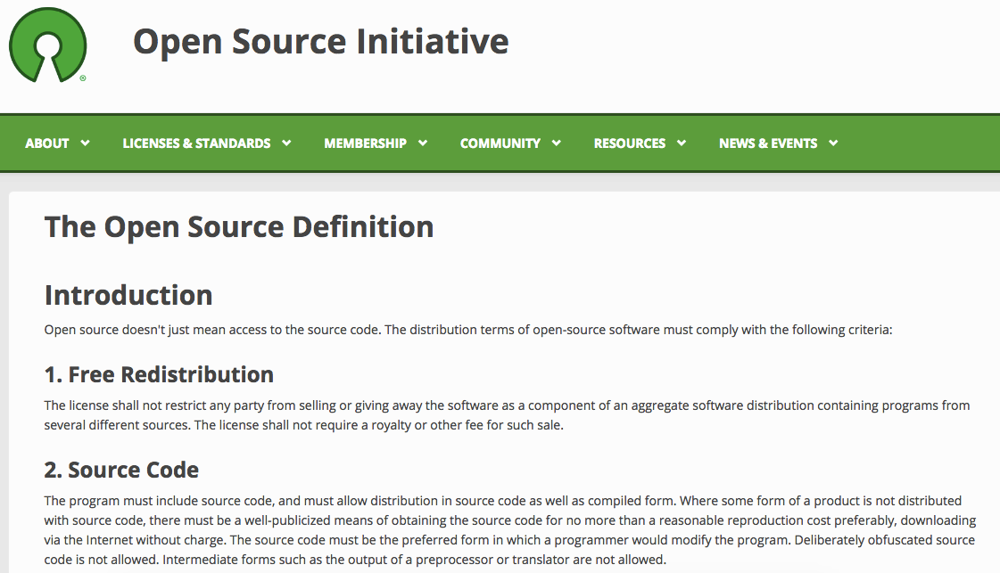

## Summary
[[NadiaEghbal]] argues that everyday use of “open source” had expanded beyond the Open Source Initiative's license-based definition to mean building and collaborating in public. She proposes [[PublicSoftware]] as a more accessible umbrella for discussing public creation, stewardship, compensation, and sustainability, while her follow-up explicitly preserves the legal definition and the user rights it protects.

## Key Claims
- The official open-source definition is a legal and distribution-rights standard, while popular usage increasingly describes public visibility, participation, and reuse.
- GitHub changed collaboration norms by making public building and forking commonplace, even though the cited 2015 GitHub analysis said more than 80% of projects on the platform lacked a license.
- Early open-source discourse emphasized users' freedom to adopt and modify ownerless code; newer tensions increasingly concern the rights, roles, ownership feelings, and compensation of authors and stewarding communities.
- “Public software” is proposed as a broader, more intuitive category that includes open-source software without redefining it and can connect software to other public-resource models.
- Public output does not imply unpaid labor: socially valuable projects still need formal roles, dedicated time, and sustainable compensation.
- The follow-up retracts the article's strongest dismissal of licensing by calling the legal definition essential and warning that restricting access or use would endanger capabilities users take for granted.
- Broader language may widen participation in discussions of sustainability and collaboration, but it cannot substitute for precise license terms when legal rights matter.

## Key Quotes
> “Modern open source is about 1) building and 2) collaborating in public.” - Eghbal's description of the cultural shift.

> “Licensing and legal side is important to preserve” - the follow-up's central qualification.

## Connections
- [[NadiaEghbal]] - author distinguishing the legal definition from contemporary public-development culture.
- [[PublicSoftware]] - proposed umbrella term for software made accessible to the public, including but not limited to legally open-source work.
- [[OpenSourceProjectMaintenance]] - author and community roles, compensation, ownership, and sustainability shape ongoing stewardship.
- [[OpenSourceCommercialization]] - sustainable paid work around public code requires business and licensing arrangements rather than an assumption of free labor.
- [[GitHub]] - platform credited with redefining public-development norms through repositories and forks.

## Contradictions
- The original essay says licenses are no longer useful for defining modern open source, but its follow-up says the legal definition is essential and must not be weakened. The reconciled position separates protected legal rights from a broader cultural vocabulary rather than replacing open source as a legal category.
