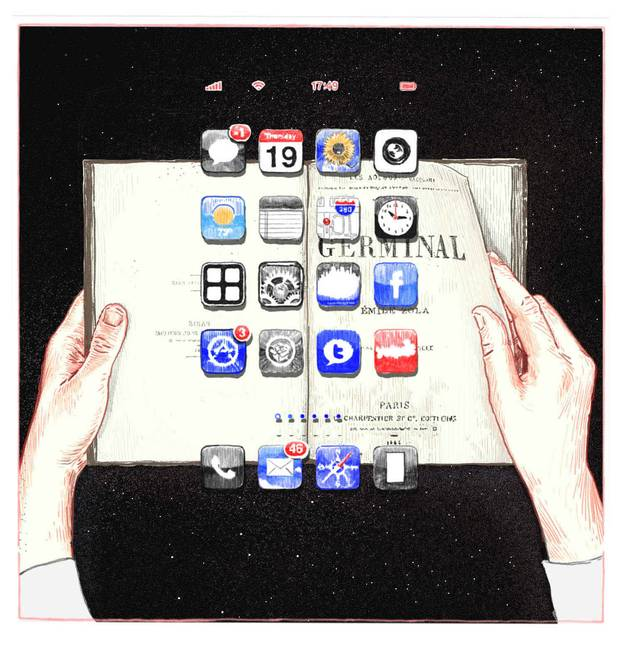

## Summary
[[MichaelHarris]] uses his own declining ability to stay with books to argue that digital media can train a fragmented, impatient, and instrumental reading style. He distinguishes reading quantity from reading quality: a text-saturated life may still weaken [[DeepReading]] when alerts, links, feeds, and rapid novelty make delay feel intolerable. His remedy is deliberately experiential rather than optimized—read books patiently, slowly, and without requiring immediate utility—while his causal claims remain a personal essay built from secondary references rather than direct empirical evidence.

## Key Claims
- Online reading often rewards fact extraction, shareable fragments, clicks, and rapid switching, which can carry an instrumental mindset into book reading.
- The central issue is not how much text people encounter but how they read: sustained attention and openness to a work's larger purpose differ from scanning for immediate use.
- Because attention and reading are learned capacities, earlier book-reading habits may not permanently insulate adults from later media environments.
- Digital interruption can reduce tolerance for delay and make readers expect or demand new stimuli rather than remain with one extended work.
- A cynical reading style can shape writing toward short, provocative, easily consumed, and explicitly useful material.
- [[DeepReading]] is effortful rather than biologically automatic, so its loss is plausible but its preservation can also be practiced.
- Rebuilding the capacity requires changing the reading diet and making room for patient, slow, non-instrumental engagement with books.

## Key Quotes
> “What's at stake is not whether we read. It's how we read.” - Harris's distinction between text volume and reading quality.

> “Beauty in, beauty out. Garbage in, garbage out.” - on creators processing what they consume.

## Connections
- [[MichaelHarris]] - author and first-person case subject of the essay.
- [[DeepReading]] - the sustained, patient reading capacity Harris believes digital habits can erode and deliberate book reading can rehearse.
- [[FocusedReading]] - useful goal-directed selection that becomes limiting when all reading is reduced to extraction and immediate utility.
- [[AttentionManagement]] - control of alerts, novelty, and reading diet is necessary to preserve extended attention.
- [[SpeedReadingMethod]] - complementary selective method for practical nonfiction, but not a substitute for literary absorption or sustained argument.
- [[InformationOverload]] - abundant streams and continuous novelty create the environment in which fragmented reading feels normal.

## Contradictions
- The essay qualifies strongly instrumental versions of [[FocusedReading]] and [[SpeedReadingMethod]]: selecting only immediately useful material may be efficient for practical nonfiction while undermining forms of reading whose value lies in patience, style, ambiguity, atmosphere, or cumulative experience.
- Harris's personal experience and cited public commentary do not establish population prevalence, isolate screens as the cause, measure neurological change, or show that print reliably produces deeper comprehension. Genre, purpose, design, disability, literacy, and individual practice can matter alongside medium.
- The two source embeds were opened and found to be alternate crops of the same editorial illustration. The fuller version was retained once because its app icons and notification badges layered over an open novel visualize the essay's book-versus-interface argument; the tighter duplicate was omitted.
