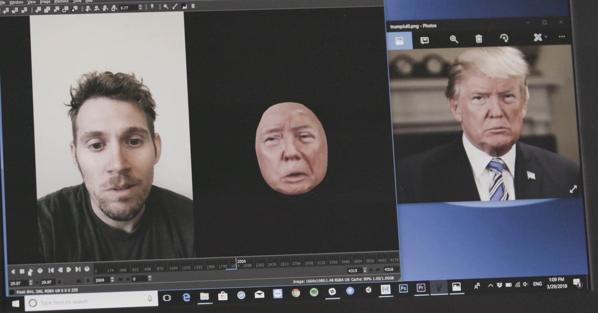
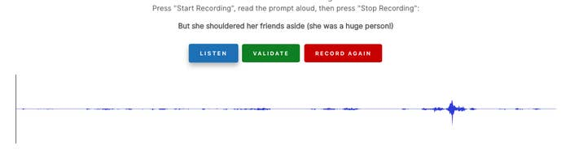
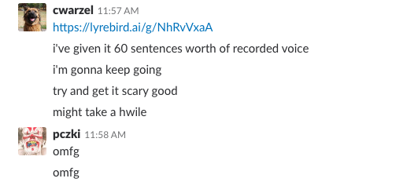
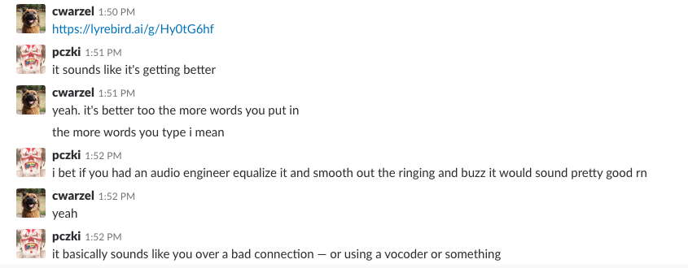
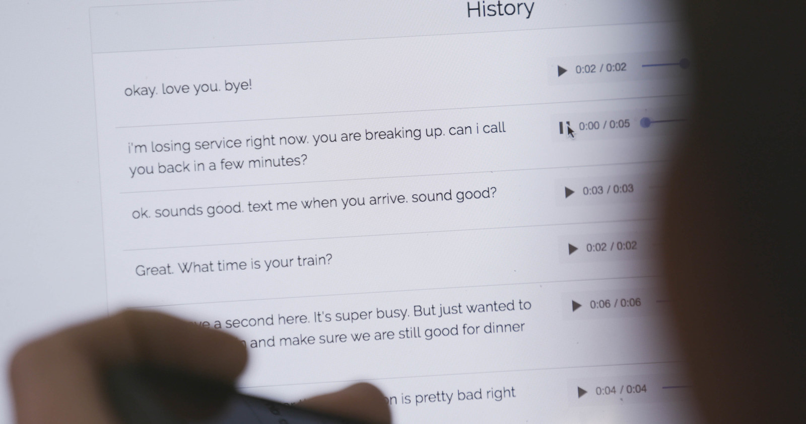
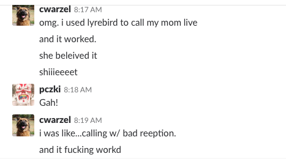

## Summary
[[CharlieWarzel]] reports using [[Lyrebird]] to build a text-to-speech copy of his voice from about sixty prompted recordings, then fooling his mother during a short, pre-scripted call. The result grounds [[VoiceCloneImpersonation]] in more than model fidelity: a familiar dinner-plan pretext, brief generated clips, and a claimed bad connection hid audible flaws well enough for an unsuspecting listener to accept the identity claim.

The lead image places voice cloning within a wider synthetic-media workflow by showing a recorded face beside a manipulated face model and a Donald Trump reference image.

## Key Claims
- Lyrebird created a usable vocal avatar by learning the author's cadence and pronunciation from prompted recordings, after which arbitrary typed text could be rendered in his voice.
- About one hour and sixty sentences produced a recognizable but monotone and grainy first clone rather than a perfect reproduction.

The interface breaks enrollment into prompted recording, listening, validation, and re-recording, making voice capture accessible without specialist equipment in the reported experiment.

The editor's reaction supports recognizability after sixty sentences while the article still describes the output as robotic.

- More training examples improved cadence, although ringing, buzz, and grain remained audible.

The editor explicitly says the clone sounds more like the author and that its defects resemble a bad connection, suggesting both improvement and a ready-made cover story.

- The successful deception depended on staging: the author prepared likely phrases, kept the conversation brief, used ordinary dinner plans as shared context, and blamed poor reception before ending the call.

The saved clips include confirmations, a train-time question, an affectionate sign-off, and a line about losing service, showing that the interaction was assembled from short anticipated turns.

- The author's mother did not doubt the caller's identity and initially struggled to believe the audio had been generated by AI.

The contemporaneous exchange reports that the live attempt worked and that repetition was disguised as a bad connection.

- The experiment is presented as an early warning about cheap, public synthetic-media tools making fabricated events and impersonation more accessible.

## Key Quotes
> "I never doubted for a second that it was you." - the author's mother on accepting the cloned voice.

> "What happens ... when anyone can make it appear as if anything has happened?" - [[AvivOvadya]] on synthetic media and disinformation.

## Connections
- [[CharlieWarzel]] - journalist who conducted and reported the voice-cloning experiment.
- [[Lyrebird]] - public vocal-avatar service used to record prompts and synthesize typed speech.
- [[VoiceCloneImpersonation]] - the combined technical and social process demonstrated by the call.
- [[UncannyValleyOfAI]] - the grainy clone succeeded despite imperfect realism because context constrained what the listener expected.
- [[AvivOvadya]] - disinformation researcher whose warning motivated the experiment.

## Contradictions
- No direct contradiction with the wiki was found. The result qualifies any assumption that convincing synthetic media must be technically flawless: this single staged call succeeded by combining recognizable audio with expectation management and a plausible explanation for defects.
- The article is a first-person demonstration with one target, one speaker, one service, a short planned exchange, and no blinded listening or control condition; it does not measure general deception rates.
- The test used consented recordings of the author's own voice, while the article's broader malicious-use warning is prospective rather than demonstrated by the experiment.
- The saved source does not provide independent audio for evaluation, so fidelity and improvement claims rest on the author's account, his editor's messages, and the reported reaction of his mother.
