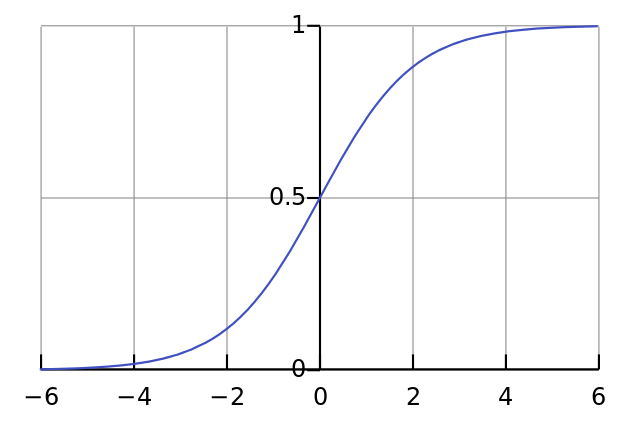
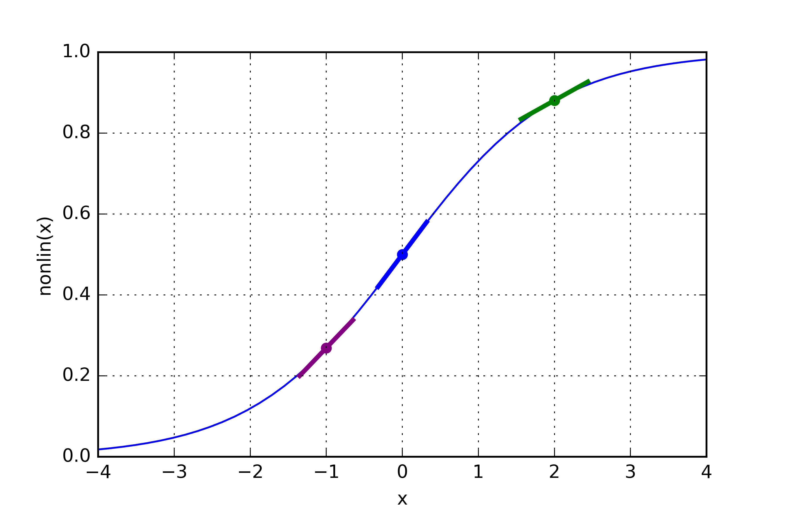
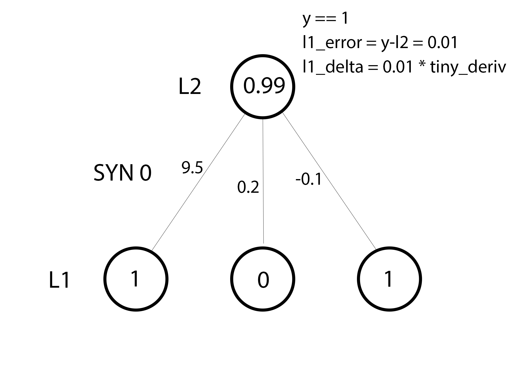
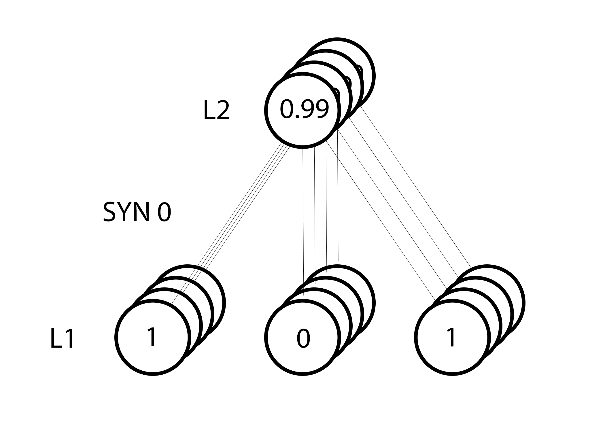
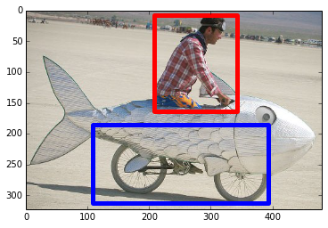

## Summary
[[Iamtrask]] builds an intentionally small NumPy [[NeuralNetwork]] to make [[Backpropagation]] inspectable rather than hiding it behind a framework. A one-weight-layer example learns a directly correlated feature; a second hidden layer then solves XOR by learning combinations of inputs, connecting the mechanics of [[NeuralNetworkTraining]] to the representation-learning intuition behind [[DeepLearning]].

## Key Claims
- A sigmoid turns each weighted sum into an output between zero and one, while its output-form derivative `out * (1 - out)` scales updates by local slope.
- In the simple network, full-batch training computes all four predictions together, multiplies prediction error by sigmoid slope, and updates each weight from the summed input-times-delta contributions.
- The weights, not the transient layer values, hold what the network has learned.
- A model without a hidden layer can learn the directly correlated first input but cannot represent XOR, where neither input alone correlates with the output.
- A hidden layer can turn combinations of inputs into intermediate features that the output layer can use; backpropagation assigns hidden-layer error according to each unit's downstream contribution.
- Random initialization can expose weakly useful hidden features, and training amplifies the correlations that reduce output error.
- Rebuilding the toy network from memory is recommended as an exercise for understanding arbitrary architectures beyond framework APIs.

The plots show both parts of the sigmoid argument: bounded outputs and the strongest local slope near the uncertain midpoint, with smaller derivatives toward saturated zero-or-one predictions.

The diagrams move from one nearly correct prediction to the full batch: every active input receives an update, and contributions from examples are aggregated before the shared weights change.

The two image examples illustrate the nonlinear case: no fixed pixel need identify an object, but spatial combinations can form a reusable hidden representation.

## Key Quotes
> "A neural network trained with backpropagation is attempting to use input to predict output." - the tutorial's starting abstraction.

> "The output of the first layer (l1) is the input to the second layer." - the hidden-layer composition used for XOR.

## Connections
- [[Iamtrask]] - author and teacher presenting the network as an intuition-building exercise.
- [[NeuralNetwork]] - the layered weighted model implemented directly in NumPy.
- [[NeuralNetworkTraining]] - the repeated prediction, error, delta, and weight-update loop.
- [[Backpropagation]] - sends output error backward through downstream weights to assign hidden-layer error.
- [[DeepLearning]] - described as adding layers that learn progressively useful combinations of inputs.

## Contradictions
- The tutorial calls sigmoid outputs "probabilities," but a bounded activation is not automatically a calibrated probability estimate.
- Its confidence language is pedagogical: small sigmoid derivatives near saturation reduce updates, but saturation can also impede learning rather than certify correctness.
- The examples omit biases and an explicit learning-rate multiplier, use full-batch updates without averaging, and rely on Python 2 syntax; they explain the core mechanics rather than provide a modern production training recipe.
