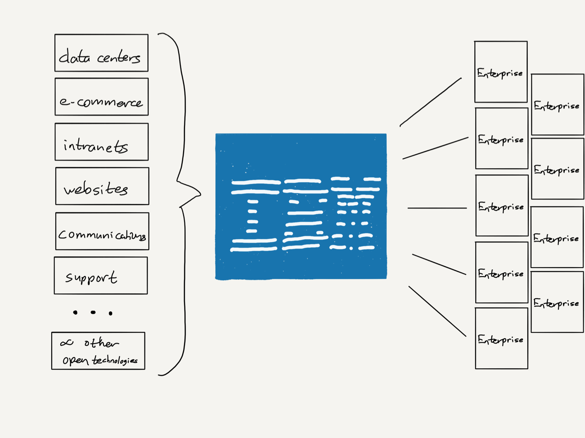
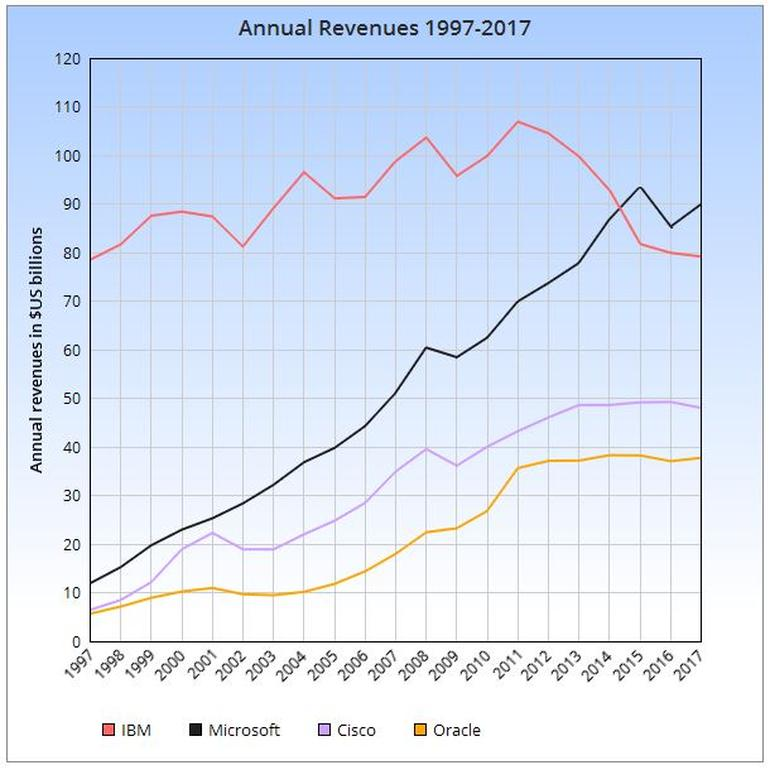

## Summary
[[BenThompson]] interprets [[IBM]]'s announced $34 billion acquisition of [[RedHat]] as an attempt to reuse Lou Gerstner's 1990s playbook: integrate fragmented, open technologies into enterprise solutions and monetize service, middleware, and trusted delivery rather than win every product category. The 2018 essay argues that [[OpenShift]] and portable [[Kubernetes]] workloads offered IBM a pragmatic [[HybridCloudStrategy]] after it missed hyperscale public cloud, but questions whether customer demand, Microsoft competition, and IBM's culture would let that strategy succeed.

## Key Claims
- [[RedHat]] founder Bob Young says Gerstner-era IBM taught Red Hat that enterprise customers buy outcomes and support, helping Red Hat frame freely reusable Linux as a subscription and services business.
- Gerstner turned IBM's breadth and global customer presence into an [[EnterpriseIntegrationBusinessModel]] when immature, fragmented Internet technologies created a problem large enterprises did not want to solve vendor by vendor.
- IBM captured value by integrating open and commoditized technologies, operating enterprise systems, and selling proprietary middleware, but the resulting lock-in and success also encouraged organizational complacency.
- The essay argues IBM lost the public-cloud transition when leadership prioritized a 2015 earnings target and underinvested relative to hyperscale providers; standardized cloud services then made many custom IBM solutions merely “good enough” substitutes.
- The 2017 revenue chart shows IBM falling from a mid-2010s peak while Microsoft overtook it; Thompson also cites 22 declining quarters, weak segment results, and falling capital expenditure as 2018 evidence against IBM's cloud narrative.

- IBM's acquisition thesis centered on [[OpenShift]]: portable containers and Kubernetes could bridge private data centers and multiple public clouds, reducing dependence on any single provider.
- The strategy remained unproven because enterprises might not see IBM as an escape from lock-in, capable customers could assemble open tools themselves, Microsoft could pair hybrid software with owned hyperscale infrastructure, and IBM still needed cultural change.

## Key Quotes
> "he wasn’t selling products he was selling a service." - Bob Young summarizing Gerstner's customer insight.

> "many companies had a problem that only IBM could solve, not that customized solutions were the end-all be-all." - Thompson on the conditional source of IBM's advantage.

> "Fortune favors the prepared mind." - the essay's test for whether strategy and culture are ready when an external opening appears.

## Connections
- [[IBM]] - company whose services turnaround, cloud miss, and Red Hat acquisition anchor the analysis.
- [[RedHat]] - open-source subscription and services company IBM agreed to acquire in 2018.
- [[BobYoung]] - Red Hat founder explaining IBM's influence on its service-led business model.
- [[LouGerstner]] - IBM leader associated with the solutions-and-services turnaround playbook.
- [[OpenShift]] - Red Hat product Thompson identifies as the acquisition's strategic prize.
- [[Kubernetes]] - portable orchestration layer underlying the multi-cloud portability thesis.
- [[HybridCloudStrategy]] - proposed bridge across private infrastructure and public-cloud providers.
- [[EnterpriseIntegrationBusinessModel]] - model of capturing value by integrating fragmented technologies and assuming enterprise operating complexity.
- [[OpenSourceCommercialization]] - Red Hat case in which support and subscriptions monetize open software.
- [[EnterpriseCloudMigration]] - adjacent migration context shaped by provider concentration, portability, and legacy workloads.
- [[BenThompson]] - Stratechery analyst making the historical analogy and 2018 forecast.
- [[Stratechery]] - publication in which the essay appeared.

## Contradictions
- The article challenges any reading of customized enterprise solutions as a durable end state: standardized public cloud reduced the scarcity of IBM's problem-solving advantage.
- The hybrid-cloud thesis is a 2018 acquisition rationale, not evidence that the deal later produced portability, growth, or successful cultural change.
- IBM's quoted claim that 80 percent of workloads had not moved to cloud is company-supplied and is not independently established by the source.
- Revenue, segment growth, and capital-expenditure figures are historical snapshots with different accounting boundaries; they indicate strategic pressure but do not by themselves prove causality.
