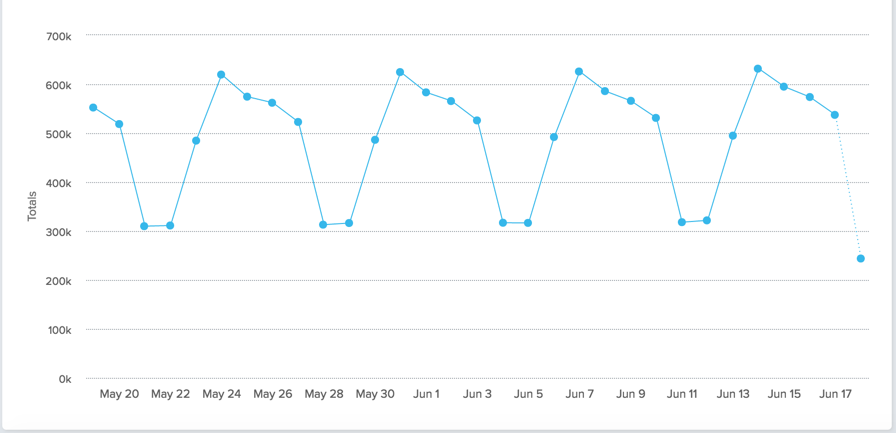

## Summary
[[DanWolch]] describes a lightweight [[BehavioralFeedbackSampling]] workflow learned from [[BrianBalfour]] while working on [[HubSpot]] sales products: define the product question, use behavioral event histories to locate relevant cohorts, solicit reply-by-email feedback, and code responses into recurring themes. The method sharpens [[CustomerLedProductDevelopment]] by distinguishing valuable evidence from convenient or loud feedback, but its response-rate, representativeness, privacy, and causal limits remain unmeasured.

## Key Claims
- A product team should choose interview candidates around its current question: activation work calls for people who signed up but did not reach value, while retention work calls for people who used the product and then stopped.
- User-level event histories can identify super-active users, brief drive-by visitors, and previously engaged users who quit, each of whom can answer a different research question.
- Aggregate trend charts help locate changes over time but must be resolved to individual users before they can support targeted outreach.

- Spreadsheet filtering and pivot tables are presented as sufficient for a quick first pass; Wolch recommends limiting exploratory analysis to roughly thirty minutes to avoid analysis paralysis.
- Plain personal email that asks recipients to reply directly can reduce friction compared with a templated survey link; Wolch reports response rates of 10-20% but provides no campaign details or comparison.
- Follow-up questions based on the five-whys technique can deepen an initial account, while routing replies into a spreadsheet and manually assigning a small set of feedback buckets can expose recurring language and themes.

## Key Quotes
> "talk to the right customers" - the article's refinement of the general instruction to talk to customers more.

> "Nobody wants to click on a link to fill out a survey." - the rationale for accepting direct email replies.

## Connections
- [[DanWolch]] - author and HubSpot product manager presenting the workflow.
- [[BrianBalfour]] - person Wolch credits with teaching him the process.
- [[BehavioralFeedbackSampling]] - central method for recruiting research participants from usage patterns.
- [[CustomerLedProductDevelopment]] - broader practice that the source makes more selective and operational.
- [[ProductUserSegmentation]] - super-active, drive-by, and lapsed users are behavior-defined segments with different evidentiary value.
- [[Amplitude]] - example analytics system used to illustrate aggregate event trends.
- [[Zapier]] - automation layer proposed for routing labeled email replies into a spreadsheet.
- [[StartupGrind]] - Medium publication venue for the article.

## Contradictions
- No direct contradiction was found. The source reinforces existing warnings that convenient, vocal, or expert respondents are not automatically representative, then proposes behavioral selection as a partial remedy.
- The workflow is one practitioner's account. It gives no email volume, denominator, confidence interval, nonresponse analysis, controlled survey comparison, evidence that its categories predict product outcomes, or procedure for reconciling stated explanations with observed behavior.
- Selecting only users visible in an analytics system excludes untracked, privacy-protected, inaccessible, or pre-activation users and can overrepresent people with identifiable email addresses. Cohort definitions also depend on expected usage frequency; one inactive day need not mean churn for an episodic product.
- The source does not discuss consent, data minimization, email-list handling, or the possibility that BCC outreach and automated response routing may be inappropriate in some contexts.
- The supplied Markdown refers to an event graph, pivot table, email example, automation setup, response sheet, and feedback report, but only the aggregate event chart is actually embedded. That chart shows daily totals and a repeating weekly pattern but has no title, legend, named event, or user-level rows; the other visual examples could not be inspected, so their details are not treated as evidence.
