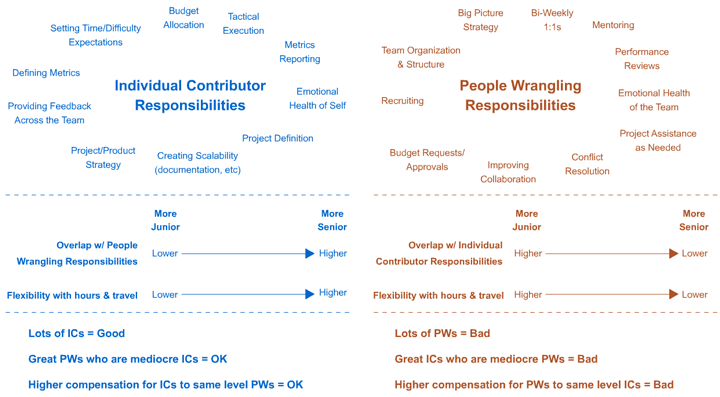

## Summary
[[RandFishkin]] argues that companies should offer advancement, influence, titles, and compensation on parallel individual-contributor and people-management tracks rather than treating management as the only promotion. Using [[Moz]] examples and a responsibility diagram, he distinguishes senior ICs who expand their cross-team strategic and execution influence from people managers who create the conditions for teams to succeed through staffing, coaching, cohesion, feedback, and organizational support. The article further argues that ICs should own substantial decisions about what, when, where, and how work is done, while managers concentrate more on who and why.

## Key Claims
- Companies need many strong individual contributors and comparatively few strong people managers, so a career system that makes management the only route upward misaligns incentives with organizational need.
- [[DualCareerTracks]] should offer roughly equivalent levels, pay, status, and influence so that strong ICs can advance without accepting direct reports.
- IC seniority should widen strategic and cross-team influence while preserving hands-on responsibility; people-management seniority should shift attention away from execution and toward team health, mentoring, staffing, coordination, and organizational context.
- [[ManagementRoleFit]] depends on motivation and capability: people who enjoy doing excellent work may fit the IC track, while those who are effective at enabling others may fit management.
- Promoting a strong IC into management without fit can simultaneously remove an excellent contributor and create a weak manager whose effects spread across a team.
- Granting ICs autonomy over execution supports mastery and retention, while managers can retain responsibility for purpose, team composition, and enabling conditions.

## Key Quotes
> "She didn't want people reporting to her. She didn't want greater responsibility for a team. She wanted to write." — example of promotion conflicting with preferred work

> "He lets his influence define his role, rather than the other way around." — description of senior IC impact

> "The highest level ICs should be able to make what the C-suite earns." — proposed compensation parity

## Connections
- [[RandFishkin]] — author and first-time CEO describing the dual-track model and his own IC-style leadership.
- [[Moz]] — company where the proposed title, team, responsibility, and salary structure was being developed.
- [[DualCareerTracks]] — captures the parallel IC and people-management advancement system.
- [[ManagementRoleFit]] — separates enthusiasm for direct contribution from skill and motivation in enabling other people.
- [[EngineeringCareerArchitecture]] — provides a broader framework for explicit levels, expectations, and promotion evidence.
- [[EngineeringTeamMotivation]] — IC ownership of execution is linked to autonomy, mastery, purpose, happiness, and retention.

## Contradictions
- The source qualifies management-centered career assumptions implicit in traditional promotion ladders: seniority can be expressed through wider IC influence without direct reports.
- No direct factual contradiction is established. The model is a 2013 founder-practitioner proposal without comparative outcome data, and its division of managers owning “who and why” while ICs own “what, when, where, and how” may not fit every team, level, or regulated setting.
