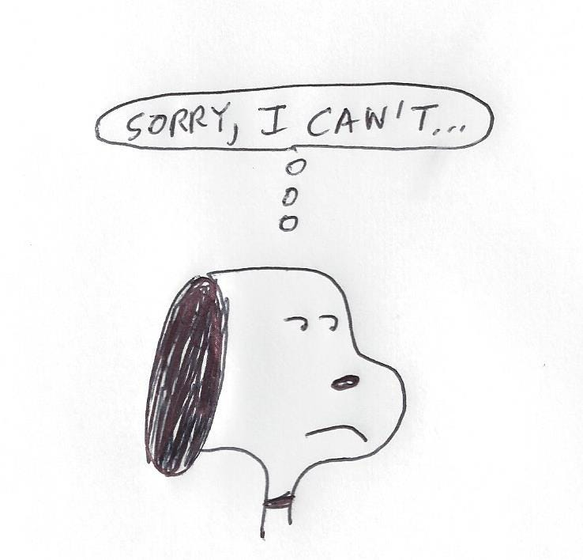

## Summary
In a short first-person account of seeking advice while exploring venture capital, the `sneakerheadVC` writer argues that a prompt, unambiguous refusal can show more respect than enthusiastic but indefinite postponement. The essay connects [[RespectfulRefusal]] to [[OpportunityCost]], [[AttentionManagement]], and [[PersonalProductivity]]: people cannot make every request a priority, but they can avoid transferring avoidable uncertainty and follow-up work to the requester.

## Key Claims
- A direct no lets the requester update plans and priorities instead of waiting on a vague future possibility.
- Nonresponse communicates low priority indirectly, but one follow-up followed by disengagement can limit the requester's additional cost.
- Expressing interest while repeatedly moving a meeting without offering a new date consumes the requester's time and can feel more disrespectful than refusal.
- A quick “I’m sorry. I can’t.” acknowledges the request, sets a clear boundary, and preserves respect despite disappointment.
- Protecting one's own priorities limits how many requests can receive time; it does not prevent giving each requester a clear response.

## Key Quotes
> “I’m sorry. I can’t.” - the concise refusal the writer presents as honest, clear, and respectful.

> “I can’t give everyone my time and respect my priorities. But, I do have time to give everyone my respect.” - on separating scarce availability from courteous closure.

## Connections
- [[RespectfulRefusal]] - the essay's central practice is prompt, honest closure without false future enthusiasm.
- [[OpportunityCost]] - both parties need clarity so they can allocate scarce time to their actual priorities.
- [[AttentionManagement]] - declining requests can protect limited mental capacity as well as calendar time.
- [[PersonalProductivity]] - selective commitment is paired with a norm of responding respectfully.

## Contradictions
- No direct contradiction found. The source complements existing material on saying no by emphasizing the requester's uncertainty and follow-up cost, not only the responder's protected time.
- The account is one retrospective anecdote and does not establish that response speed reliably reveals organization, purpose, arrogance, or the actual reason a request was declined.
- “Not a priority” is the narrator's interpretation; silence or delay can also arise from overload, illness, access needs, lost messages, assistants, or changing circumstances.
- Directness is context-sensitive: a terse refusal can still be discourteous when tone, explanation, duty, power imbalance, or an existing commitment calls for more care.
- The full-size illustration was retained once; its repeated embed and separate 30-by-29-pixel thumbnail were omitted as duplicates.
