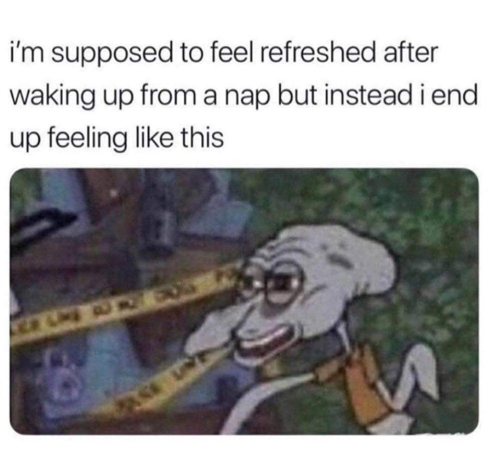
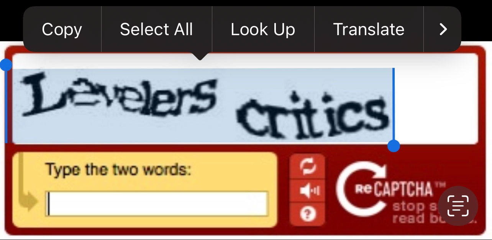
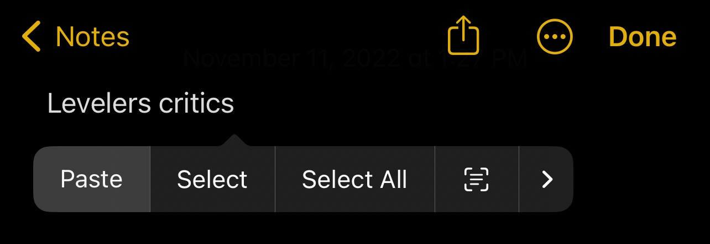
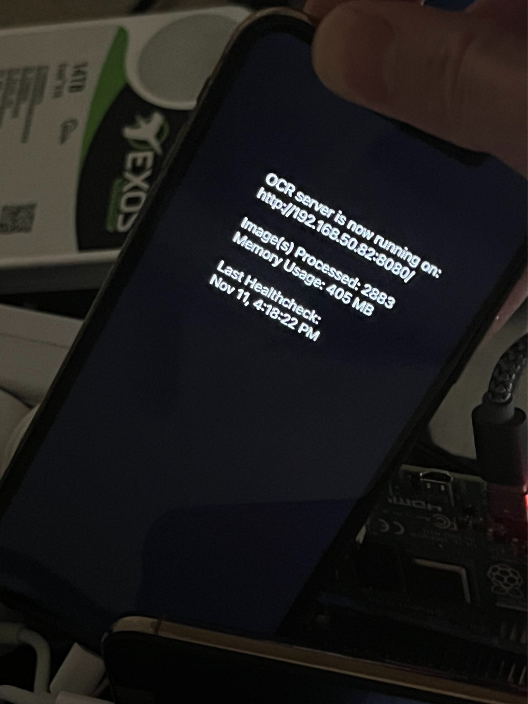
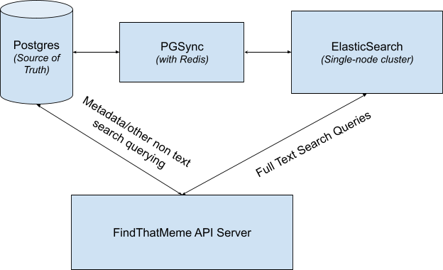
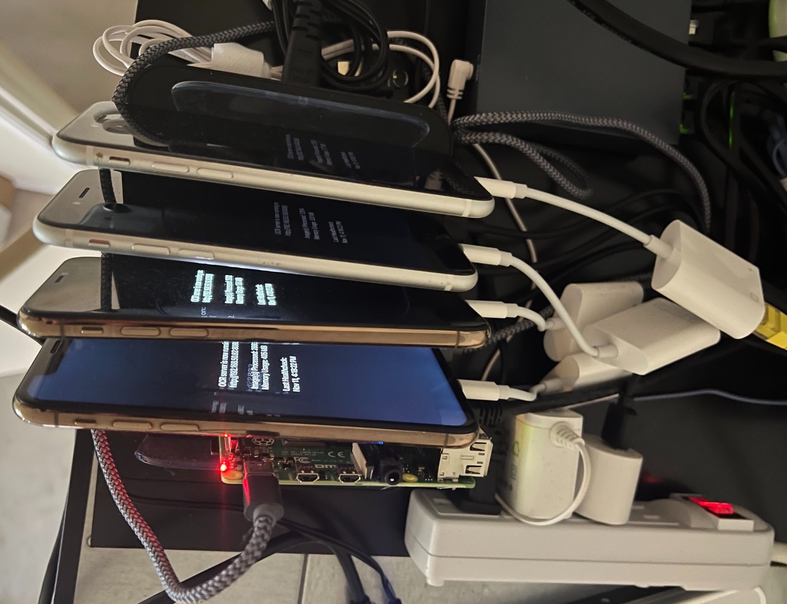
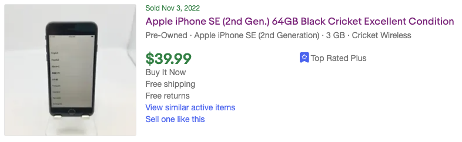
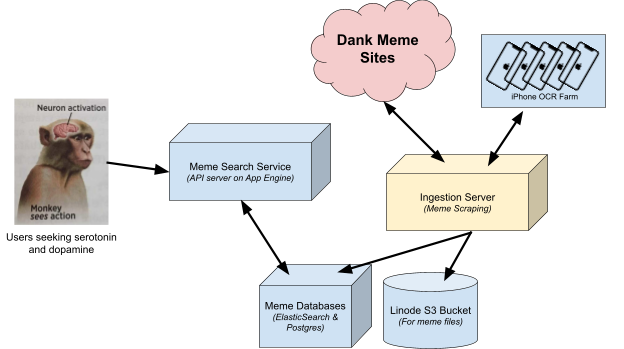

## Summary
The pseudonymous author IAmMandatory describes building [[FindThatMeme]], a search engine that extracts text from varied meme images and sampled video frames, stores canonical records in [[PostgreSQL]], and serves full-text retrieval through a rebuildable Elasticsearch index. The central engineering move was to turn Apple's accurate on-device Vision OCR into an HTTP service and then a low-cost cluster of used iPhones behind Raspberry Pi and NGINX load balancing. The account connects [[VisualTextIndexing]], [[CostConstrainedInfrastructure]], and [[RebuildableDerivedIndex]] while remaining a first-person 2023 architecture report rather than an independently reproduced benchmark.

## Key Claims
- Tesseract handled a meme with regular high-contrast type but badly misread a remixed game meme whose captions, label overlays, font sizes, colors, and image content varied.

- iOS could select and correctly copy the deliberately distorted words “Levelers critics” from an old reCAPTCHA, motivating automated use of the Vision framework for harder meme text.

- A Swift app exposed Vision OCR through GCDWebServer; the pictured prototype reports an HTTP endpoint, 2,833 images processed, 405 MB memory use, and a last health check.

- The phone app leaked memory and typically crashed after 20,000–40,000 images, so iOS Guided Access was used as an automatic restart mechanism that also recovered from corrupt-image crashes.
- [[PostgreSQL]] remained the canonical store for text and metadata; PGSync mirrored selected columns through Redis into a single-node Elasticsearch cluster that could be deleted and rebuilt after index loss.

- Generated-data testing and the running service reportedly supported sub-second text search across about 17 million memes on a shared six-core, 16 GB RAM Linode instance; the article supplies no benchmark protocol or latency distribution.
- Video memes were converted into ten evenly spaced screenshots with ffmpeg, then each frame was sent to the same phone OCR service; this made each video roughly ten times the image-OCR work.
- The author scaled OCR with cosmetically damaged, carrier-locked, or IMEI-blocklisted older iPhones whose compute and Wi-Fi remained usable, placing them behind an NGINX load balancer on a Raspberry Pi.

- A pictured second-generation iPhone SE sold for $39.99; at the article's quoted Google Cloud Vision rate of $1.50 per thousand images, its purchase price would equal about 26,660 cloud OCR requests before electricity, cooling, maintenance, networking, development, depreciation, or utilization were counted.

- The final diagram separates scraping and ingestion, OCR, object storage, canonical and search databases, and a search API/client, making the low-cost hardware choice part of a larger recoverable pipeline.

## Key Quotes
> “Finally it seemed there was a scalable OCR solution” - on discovering that Apple's Vision framework exposed the recognition capability for automation.

> “I could blow ElasticSearch away” - on treating the search store as a derivative that PGSync could reconstruct from PostgreSQL.

## Connections
- [[FindThatMeme]] - the meme retrieval project and architecture described by the author.
- [[VisualTextIndexing]] - images and sampled video frames become searchable text through OCR.
- [[CostConstrainedInfrastructure]] - cheap impaired phones, a Raspberry Pi, single-node search, and recoverability trade reliability for sustainable side-project cost.
- [[RebuildableDerivedIndex]] - PostgreSQL is authoritative while Elasticsearch is disposable and reconstructable.
- [[PostgreSQL]] - canonical store for meme text, context, and source metadata.
- [[SystemReliability]] - restarts, load balancing, and rebuild paths contain faults without claiming high availability.
- [[Apple]] - its iOS Vision framework and Guided Access feature make the phone-based OCR service possible.

## Contradictions
- The performance, OCR-quality, crash-frequency, corpus-size, and cost claims are self-reported point observations without source data, reproducible benchmarks, comparison methodology, or current verification.
- The $39.99 device-versus-cloud comparison is a break-even illustration, not total cost of ownership: it omits labor, power, cooling, accessories, failed devices, throughput, queueing, utilization, and service-level differences.
- A single Elasticsearch node and automatic app restart reduce cost and recovery effort but do not provide uninterrupted service, eliminate data loss windows, or substitute for measured reliability.
- Ten evenly spaced frames can miss brief captions, scene changes, and audio-only meaning, so the video pipeline indexes a sample rather than the complete semantic content.
