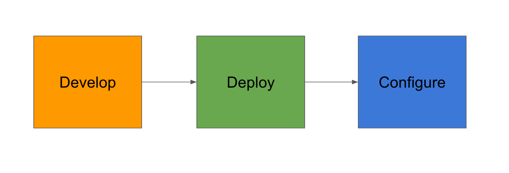

## Summary
This implementation guide combines [[Terraform]], [[Packer]], and [[Ansible]] to move an Nginx static-site configuration from EC2 launch time into an [[AWS]] AMI build. Terraform first creates the network, Packer launches a temporary builder in that subnet and invokes Ansible, and a second Terraform configuration selects the tagged AMI and creates the application instance. The example makes [[ImmutableInfrastructure]] concrete, but its 2018 code, local state coupling, credential inputs, public builder access, and `most_recent` image selection are not a current production reference architecture.

## Key Claims
- [[ImmutableInfrastructure]] replaces repeated in-place server updates with preconfigured machine images and instance replacement, preserving earlier images as potential rollback artifacts.
- Build-time configuration can reduce instance provisioning delay and variation because application dependencies are installed once while the image is baked rather than on every launch.

- The workflow separates infrastructure into a Terraform-managed network layer and a Terraform-managed instance layer, with network state supplying the subnet and instance inputs.
- [[Packer]] uses the Terraform-created subnet to launch an Amazon EBS builder, while [[Ansible]] installs the static site and enables Nginx before the AMI is finalized.
- Terraform discovers an available AMI through the `Name=Packer-Ansible` tag with `most_recent = true`, then supplies its ID to the EC2 instance module.
- Enabling Nginx at image-build time lets a launched instance begin serving without waiting for a post-launch configuration pass.

## Key Quotes
> "immutable components which are recreated and replaced instead of updating" - the article's operating-model definition.

> "We should do configuration up front using Packer" - on moving Ansible work into image construction.

## Connections
- [[ImmutableInfrastructure]] - central build-and-replace operating model demonstrated by the AMI pipeline.
- [[InfrastructureAsCode]] - Terraform, Packer templates, and Ansible playbooks divide repeatable infrastructure work across provisioning and image construction.
- [[ConfigurationManagement]] - Ansible remains useful, but runs during the bounded image build rather than converging every launched application server.
- [[DeploymentAutomation]] - the built AMI becomes the deployable unit used for EC2 creation and potential rollback.
- [[Packer]] - creates the AMI and invokes Ansible as an image-build provisioner.
- [[Terraform]] - creates the VPC, subnet, routing, key pair, security groups, and EC2 instance and reads the network state.
- [[Ansible]] - installs the static website and enables Nginx during the Packer build.
- [[AWS]] - supplies the VPC, subnet, AMI, EC2, key-pair, routing, security-group, and Elastic IP substrate.

## Contradictions
- Selecting `most_recent` from every available AMI sharing one tag is less explicit than promoting a pinned image ID; an unintended newer image could become the deployment input without a separate approval boundary.
- The example reduces image-content drift but does not eliminate mutable runtime state, secrets, external dependencies, data compatibility, traffic cutover, health verification, or rollback coordination.
- The snippets use historical Terraform syntax, access-key variables, a local state-file dependency, and public-IP builder access. They demonstrate component handoffs but should not be treated as current security or state-management guidance.
- The article asserts faster, more reliable deployment without reporting build duration, rollout measurements, failure rates, comparison data, or recovery tests.

## Image Notes
- All five effective local image references were opened. The readable process diagram was retained because it shows configuration as a distinct post-deployment phase in the mutable flow.
- The stone photograph was omitted as decorative. Two 30-by-10-pixel colored exports were omitted as unusable duplicates of the process graphic, and the 30-by-12-pixel verification remnant was too downsampled to interpret or retain.
