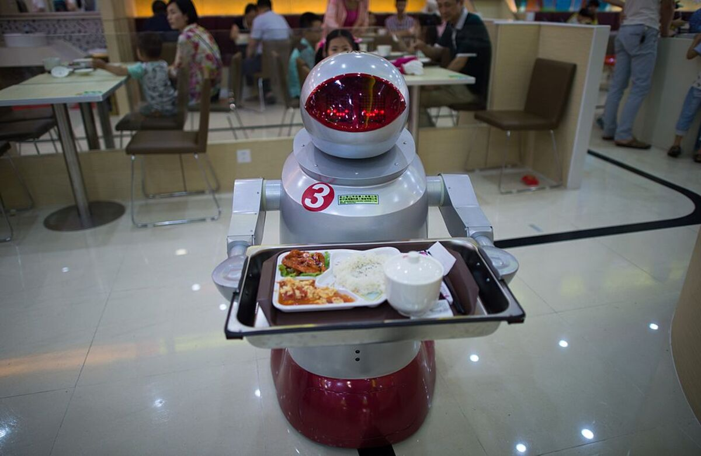

## Summary
[[TylerCowen]] argues that automation may transform jobs more often than it eliminates employment, shifting people from routine production and service tasks toward [[PersuasionWork]], customer relationships, branding, and experience. These activities can inform customers or add experiential value, but competitive persuasion can also redistribute market share without much social gain and can create pressure for misconduct. The essay therefore makes the quality of replacement work—not only the number of jobs—a central question for [[WorkplaceAutomation]].

## Key Claims
- ATM adoption did not simply eliminate bank tellers; cheaper branches and redesigned roles shifted teller work toward sales, interpersonal service, and customer relationships.
- Drawing on [[JamesBessen]], the essay treats task substitution as a mechanism that can preserve occupations while changing what workers do inside them.
- Legal, medical, warehouse, restaurant, and banking examples suggest that automation can move human effort from routine execution toward persuasion, client cultivation, and customer experience.
- Marketing can create value by informing choice, improving product-customer matching, and adding identity or enjoyment to a product.
- Brand-switching competition can also be zero- or negative-sum when firms spend heavily to move customers among nearly equivalent offerings.
- Scale economies and monopoly profits may support more socially wasteful persuasion, while sales pressure can cross into fraud, illustrated by the Wells Fargo unauthorized-account scandal.
- Visible robots can coexist with weak measured productivity growth if displaced labor moves into activities that add little measured output.

## Key Quotes
> "they are more of a marketing person" — [[JamesBessen]] on how ATM adoption changed bank-teller work.

> "a lot of marketing is a zero- or negative-sum game" — [[TylerCowen]] on competitive persuasion with limited social value.

## Connections
- [[TylerCowen]] — author of the automation-and-marketing argument.
- [[JamesBessen]] — economist cited for the bank-teller role-redesign example.
- [[PersuasionWork]] — human work in selling, branding, relationship cultivation, and experience that may expand as routine tasks are automated.
- [[WorkplaceAutomation]] — the source emphasizes partial task substitution and job redesign rather than automatic occupation loss.
- [[HumanPremiumServices]] — customer welcome and interpersonal contact may carry value, though the essay questions how much value they add.
- [[AutomaticAdvertisingInfluence]] — product identity and endorsement can affect enjoyment as well as communicate information.
- [[Amazon]] — warehouse robots illustrate the separation between automated fulfillment and human or organizational demand creation.

## Contradictions
- The essay qualifies [[WorkplaceAutomation]] accounts that describe reassigned client or relationship work as inherently higher value: employment can persist while replacement tasks produce limited social benefit.
- It qualifies [[HumanPremiumServices]] by separating genuine care, judgment, or connection from scripted welcome, competitive selling, and potentially coercive sales pressure.
