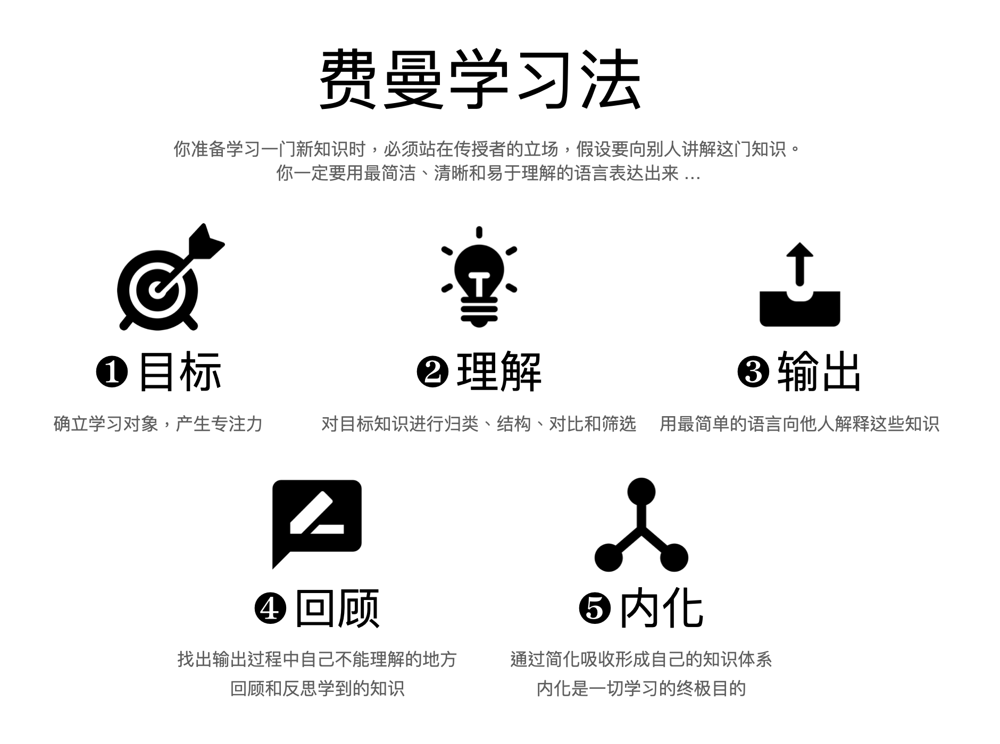
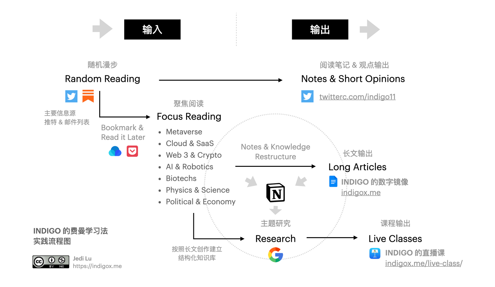
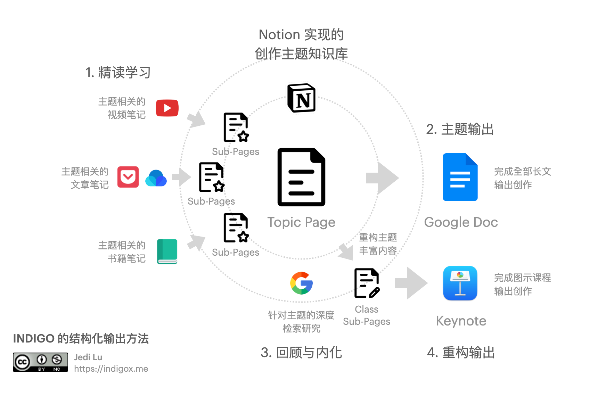

## 核心摘要

文章把“费曼学习法”实践为[解释驱动学习循环]()：确定目标、理解材料、用简单语言输出、暴露缺口、回顾并内化。作者再把它扩展为个人信息系统：随机发现内容，围绕少数主题[聚焦阅读与输出]()，用笔记、长文和课程逐步提高结构化程度。

> **图片状态：** 9张原始图片引用已解析；精选3张公开嵌入，分别解释学习循环、输入输出全流程和结构化创作；Dale学习金字塔、工具截图与三张推荐文章封面等6张省略，无private分类。

## 从解释中发现理解缺口

作者给出五步：目标、理解、输出、回顾、内化。稳定机制并不依赖“费曼”标签：当学习者必须向具体受众解释时，含混术语、跳步推理和无法举例的位置会暴露出来，再定向返回材料修正。

*图中五步不是一次性流水线；输出和回顾会把学习者送回理解阶段。*

## 输入与输出系统

作者区分“随机漫步”和“聚焦阅读”。前者扩大候选面，后者由近期输出主题过滤噪音。输出从短笔记与观点，到结构化长文，再到需要图示、案例和现场讲解的课程。

*随机输入提供发现，主题目标触发聚焦研究；输出难度逐步提高并产生新的研究缺口。*

*作者以主题页汇集书籍、链接和摘录，再形成长文、幻灯片与课程。具体工具可以替换。*

## 笔记与AI部分

文章回顾Apple Notes、Notion、Obsidian、Roam和Heptabase，并预测AI摘要、智能关联和知识助理会降低整理负担。可复用需求是[AI辅助笔记检索]()：保留原文和上下文，在需要时检索、关联和综合。具体产品优劣属于作者2023年的个人工作流快照。

## 证据边界

文章把Dale’s Cone of Experience与“学习两周后保持率10%–90%”金字塔联系起来，并称其量化验证了教学式学习。这类固定百分比并非Dale原始模型提供的可靠实验结论，因此本页不发布该图，也不使用百分比支持“输出必然更有效”。

同样，“无法输出就不能称为学习”“最好的整理就是不要整理”是强调方法的修辞。解释与教学可能改善检索练习和结构化理解，但效果仍取决于反馈质量、任务类型、先备知识和是否纠正错误。

## 来源

- INDIGO，[《费曼学习法实践 / INDIGO的信息获取与知识输出方法论》](https://www.indigox.me/feynman-technique-in-practice/)，2023-01-18。
