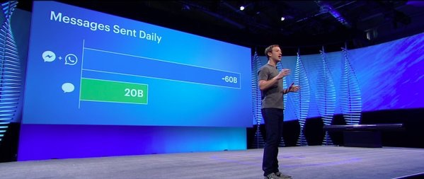

## Summary
[[BenedictEvans]] argues that technology outcomes combine strong structural forces with contingent decisions, execution, timing, personality, and luck. [[TechnologicalInevitability]] therefore requires two different counterfactual tests: whether a delayed event would probably have happened another way because the underlying forces were overwhelming, and whether a small change could instead have redirected who won or what institutional form emerged. Facebook's acquisitions of [[WhatsApp]] and [[Instagram]] illustrate contingent dominance, while [[Nokia]] and [[BlackBerry]] illustrate constraints accumulated so early that different reactions in 2007 may already have been insufficient.

## Key Claims
- Counterfactual analysis distinguishes events that merely crystallize strong underlying forces from balanced situations in which a small change could redirect the outcome.
- Technology has deterministic drivers such as Moore's law, network effects, economies of scale, and movement of value up the stack, but those drivers do not identify every eventual winner.
- [[Facebook]]'s mobile-social dominance was not inevitable: different timing and personalities might have let [[Google]] acquire [[WhatsApp]] or [[Twitter]] acquire [[Instagram]], provided those buyers also executed successfully after acquisition.
- Mobile weakened some of desktop social networking's winner-take-all pressure because push notifications, shared address books and photo libraries, and home-screen icons made it easier to use several networks.
- China's portal conglomerates provide a living counterfactual to the assumption that the portal model had to disappear; market isolation matters, but so might the earlier strategic failures of AOL and Yahoo.
- [[Nokia]] and [[BlackBerry]] may have been structurally unable to answer the iPhone by 2007 because software and component choices made years earlier constrained what they could build in time.
- Broad mobile change could be substantially foreseeable while [[Apple]]'s leadership within it remained contingent on survival, exploration, execution, and the presence of Steve Jobs.

The retained F8 slide shows roughly 60 billion combined daily messages for Messenger and WhatsApp and 20 billion for Messenger. Combined with the article's cited WhatsApp disclosure of 40 billion daily messages, it grounds the scale behind Evans's acquisition counterfactual without showing that the acquisitions alone caused Facebook's position.

## Key Quotes
> "sometimes the forces in operation are so strong that if by chance they had failed on this occasion, they'd have won another day" - on outcomes that crystallize an underlying situation.

> "we have both those deterministic drivers of change and also luck, skill and brilliance" - on why direction can be foreseeable while winners remain contingent.

## Connections
- [[BenedictEvans]] - author of the counterfactual technology-strategy argument.
- [[TechnologicalInevitability]] - the source's central distinction between structural direction and contingent outcome.
- [[LuckAndEffortInSuccess]] - related account of how preparation and effort interact with timing, support, and chance.
- [[TechnologyTransitionStrategy]] - strong ecosystem forces can move an industry's center of gravity without fixing the winning company in advance.
- [[AggregationTheory]] - shows how network effects and demand control can become self-reinforcing while remaining sensitive to platform structure.
- [[MobileEcosystem]] - shows how scale and supply-chain investment can shape an industry without fixing every company outcome.
- [[Facebook]] - acquisition and mobile-transition case used to reject retrospective inevitability.
- [[WhatsApp]] - acquisition target whose scale helps explain Facebook's later mobile-social position.
- [[Instagram]] - acquisition target that might counterfactually have strengthened Twitter instead.
- [[Nokia]] - example of strategic constraints accumulated years before the visible competitive crisis.
- [[BlackBerry]] - parallel example of an incumbent whose inherited software and component model limited its response.

## Contradictions
- The essay qualifies deterministic readings of [[MobileEcosystem]] and [[TechnologyTransitionStrategy]]: structural forces can make a broad transition likely without making the identity or dominance of a particular winner inevitable.
- It also qualifies decision-day turnaround stories. For Nokia and BlackBerry, the relevant counterfactual may require changing the company years earlier rather than choosing differently after the iPhone launch.
- The acquisition alternatives are hypothetical and explicitly depend on continued post-acquisition execution; the essay supplies no comparative causal analysis proving that Google or Twitter could have reproduced Facebook's outcomes.
- The messaging figures, mobile affordances, Chinese-internet scale, corporate positions, and incumbent constraints are a 2016 analytical snapshot rather than current market evidence.
