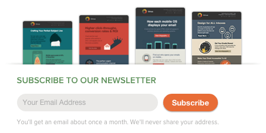
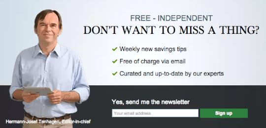
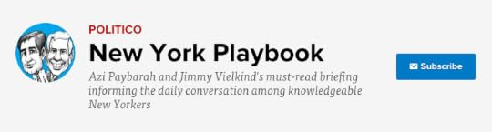
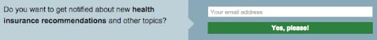
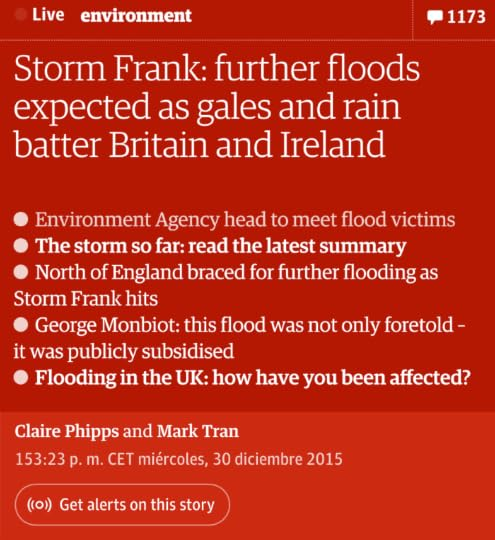
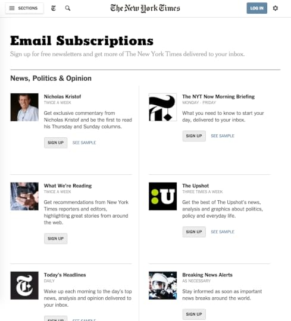
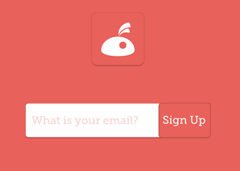
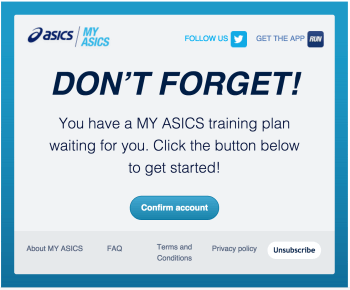
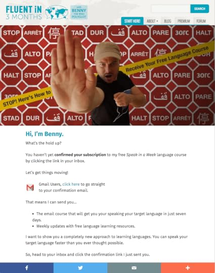

## Summary
This 2016 [[Optimizely]] article presents newsletter acquisition as an end-to-end [[NewsletterSignupOptimization]] problem spanning the offer, signup placement, audience context, choice, social proof, form interaction, and double-opt-in confirmation. Its examples show how previews, named editors, topic-specific alerts, selectable cadence, animated feedback, and explicit confirmation steps can make the exchange and next action more legible. The article is a practitioner hypothesis catalogue rather than measured evidence: it reports no experiment design, conversion lift, retention, deliverability, incentive cost, or subscriber-quality outcome, and its legal and identity-provider claims require current jurisdiction-specific verification.

## Key Claims
- A signup request should make the exchange concrete by previewing representative newsletters, stating frequency, explaining privacy expectations, and clarifying unsubscribe options.
- Incentives may improve initial and confirmed signup, especially when fulfillment follows confirmation, but referral rewards depend on brand trust and the article supplies no economics or quality measures.
- Signup prominence and messaging can vary by visitor state: new visitors may need content first, engaged returners may justify a stronger prompt, and known subscribers should see other calls to action.
- Contextual topic language, named curators, subscriber counts, credible audience identities, and demonstrated value are proposed as ways to make the newsletter more relevant and trustworthy.
- Topic and frequency choice can turn one undifferentiated list into a subscriber-controlled relationship, while article-level alerts can bridge a specific information need into broader retention.
- Confirmation is part of the conversion path: focused email design, explicit next-step instructions, a direct route to the inbox, and fewer redundant messages may reduce double-opt-in abandonment.
- One-tap email composition and social sign-in are proposed as ways to reduce typing, but the article does not analyze consent, privacy, accessibility, provider dependence, or whether those routes still require confirmation.

The [[Litmus]] example combines visual samples with a short email field, one call to action, an approximate monthly cadence, and a promise not to share the address.

The Finanztip and Politico examples make responsibility visible through named people while pairing identity with a concrete content promise.

The contextual examples connect the prompt to the page's current subject instead of asking for a generic newsletter commitment.

The New York Times screen exposes differences among newsletters and shows cadence labels such as daily, twice weekly, and as necessary.

The animation does more than decorate the field: after submission it transforms the control into a clear confirmation-state instruction.

The two confirmation examples emphasize one required action; the Fluent in 3 Months page additionally explains what the subscriber will receive and offers a direct inbox route.

## Key Quotes
> "Position your signup form accordingly." - introducing the claim that prompt prominence should follow demonstrated visitor interest.

> "Don’t stop there" - extending optimization beyond the web form into the confirmation email and double-opt-in path.

## Connections
- [[NewsletterSignupOptimization]] - central end-to-end framework joining value, relevance, interaction, and confirmation.
- [[Optimizely]] - publisher presenting the examples as optimization ideas rather than measured results.
- [[Litmus]] - example that previews prior editions and states cadence and address-sharing expectations.
- [[TheGuardian]] - example that turns a live story into a contextual alert subscription.
- [[ConversionRateOptimization]] - broader experimental discipline needed to test the article's signup hypotheses.
- [[ProductFlowFriction]] - signup fields, confirmation detours, redundant email, and inbox navigation all consume user intent.
- [[WebsitePersonalization]] - visitor status, article topic, and prior engagement are proposed inputs to message and placement.
- [[SocialProof]] - subscriber volume, professional identity, testimonials, and demonstrated savings are proposed trust signals.

## Contradictions
- No direct contradiction with the wiki was found. The source complements existing friction evidence by treating confirmation guidance as potentially useful effort rather than assuming every extra step is harmful.
- The article's statement that double opt-in is legally required in most countries is too broad for current use; consent and confirmation requirements vary by jurisdiction, purpose, and implementation and must be verified against current law.
- Its claims that email-in or Facebook/Google sign-in avoid double opt-in are historical implementation assertions, not durable legal or platform guidance.
- None of the ten tactics includes controlled results, so the examples demonstrate interface possibilities rather than causal conversion gains.
