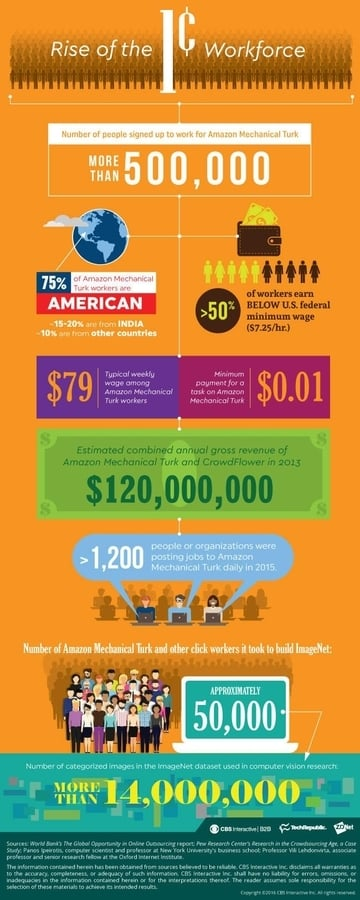
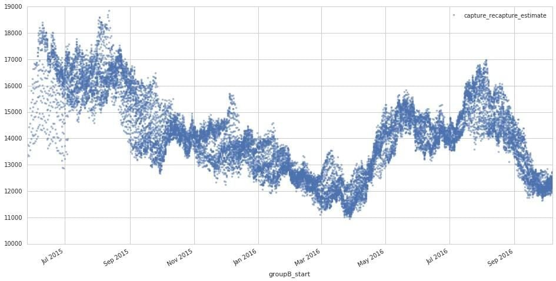
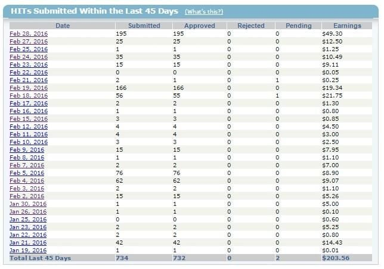

## Summary
Hope Reese and Nick Heath's 2016 TechRepublic feature presents [[AmazonMechanicalTurk]] as both infrastructure for [[DataAnnotationLabor]] and a labor market that transfers uncertainty and risk to globally distributed workers. Through worker testimony, platform statistics, and expert commentary, it connects low-paid task fragmentation, unpaid search and rejection risk, opaque qualification and requester systems, restricted payment methods, and exposure to traumatic content with the growing demand for labeled data and human-machine services. The account is a historical journalistic snapshot rather than a current audit of the platform, and most worker conditions are illustrated through a small number of interviews.

## Key Claims
- AMT turns larger jobs into Human Intelligence Tasks that requesters post and workers claim, including categorization, transcription, surveys, data cleaning, content moderation, and labeling examples for supervised machine learning.
- More than 500,000 people were reportedly registered, but the estimated active population was only 15,000–20,000 per month; a supplied chart shows the modeled active pool fluctuating roughly between 11,000 and 18,500 from mid-2015 to late 2016.
- Workers bear substantial unpaid and uncompensated time: they monitor unpredictable postings, evaluate requesters, load scripts, check statistics, and may complete work that a requester rejects without explanation.
- Pay and access were highly uneven. More than half of workers reportedly earned below the then-US federal minimum wage, one worker described $25 for eight hours as a good day, non-US location restrictions reduced opportunity, and only US and Indian workers could receive cash directly.
- Opaque platform governance amplified power asymmetry: Amazon did not disclose how it awarded the higher-access Masters status, requesters could rate workers while workers lacked a native reciprocal review mechanism, and worker support was limited largely to email.
- AI training and digital services depended on hidden human work. The article reports that nearly 50,000 people, many recruited through AMT, checked and labeled almost one billion candidate images while building [[ImageNet]].
- Content moderation and labeling could expose workers without warning to graphic violence, pornography, or child sexual abuse material; the article connects repeated exposure to physical strain, isolation, and vicarious traumatization while reporting very low per-item pay.
- Automation changed rather than simply eliminated the work: machines handled easier cases, people supplied labels or exceptions, and experts expected expanding applications to create continuing demand for context-specific human judgment.

## Key Quotes
> "I'm literally chained to my computer." — Kristy Milland on interrupting daily life to claim unpredictable batches

> "It's exploding underneath our noses." — Mary Gray on work sourced, managed, paid, and delivered through software

## Connections
- [[AmazonMechanicalTurk]] — platform whose marketplace rules, worker experience, and AI-training role anchor the article.
- [[PlatformMicrowork]] — task fragmentation, on-demand allocation, piece rates, and software-mediated control define the labor model.
- [[DataAnnotationLabor]] — workers label, check, sort, clean, and moderate the data and outputs used by machine-learning systems.
- [[ImageNet]] — large labeled-image dataset whose construction reportedly involved nearly 50,000 people recruited mainly through AMT.
- [[AugmentedIntelligence]] — the article predicts durable systems in which machines handle routine cases and people label, correct, or take over difficult ones.
- [[UnsupervisedLearning]] — proposed complement to human-led supervised learning, not evidence in this 2016 account that label demand had disappeared.
- [[WorkplaceAutomation]] — software decomposes, schedules, evaluates, and pays for work while also automating portions of the task stream.
- [[Turkopticon]] — worker-built response to missing requester transparency and reciprocal reputation.

## Contradictions
- The headline registration count exceeds 500,000, while the article's expert estimate places monthly active workers at only 15,000–20,000; registrations should not be read as simultaneous employment.
- The supplied active-population chart spans roughly July 2015 through October 2016 even though its caption describes an estimate from June to October 2016.
- Forecasts of continuing or growing human-in-the-loop demand conflict with a simple replacement narrative, but the article does not measure later net employment, hours, wages, task quality, or displacement as automation changes the mix of work.
- Worker testimony is detailed but not representative sampling. Pay figures, health effects, governance failures, and requester behavior vary by task, country, qualification, and dependence on the platform.
- Platform, dataset, and market figures are attributed historical estimates, often from third parties, and do not constitute a current independent audit of AMT or the global crowd-labor market.
