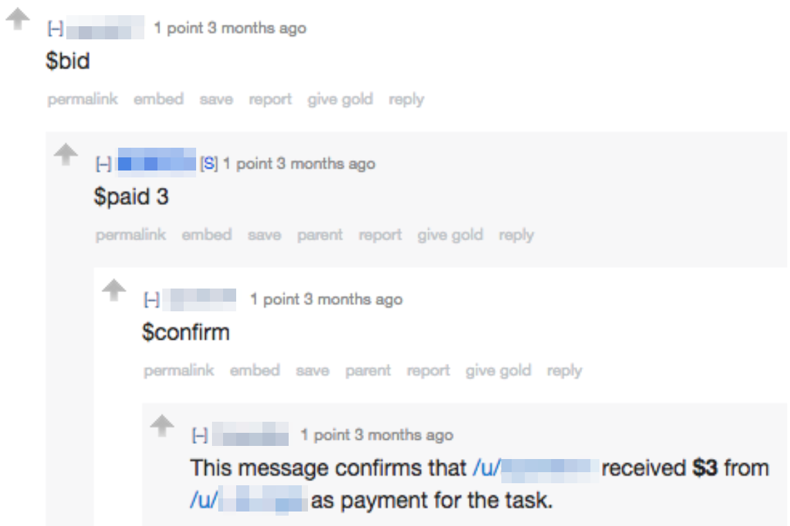
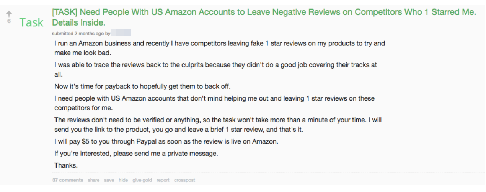
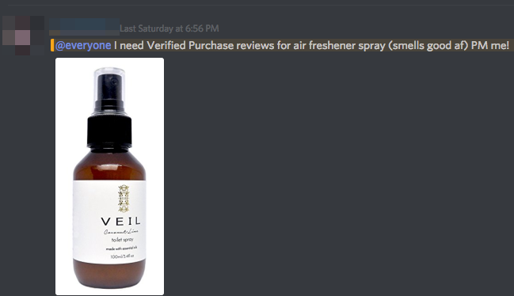
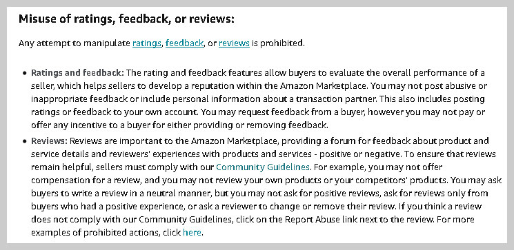
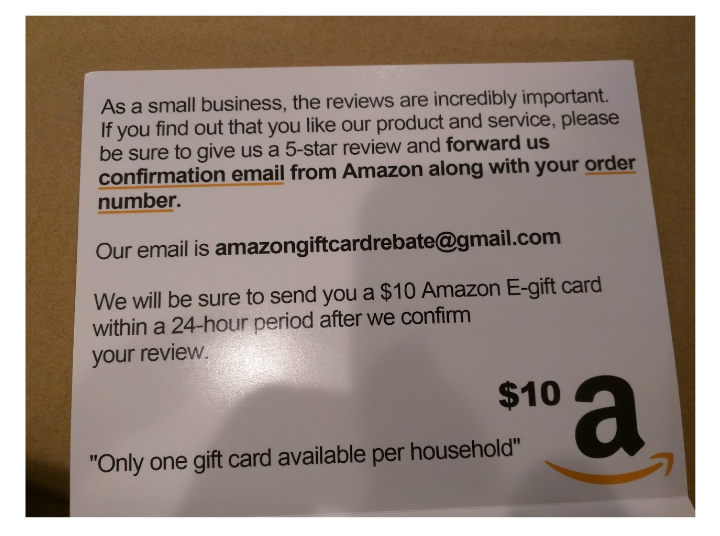
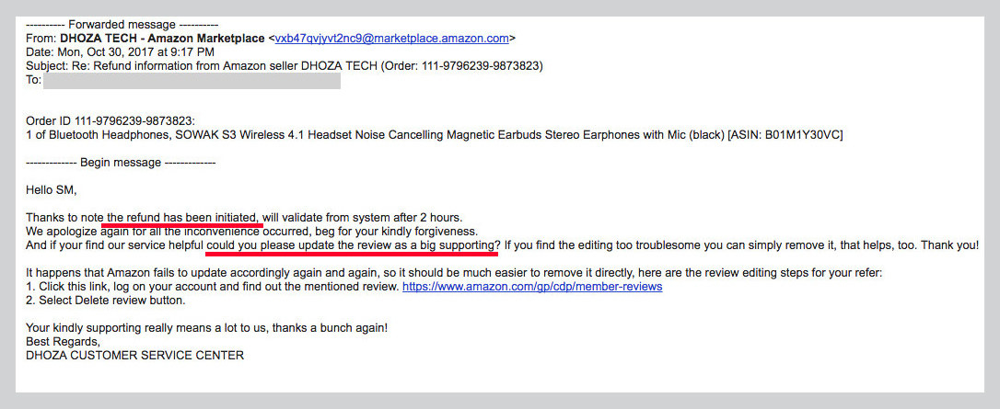

## Summary
[[NicoleNguyen]] reports that an organized market for paid Amazon reviews linked sellers, reviewers, recruiters, and moderators through Facebook groups, Reddit, Slack, Discord, PayPal refunds, commissions, and product resale. The system exploited familiar trust signals—including five-star ratings and verified-purchase badges—while exposing buyers to low-quality and sometimes health-related products and pressuring legitimate sellers to manipulate reviews or lose visibility. [[Amazon]] combined policy, lawsuits, investigators, account sanctions, and machine learning against the abuse, but the article argues that marketplace incentives and adaptive off-platform coordination kept enforcement incomplete.

## Key Claims
- Positive reviews strongly affect marketplace discovery and conversion, while relatively few ordinary customers leave them, creating a valuable manipulation target.
- After Amazon banned third-party incentivized reviews in 2016, sellers and reviewers shifted to less visible cash commissions, private groups, ordinary buyer accounts, and reimbursement after publication.
- Fraud networks could manufacture positive reviews for a seller or negative reviews for competitors; moderators and recruiters took a share while reviewers kept or resold the products.
- Paying with a reviewer's own card and meeting Amazon's purchase threshold could preserve the verified-purchase badge even when the seller later refunded the transaction off-platform.
- Manipulated reviews can harm consumers beyond disappointing purchases: the article traces implausible endorsements of boric-acid suppositories and prenatal-category supplements alongside medical warnings and reports of irritation.
- Review fraud creates a coercive market dynamic for sellers because ratings influence ranking and sales, yet Amazon also benefits from third-party marketplace volume, fulfillment, and seller-service revenue.
- Amazon's detection, weighting, policy, account enforcement, investigations, and lawsuits raise attacker cost but do not remove the economic incentive or the off-platform coordination network.

## Key Quotes
> "Amazon's ban didn't stop sellers from recruiting reviewers. It only drove the practice underground." - the article's account of adaptation after the 2016 policy change.

> "The fake reviews and sales are so intertwined now." - BedBand founder Jamie Whaley on manipulation becoming embedded in marketplace competition.

## Connections
- [[NicoleNguyen]] - BuzzFeed News reporter who documented reviewer recruitment, payment, evasion, consumer harm, seller pressure, and Amazon's response.
- [[Amazon]] - marketplace operator whose review, ranking, fulfillment, and seller systems form both the target of manipulation and the enforcement boundary.
- [[MarketplaceReviewFraud]] - coordinated manipulation system described by the article.
- [[MarketplaceTrust]] - ratings and verified-purchase badges are confidence mechanisms whose value depends on resistance to adversarial gaming.
- [[SocialProof]] - star ratings and review volume influence purchase choices but become misleading when purchased or coordinated.
- [[PlatformAbuseResponse]] - policies, detection, sanctions, lawsuits, and off-platform investigation used against adaptive abuse.
- [[CommunityReputationSystems]] - review histories reveal how reputation data can accumulate genuine experience or manufactured signals.

## Contradictions
- ReviewMeta labeled 9.1% of its 58.5-million-review dataset “unnatural,” while Amazon said reviews it identified as inauthentic were less than 1% in March. These figures measure different populations and detection systems, so they establish uncertainty rather than a directly comparable fraud rate.
- Amazon's claim that inauthentic reviews were a tiny share conflicts with the article's evidence of persistent organized recruitment, but the reporting does not provide a representative audit of all Amazon reviews or measure the prevalence of undetected fraud.
- The article is a May 2018 investigation. Named groups, policies, thresholds, market figures, listings, and enforcement capabilities are historical and should not be treated as current without later evidence.
