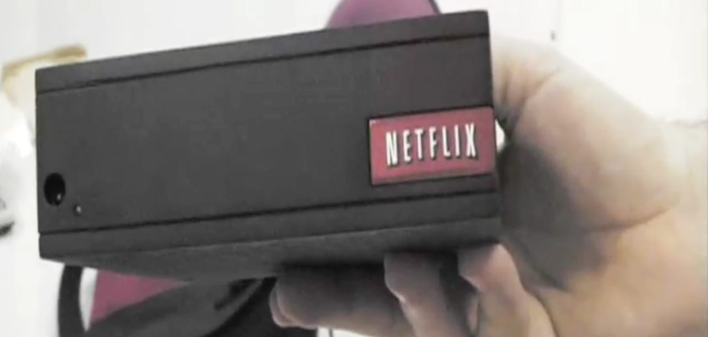
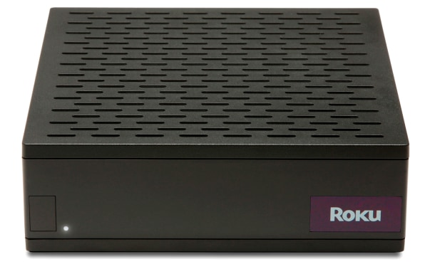

## Summary
This retrospective reconstructs [[ProjectGriffin]], Netflix's nearly launched 2007 streaming player, and [[ReedHastings]]' late decision to spin the team out as [[Roku]] rather than compete with prospective device partners. The case presents [[PlatformNeutrality]] as a deliberate strategic choice: Netflix gave up first-party hardware control so its service could spread across televisions, set-top boxes, game consoles, and other manufacturers' products. It also shows the organizational cost of reversing a project after validation testing, manufacturing preparation, pricing, advertising, and strong internal enthusiasm were already in place.

## Key Claims
- [[ProjectGriffin]] had progressed through engineering, design, and production validation, internal beta testing, pricing, marketing preparation, and Foxconn production work before cancellation.
- Hastings concluded that shipping Netflix-branded hardware would make Netflix a competitor to Apple, Sony, LG, Samsung, and other companies whose devices could distribute its streaming service.
- Netflix spun the player team out as [[Roku]], allowing the device effort to continue outside Netflix while Netflix pursued broad licensing and device integration.
- The decision required abandoning substantial sunk work and overriding strong internal momentum only weeks before the planned launch.
- [[AnthonyWood]], who led Griffin and later served as Roku CEO, retrospectively judged the spinout correct because it prevented recurring conflict between Netflix's service-licensing interests and its hardware interests.
- The article attributes Netflix's later ubiquity partly to remaining hardware-agnostic, but this is a retrospective strategic interpretation rather than a controlled counterfactual.

## Key Quotes
> "We could not be competing against Sony, LG, and Samsung." - Steve Swasey on the partner conflict Hastings sought to avoid.

> "At the end of the day, there is one decision maker." - Swasey on Hastings' responsibility for the reversal.

## Connections
- [[Netflix]] - developed Griffin but chose broad streaming distribution over owning the player hardware.
- [[ProjectGriffin]] - codename for the near-launch Netflix Player program.
- [[Roku]] - independent company that received the spun-out Griffin team and device work.
- [[ReedHastings]] - made the late decision to stop the Netflix-branded launch.
- [[AnthonyWood]] - led Griffin and later led Roku.
- [[PlatformNeutrality]] - strategic rationale for avoiding direct competition with distribution partners.
- [[SunkCostFallacy]] - the case shows a willingness to stop despite extensive unrecoverable investment when future incentives changed.
- [[AppleTV]] - example Hastings reportedly used when explaining why first-party hardware could block a desired partnership.

## Contradictions
- The article's claim that Netflix's hardware neutrality enabled later streaming dominance is plausible but retrospective. It does not isolate the decision from content licensing, broadband adoption, software execution, pricing, competition, or other causes.
- The account relies heavily on retrospective interviews, including anonymous senior sources, and does not include contemporaneous decision documents or dissenting hardware-partner evidence.
- The source presents the spinout as strategically correct but does not compare the foregone economics, differentiation, or bargaining power of launching the Netflix Player.

## Image Notes
- All six local images were opened. The Netflix Player prototype and later Roku player were retained because they directly show the product transition at the center of the article.
- A second prototype still was omitted as a duplicate. The Reed Hastings, sleeping-employee, and Foxconn stills were omitted because they illustrate the parody-video anecdotes already stated in the prose without adding material evidence.
