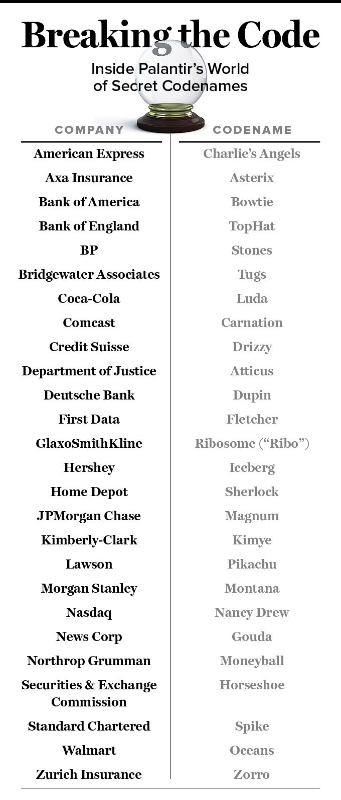

## Summary
William Alden's 2016 investigation portrays [[Palantir]] as a high-growth but unprofitable hybrid of proprietary software and intensive client service whose reported $1.7 billion in 2015 bookings produced $420 million in cash collections while spending exceeded $500 million. More than 1,000 internal emails and documents plus interviews describe expensive pilots, lost corporate clients, difficult implementations, an abandoned cyber-response team, and a consumer-goods data consortium that struggled to convert interest into durable value. The same evidence connects below-market cash pay, illiquid stock options, an annualized 20% departure rate through mid-April 2016, a blanket 20% raise for eligible employees, and the cancellation of annual performance reviews.

## Key Claims
- Palantir combined proprietary data-analysis software with on-site "forward deployed engineers," making the offering a hybrid software-and-consulting model rather than a low-touch product.
- The company reported $1.7 billion in 2015 bookings but collected $420 million in cash, because bookings included trials, long commitments, discretionary bonuses, and other complex terms that might not convert quickly or fully.
- Coca-Cola, American Express, and Nasdaq ended or declined major engagements amid concerns about price, sustained value, executive support, hardware constraints, or difficult working relationships; Kimberly-Clark and Hershey also expressed reservations while continuing some work.
- BP's reported ten-year memorandum worth $1.2 billion showed that the same bespoke model could produce unusually large commitments, although the article could not determine its 2015 cash contribution.
- More than 100 employees left through April 15, 2016, producing a reported 5.8% year-to-date and 20% annualized departure rate, compared with 13.6% in 2015, 12.2% in 2014, and 9.2% in 2013.
- Compensation relied heavily on stock options while salaries were generally capped below the market described by the source; employee liquidity concerns contributed to the context for [[AlexKarp]]'s broad raise and review-system reset.
- Palantir's secrecy included customer codenames, but the retained visual shows those aliases covered a broad corporate and government portfolio rather than only intelligence work.

## Key Quotes
> “There’s definitely been a little bit of a shift from bookings to cash.” - financial operations analyst Brian Campbell on changing investor attention.

> “We struggled from day 1 to make Palantir a sticky product for users and generate wins.” - an internal assessment of the American Express engagement.

> “We’re looking to do transformational work with our customers.” - chief of staff Gavin Hood on Palantir's desired relationship with clients.

## Connections
- [[Palantir]] - company investigated through internal financial, customer, project, and staffing records.
- [[AlexKarp]] - cofounder and CEO who announced the compensation and performance-review changes.
- [[PeterThiel]] - Palantir cofounder and an early architect of the company.
- [[EnterpriseIntegrationBusinessModel]] - Palantir paired software with embedded engineers and responsibility for client-specific outcomes.
- [[BookingsToCashConversion]] - the article's central financial warning is that announced bookings were not equivalent to collected cash.
- [[EmployeeEquityRisk]] - below-market salary, stock-option dependence, limited liquidity, and uncertain operating outcomes concentrated employee risk.
- [[CustomerSuccess]] - the lost and hesitant accounts show that deployment effort and executive sponsorship do not guarantee durable user value.

## Contradictions
- The investigation challenges any simple reading of rapid hiring, rising collections, a $20 billion valuation, or large bookings as proof of a durable enterprise-software business; each measure coexisted with losses, client exits, and uncertain conversion to cash.
- Palantir disputed the implication of broad customer weakness by emphasizing multi-year relationships, continued headcount growth, ongoing work with consumer-goods clients, and the possibility of immediate profitability if it stopped investing for growth.
- The report is a May 2016 snapshot based partly on anonymous sources and leaked internal material. It does not audit Palantir's accounts, establish the later outcome of the cited deals, or show that every departure, failed pilot, or client objection had the same cause.

## Image Notes
- Retained the client-codename table because it records relationships not fully enumerated in the prose, including Bank of America/Bowtie, Bank of England/TopHat, Comcast/Carnation, Department of Justice/Atticus, GlaxoSmithKline/Ribosome, JPMorgan Chase/Magnum, Northrop Grumman/Moneyball, SEC/Horseshoe, Standard Chartered/Spike, and Zurich Insurance/Zorro.
- Omitted two near-duplicate Palantir office/logo photographs and portraits of Alex Karp and Peter Thiel because they add no material evidence beyond identification already supplied by captions and prose.
