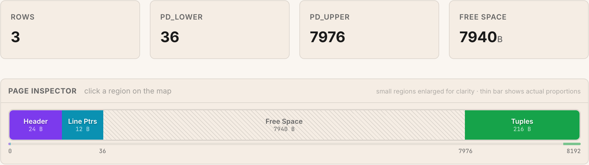

## Summary
This article uses PostgreSQL's `pageinspect` extension to connect the database's default 8,192-byte I/O unit to its internal slotted-page layout. A heap page combines a 24-byte header, fixed-size line pointers growing from the front, tuples growing from the back, and free space between them; the inspected diagram makes the direction and measured regions explicit. The walkthrough also links that layout to WAL recovery, optional checksums, page-level pruning, stable tuple addresses, HOT updates, capacity estimation, and index-specific special space.

## Key Claims
- [[PostgreSQL]] normally reads and writes data in 8KB pages, so page size mediates metadata overhead, row density, and I/O amplification.
- [[PostgreSQLPageArchitecture]] uses a slotted layout: the header records page state, line pointers grow upward from `pd_lower`, tuple data grows downward from `pd_upper`, and the gap is reusable free space.
- A line pointer gives a tuple a stable `(page, slot)` `ctid`, allowing within-page tuple movement and HOT redirection without requiring an index entry to track the tuple's current byte offset.
- `pd_lsn` coordinates a page with WAL replay, optional `pd_checksum` detects some disk corruption, and `pd_prune_xid` helps readers decide when dead tuples can be pruned locally.
- Page capacity depends on the 24-byte page header plus per-row line-pointer, tuple-header, padding, and payload costs; the example fits 119 variable-width tuples on one page rather than the rough estimate of 107.
- Heap pages use no special space in the example, while a B-tree leaf page reserves 16 bytes at the end for index metadata such as page links, level, and flags.
- PostgreSQL supports non-default compile-time block sizes, but changing the default is a workload-specific rebuild decision rather than routine tuning.

## Key Quotes
> "The 8KB page is THE atomic unit of I/O." - the article's organizing premise.

> "Free space is the gap between them." - the central spatial rule of the slotted layout.

## Connections
- [[PostgreSQL]] - database whose heap and B-tree pages are inspected.
- [[PostgreSQLPageArchitecture]] - synthesis of the page regions, growth directions, stable indirection, and lifecycle metadata.
- [[DatabaseEngineeringTradeoffs]] - page size balances metadata overhead against wasted space and amplified I/O.
- [[StoragePerformanceBenchmarking]] - `pageinspect`, `pg_column_size()`, catalog estimates, and measured tuple counts expose physical storage behavior.
- [[BackupAndRecovery]] - page LSNs and checksums support recovery coordination and corruption detection, respectively.
- [[Oracle]] - comparison point whose default database block size is also 8KB but is configured differently.

## Contradictions
- The article overstates `pd_lsn` as the single field that makes crash recovery work. It is one coordination mechanism within WAL logging, replay rules, full-page images, durability ordering, and recovery control.
- The explanation of index-only scans conflates the heap page's `PD_ALL_VISIBLE` flag with the visibility map consulted by an index-only scan. The concepts are related, but the executor does not skip the heap merely by reading this page-header bit.
- The hardware-alignment rationale and page-capacity results are explanatory examples, not evidence that 8KB is optimal for every current device, filesystem, schema, or workload.
- The production checksum recommendation is operational advice from one practitioner article; enabling checksums requires version- and deployment-specific planning beyond the example.
