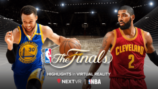
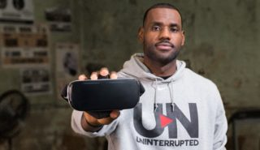
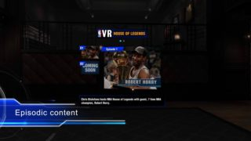
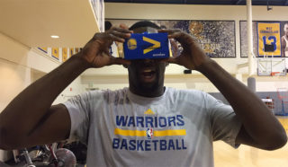
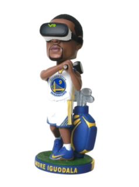

## Summary
Manouk Akopyan describes how the [[NBA]] moved in 2016–2017 from isolated virtual-reality experiments to a scheduled production partnership with [[NextVR]], treating live games as the core of a broader [[VirtualRealitySports]] strategy that also included highlights, storytelling, promotion, referee training, and exploratory esports work. [[JeffMarsilio]] presents VR as an additive third viewing option with international reach, while modest engagement, immature hardware adoption, production limitations, and skepticism from Charles Barkley and Mark Cuban keep the article's near-term optimism qualified.

## Key Claims
- The NBA's multi-year NextVR partnership replaced one-off experiments with a recurring schedule intended to improve production through repeated broadcasts: 25 games were planned, all 30 teams were to appear at least once, and League Pass offered one live VR game per week.
- The Finals package used on-demand virtual-reality highlights to approximate a courtside perspective for fans who could not attend, positioning immersion as an additional medium rather than a near-term replacement for television or mobile.
- International access was central because fewer than one percent of the league's reported 155 million core fans attended games in arenas; the VR service expanded globally outside China, although Marsilio said audience numbers remained modest relative to conventional digital video.
- The league evaluated session duration, enjoyment, social reaction, and game-by-game production learning while reserving larger technical changes for the offseason, rather than treating raw reach as the only success measure.
- The broader portfolio included Oculus 360 video and documentaries, House of Legends storytelling, VR referee training, prospective spatial movement, and exploratory links with the NBA 2K esports audience.
- Teams and players also used VR as marketing: the Warriors used it in Kevin Durant recruiting and gave away cardboard viewers and a VR-themed Andre Iguodala bobblehead, while LeBron James and the Cavaliers participated in branded films and experiences.
- Adoption remained uncertain because a headset experience was hard to demonstrate without hardware, live-camera quality was contested, and prominent basketball figures rejected the value proposition.

## Key Quotes
> "It’ll just be another way people can experience the game." - Marsilio on VR as an additive viewing option.

> "The numbers are modest compared with what you would see with traditional, 2D digital content." - Marsilio on the gap between enthusiasm and contemporary audience scale.

## Connections
- [[NBA]] - league moving from experimental VR productions to a recurring live-game and content portfolio.
- [[NextVR]] - production and distribution partner for weekly live games and Finals highlights.
- [[JeffMarsilio]] - NBA digital-media executive explaining the commitment, metrics, and adoption thesis.
- [[VirtualRealitySports]] - immersive-media strategy connecting access, production learning, storytelling, promotion, and interactive potential.

## Contradictions
- Marsilio expected every game eventually to be produced in VR and anticipated a fairly near future for the medium, while Mark Cuban argued that the front-row proposition did not work and that cameras were years from supporting meaningful live programming; the source does not resolve the disagreement with later adoption data.
- Positive social response and long engagement were emphasized, but the article reports no audience counts, retention, revenue, comparative viewing quality, production cost, or measured international impact, and acknowledges that reach was modest beside two-dimensional content.
- The account is a 2017 strategy snapshot. Its plans for spatial movement, NBA 2K integration, universal game production, and headset-driven tipping-point adoption are forecasts or explorations rather than demonstrated outcomes.
