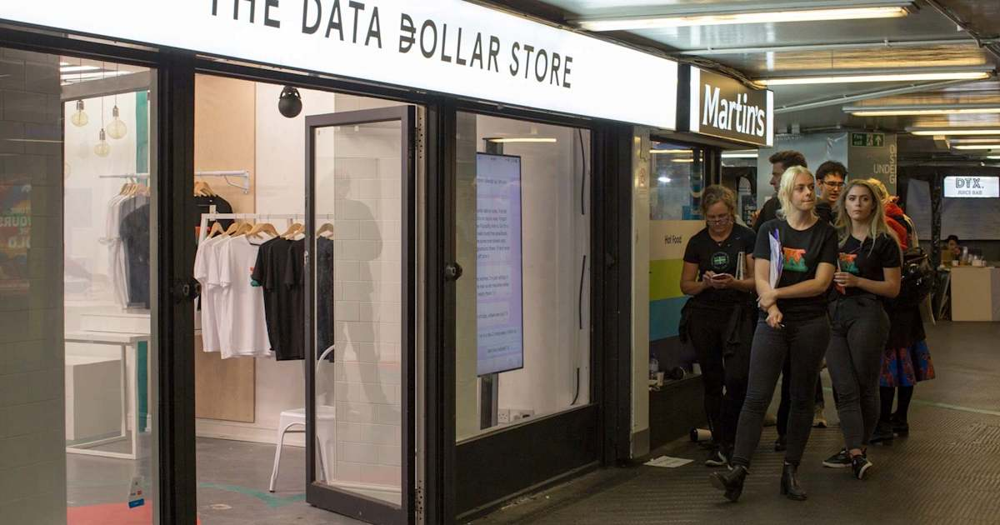

## Summary
[[NickSummers]] reports from [[DataDollarStore]], a one-week London pop-up created by [[KasperskyLab]] with street artist [[BenEine]] to make the economic and emotional value of personal data tangible. Goods could be acquired only by surrendering phone photos or message screenshots, with more exclusive merchandise requiring less shopper control over which data staff selected. Shoppers' hesitation and Summers's own retreat to the least intrusive purchase show that an explicit exchange can expose privacy sensitivity that routine online collection leaves abstract, but the stunt does not establish a market price for personal data or a viable compensation system.

## Key Claims
- [[DataDollarStore]] translated hidden [[DataMonetization]] into an explicit barter: mugs, shirts, and prints were priced in photos, messages, or access to a phone rather than money.
- The exchange used a graded privacy cost: a mug allowed selected material, a shirt required recent material, and a print let staff choose from the phone, reducing the shopper's control as the merchandise became more exclusive.
- Visible, immediate surrender made shoppers inspect their devices and recognize photos and conversations as sensitive even though comparable behavioral information is routinely collected online.
- Summers chose the least intrusive option and avoided images of identifiable people, providing a first-person example of how an explicit exchange can change privacy behavior.
- [[BenEine]] argued that people should understand the value of information and receive some benefit when others use it.
- The store was an awareness campaign, not a forecast, valuation study, representative behavior experiment, or operational market for personal data.

## Key Quotes
> "This is stuff we give away freely all the time." - Eine on the contrast between routine disclosure and an explicit exchange.

> "Information has value, and we should know what that value is." - Eine on the campaign's intended lesson.

## Connections
- [[NickSummers]] - Engadget reporter who visited the store and completed its least intrusive exchange.
- [[DataDollarStore]] - Kaspersky Lab pop-up that made personal data the only accepted currency.
- [[KasperskyLab]] - cybersecurity company that staged the awareness campaign.
- [[BenEine]] - street artist who supplied the merchandise and articulated the user-compensation argument.
- [[DataMonetization]] - the stunt made normally indirect economic value visible through a physical exchange.
- [[WebAdEconomics]] - routine tracking and targeted advertising provide the implicit online exchange the store sought to dramatize.
- [[PrivacyPovertyDivide]] - qualifies any claim that visible acceptance or continued service use proves privacy indifference or unconstrained consent.

## Contradictions
- No direct contradiction was found. The observed hesitation supports the existing qualification in [[PrivacyPovertyDivide]] that disclosure does not by itself prove indifference, while the voluntary promotional setting differs materially from disclosure required for essential services.
- The merchandise tiers created memorable exchange rates but do not contradict the use-case view in [[DataMonetization]]: they were campaign choices, not evidence of stable individual or market prices for photos, conversations, behavioral profiles, or inferred data.

## Image Notes
Both images were opened and inspected. The storefront photograph was retained because it establishes the physical retail setting and visible shopper queue central to the campaign's explicit-exchange design. The portrait of [[BenEine]] was omitted as illustrative because it added no material information beyond his identity and quoted role.
