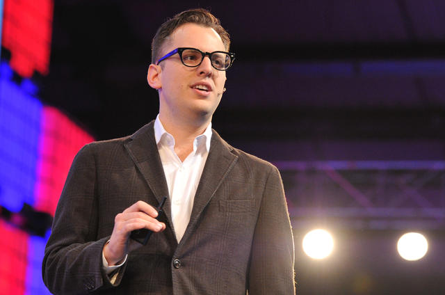

## Summary
[[FirstRoundReview]] interviews [[MikeKrieger]] about [[Instagram]]'s engineering organization growing from six generalist developers at its 2012 acquisition to more than 300 engineers. Krieger describes [[EngineeringOrganizationEvolution]] as a sequence: hire pragmatic, curious generalists; add specialists and management behavior before overload becomes visible; use platform teams to establish technical standards and culture; then move to product teams when functional allocation blocks shared goals. The account is a retrospective from one unusually successful company with Facebook recruiting and management support, so its stages and thresholds are useful signals rather than universal rules.

## Key Claims
- Early engineering teams benefit from generalists who will cross disciplines, follow necessary task chains, and stop when a sufficient existing solution protects scarce product-building time.
- Curiosity, pragmatic work trials, nuanced tradeoffs among completeness, polish, and timing, and alignment with a short list of company goals are stronger early-stage signals than narrow pedigree or stack specialization.
- Hiring a diverse team early is path-dependent: visible representation and repeated public commitment can improve later recruiting, while an established monoculture raises the barrier for first underrepresented hires.
- Specialization becomes useful when platform limits, new-market performance, or codebase scale exceed generalist capacity; standards then ease onboarding, while end-to-end knowledge remains valuable across boundaries.
- Manager behavior such as one-on-ones should precede formal hierarchy, and a founder's inability to perform both technical and people work is a lagging signal that dedicated management is already needed.
- Internal management candidates need interest, mentoring, recurring fit checks, and an off-ramp; external candidates need relevant scaling experience, enthusiasm for hands-on building, and candid partnership with the learning founder and affected team.
- Platform teams can form engineering standards and quality identity, but persistent cross-platform staffing conflict signals a move toward product teams with shared goals and broader prioritization context; Krieger says Instagram's switch near 150 engineers came too late.

## Key Quotes
> "You want to have manager behavior on the team even before you have formal management." - Krieger on beginning one-on-ones and people leadership before creating management layers.

> "People often see the stage where you’re organized by platform as a necessary evil on the way to product teams. I think it's actually when you form your engineering culture." - Krieger on the value of the intermediate platform stage.

## Connections
- [[MikeKrieger]] - interview subject reflecting on his transition from first-time manager to leader of a multi-layer engineering organization.
- [[Instagram]] - company case for generalist hiring, specialization, management layers, platform teams, and product teams.
- [[FirstRoundReview]] - publisher translating the retrospective into stage-specific operating advice.
- [[EngineeringOrganizationEvolution]] - synthesis of the source's generalist, specialist, management, platform, and product-team transitions.
- [[InclusiveHiring]] - early representation and visible commitment are presented as path-dependent recruiting conditions.
- [[ManagementRoleFit]] - new managers need interest, mentoring, recurring check-ins, and a credible route back to individual contribution.
- [[TeamBasedOrganizationalDesign]] - product teams replace cross-platform resource allocation when functional boundaries obstruct shared outcomes.

## Contradictions
- No direct contradiction was found. The source qualifies flat-organization enthusiasm by separating unnecessary hierarchy from management behavior that should start early, and it qualifies specialization by preserving the leverage of end-to-end generalists.
- The account is retrospective practitioner evidence from Instagram under exceptional growth, brand strength, Facebook recruiting access, coaching, and experienced-manager support. It supplies no comparative delivery, quality, retention, diversity, or employee-sentiment data, and the reported transition near 150 engineers is an admitted late move rather than a validated threshold.
- The sole local image was opened and retained as an identity and event-context photograph. It adds no independent evidence for the organizational claims.
