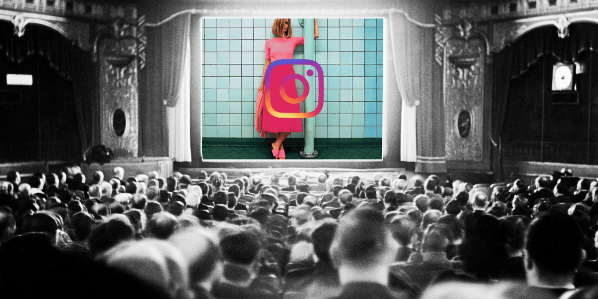

## Summary
This 2018 essay argues that [[Instagram]] Stories shifted the pressure of social media from maintaining a polished permanent feed toward continuously performing an interesting life for a visible audience. Ephemerality and the absence of public like counts reduce some reputational risk, but the private viewer list supplies a different validation loop that can shape holidays, nights out, dating, memory, and offline behavior. The article combines reported platform figures, secondary research, expert interpretation, and a few interviews, so its account of [[PerformativeSelfPresentation]] is illustrative rather than causal or representative.

The retained editorial illustration places an Instagram image on a cinema screen before a large audience, visually reinforcing the article's framing of ordinary life as staged public performance without adding independent behavioral evidence.

## Key Claims
- Instagram launched Stories in 2016 as a response to [[Snapchat]] and reportedly reached 400 million daily users by June 2018, but the source does not provide the underlying platform data.
- A 24-hour lifespan and no public like count can lower archive and public-judgment pressure without removing audience awareness.
- The private viewer list turns attention into personalized feedback, encouraging users to monitor who watched and to keep supplying material.
- Low-friction sequential posting can make holidays, nights out, meals, exercise, and dating feel like material for an ongoing personal broadcast.
- Interviewees describe staging scenes, exaggerating enjoyment, and maintaining an attractive personal brand for friends or romantic interests.
- [[PamelaRutledge]] interprets self-presentation as a mixture of aspiration, validation, and acceptance; she warns that it becomes harmful when it displaces other goals or determines self-worth.
- Stories can also preserve edited positive memories, so recording is not inherently harmful even when the remembered artifact differs from the lived event.
- The article cites broader Instagram mental-health concerns but acknowledges that Stories had not been studied separately enough to establish its psychological effects.

## Key Quotes
> "I went to Greece and found myself putting on this act as if I was on a reality show." - Katie on holiday performance

> "If capturing an event allows people to revisit positive emotions and memories, then it is serving an important purpose." - [[PamelaRutledge]]

## Connections
- [[Instagram]] - platform and Stories feature at the center of the account.
- [[Snapchat]] - originator of the ephemeral Stories format that Instagram copied.
- [[PerformativeSelfPresentation]] - synthesis of how imagined audiences and viewer feedback reshape offline behavior.
- [[SocialDriverHierarchy]] - views and visible attention can turn contribution into recognition and status motivation.
- [[HereAndNowMedia]] - ephemerality creates immediacy but can also intensify continuous documentation and performance.
- [[DepressionAndSocialMedia]] - the source reports broader mental-health concern while preserving the absence of Stories-specific causal evidence.

## Contradictions
- Earlier sources describe ephemerality as lowering the cost of temporary or mundane expression. This article does not negate that mechanism, but shows that audience visibility and repeated posting can replace archive pressure with performance, monitoring, and continuity pressure.
- The article's anecdotes and quoted survey indicate deceptive or staged presentation, but they do not establish prevalence across Instagram users or show that Stories caused the behavior.
- The cited 2017 mental-health ranking concerns Instagram as a whole, while the article explicitly says Stories-specific psychological effects were not yet adequately studied.

## Image Notes
The sole local GIF was opened and retained under a descriptive canonical filename. It is an editorial illustration of an Instagram post projected before a theater audience; it supports the source's performance-and-audience framing but supplies no independent measurement.
