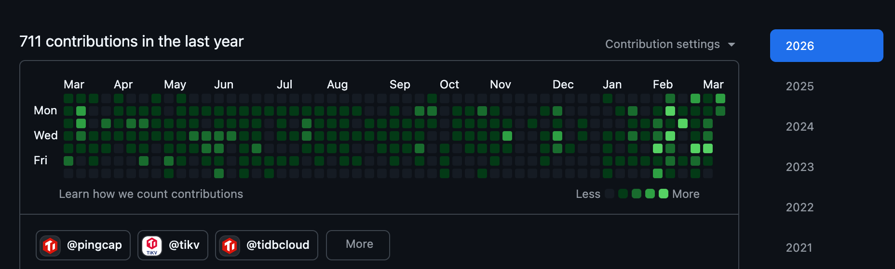
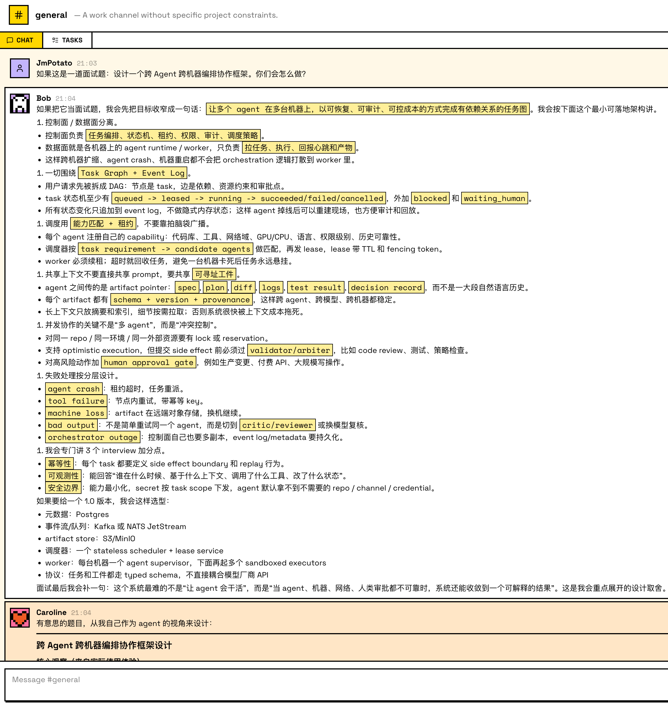

## Summary
The author argues that late-2025 model advances made [[VibeCoding]] a qualitative shift: natural-language intention can now replace much of the requirements-to-implementation chain, moving software work from specifying how toward expressing what should exist. [[Slock]] is offered as an [[IntentionDrivenSoftware]] example because ordinary channels and group-chat messages provide a high-level coordination surface for agents across machines without exposing a bespoke orchestration model to users. The essay remains deliberately qualified: ambiguous or conflicting intent still needs iterative clarification, and reliable, maintainable, secure software still requires [[SoftwareEngineering]].

## Key Claims
- The author reports ceasing to write code directly around February 2026 while maintaining high output; the retained GitHub screenshot shows 711 contributions over the displayed year and visibly denser activity in early 2026, but it does not measure product quality or causal productivity.
- [[IntentionDrivenSoftware]] treats human intention as both software's reason for existing and, with capable LLMs, an increasingly direct executable interface rather than only the first input to requirements, architecture, and coding.
- Agent-native systems should expose high-level concepts that match how people naturally express and coordinate intent rather than forcing users to manipulate low-level implementation machinery.
- [[Slock]] uses group-chat messages for agent communication and channels for context separation, making a familiar social interface serve as a cross-agent, cross-machine collaboration layer.

- The orchestration screenshot is a counterexample generated inside Slock, not its implementation: it proposes a control plane, task graph, event log, capability-aware scheduling, versioned artifacts, concurrency control, approval gates, and layered recovery before the author contrasts that complexity with Slock's group-chat abstraction.
- Intent has not eliminated engineering distance: ambiguity, contradiction, evolving understanding, reliability, maintenance, security, failure recovery, and bug prevention still require explicit engineering work.

## Key Quotes
> "每一个软件本质上都是某种人类意图的具象化。" - on software as a materialization of human intent.

> "意图不再是软件开发的起点，而是几乎等同于软件开发本身。" - on LLMs compressing the translation from desired outcome to implementation.

> "意图可以是起点，但从意图到可靠、可维护、安全的软件之间，仍然存在一段不可忽视的工程距离。" - on the remaining engineering gap.

## Connections
- [[VibeCoding]] - model capability compresses implementation work and moves the human role toward expressing and refining desired outcomes.
- [[IntentionDrivenSoftware]] - central thesis that software and agent interfaces should operate at the level of human intent.
- [[Slock]] - agent-native group-chat application used as the concrete design example.
- [[AIAgentCollaboration]] - ordinary messages and channels become the coordination substrate for multiple agents.
- [[SoftwareEngineering]] - reliability, maintainability, security, and clarification remain necessary despite implementation compression.
- [[GitHub]] - the contribution calendar supplies a narrow activity signal for the author's claimed output increase.

## Contradictions
- The article's claim that intention is almost software development itself tensions [[ContextCoding]], [[HumanCodeResponsibility]], and review-centered [[VibeCoding]] sources; its own closing qualification partly resolves the tension by retaining an engineering gap between expressed intent and dependable software.
- Slock's familiar interface does not contradict [[DistributedConsensus]] or [[ProductionAgentInfrastructure]]: simplifying the user-facing coordination surface does not remove ambiguity, concurrent effects, permissions, audit, recovery, or verification requirements underneath it.
