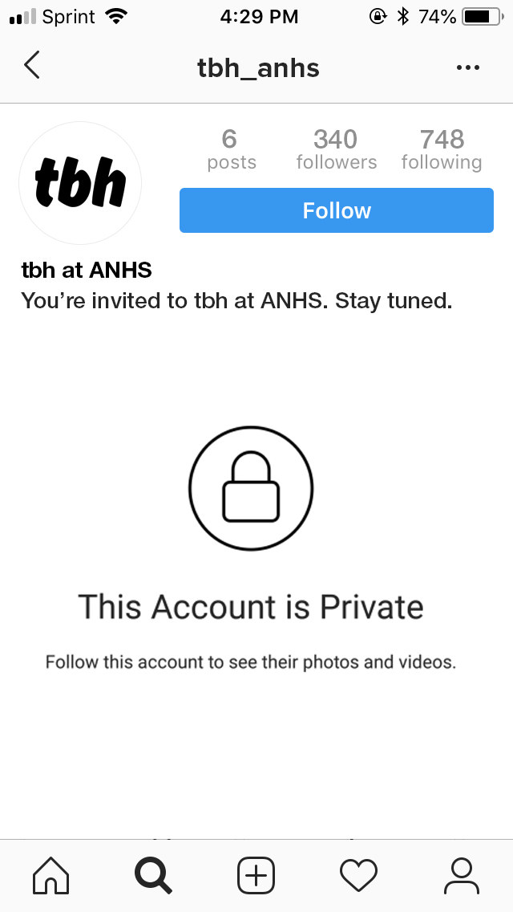
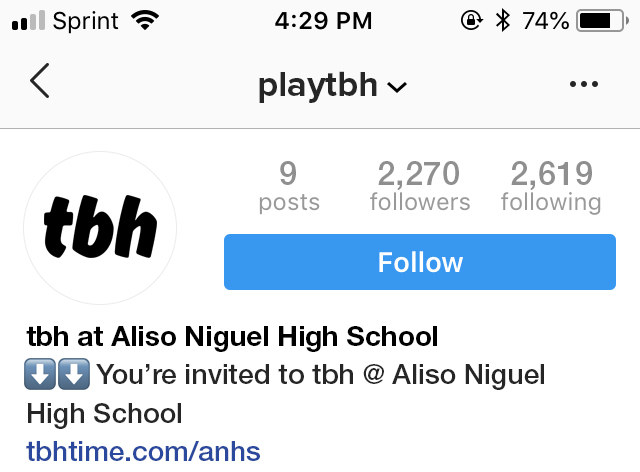

## Summary
[[RyanMac]] reports that an internal memo shared after [[Facebook]] acquired [[TBH]] documented a reproducible, school-by-school launch method for social apps. TBH used school identifiers on [[Instagram]], private invitation accounts, curiosity, delayed acceptance, and a coordinated after-school reveal to concentrate adoption inside an existing community rather than scatter early users. The memo suggests analogous Facebook product tactics, but Facebook declined to say whether it used them, and the article does not establish retention, safety, consent, or causal growth outcomes.

## Key Claims
- TBH's founders argued that broad press launches can fragment a social product's first users across communities, leaving too few friends together for the product to demonstrate its value and exhausting audience attention before later iterations.
- The team instead sought a reproducible process for penetrating individual high schools simultaneously while it tested different products before [[ProductMarketFit]].
- TBH reportedly crawled school location pages and public bios for school names, then used a separate private Instagram account for each target school to follow likely students.

- A mysterious invitation in the private profile's bio encouraged curious students to request access; TBH held those requests for about 24 hours rather than accepting them individually.
- At roughly 4 p.m., described in the memo as the “Golden Launch Hour,” TBH added its App Store URL and made the profile public, causing many acceptance notifications and profile visits at once.

- The method joined audience identification, curiosity, notification timing, and dense peer relationships into a [[SynchronizedCommunityLaunch]] intended to create immediate local critical mass.
- The memo proposed a Facebook analogue: collect push-notification permission first, then alert interested users simultaneously instead of sending each person directly to a download.
- TBH said it repeated and automated launches while iterating products, including submitting substantially different experiences as updates to an existing app binary to avoid slower review of new submissions.

## Key Quotes
> “Our team obsessed with finding ways to get individual high schools to adopt a product simultaneously.” - the memo's community-level launch objective.

> “The purpose of sharing these tactics is to provide guidance for developing products at Facebook” - TBH's stated reason for documenting the process.

## Connections
- [[TBH]] - acquired polling app whose founders documented and shared the school-by-school launch method.
- [[Facebook]] - acquirer and intended audience for the internal product-development guidance.
- [[Instagram]] - identification, invitation, notification, and link surface used in the reported workflow.
- [[GrowthHacking]] - the tactic combines behavioral timing, platform mechanics, automation, and bounded-community distribution.
- [[SynchronizedCommunityLaunch]] - concentrates attention and adoption inside an existing social group at a chosen time.
- [[ProductMarketFit]] - TBH framed repeated community launches as a way to test products before exhausting the wider audience.
- [[PlatformDistributionDependence]] - the method relied on Instagram profile states, follow requests, notifications, and Apple review behavior that TBH did not control.

## Contradictions
- The memo's claim that the tactic did not violate Instagram's terms is the founders' historical interpretation, not an independent policy or privacy review; its account discovery, identity presentation, and targeting of minors create ethical questions beyond formal compliance.
- The source reports that TBH had 2.5 million daily users and describes the launch mechanism, but gives no launch-level conversion, cohort retention, failed-school comparison, automation error, or evidence that the tactic caused durable adoption.
- The memo gave Facebook access to the method and proposed analogous tactics, but Facebook declined to comment; the article does not show that Facebook implemented them.
- The two repeated hero photographs were opened and omitted as duplicate illustrative artwork. The two retained screenshots directly document the private invitation state and the later public profile with a download link.
