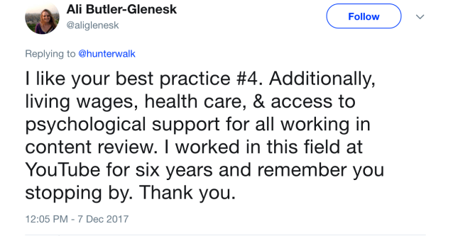

## Summary
[[HunterWalk]] describes large-platform [[ContentModerationOperations]] as a joint policy, algorithm, queueing, and labor system rather than a technology-only classifier. Content moves among fluid green, yellow, and red risk states as signals accumulate; management chooses thresholds and priorities; and trained reviewers handle routed cases, supply training judgments, and escalate ambiguity. The account also argues that safety must be managed as an executive metric and absolute harm count, while the retained response from a former YouTube reviewer adds living wages, health care, and psychological support to the operating requirements.

## Key Claims
- Content moderation governs user-created text, images, audio, and video against community standards or terms of service; advertising and editorial selection commonly have separate rules and teams.
- Universal human pre-publication review is impractical and undesirable at large scale, so algorithms initially score limited account, origin, content, and metadata signals, then revise their assessment as consumption, sharing, and user-flag evidence accumulates.
- Green, yellow, and red are fluid risk buckets rather than objective truths: false positives and false negatives remain, while management sets the thresholds, default trust posture, and human-review priorities.
- Review queues are segmented by urgency and reviewer capability such as language or content specialization; queue inflow depends on content volume and algorithmic thresholds, while review speed depends on staffing, training, quality, and tooling.
- Adding reviewers can expand how much content crosses the review threshold, shorten response time for the same workload, or do both, so reviewer headcount alone does not identify the operating change.
- Safety performance reflects governance and incentives as well as model quality: cost-center treatment, rotating junior ownership, limited leadership diversity, and weak executive attention can understate harm.
- Management should track absolute harmful-content counts, prevent repeat infringement, spend time in review queues, and consider response-time accountability; reviewers also need living wages, health care, and psychological support.

## Key Quotes
> "It’s really a policy question decided by people and enforced at the code level." - Walk on why moderation quality cannot be reduced to classifier performance.

> "Response times are the new regulatory framework" - Walk's tentative proposal to regulate the handling of flags rather than directly defining platform content.

## Connections
- [[HunterWalk]] - author drawing on earlier YouTube product-leadership experience while disclaiming current operational authority.
- [[ContentModerationOperations]] - the policy, classification, queueing, staffing, and reviewer-care system described by the article.
- [[YouTube]] - primary historical operating context for Walk's account and Butler-Glenesk's reviewer-care response.
- [[PlatformAbuseResponse]] - moderation thresholds and queues turn platform safety policy into operational response.
- [[DataAnnotationLabor]] - reviewers supply judgments that can become algorithm training examples as well as direct enforcement decisions.
- [[LivestreamingModeration]] - real-time content is a higher-urgency specialization within the broader moderation system.
- [[ContingentWorkforce]] - later wiki evidence qualifies the labor model by documenting contract moderation and divided organizational responsibility.

## Contradictions
- No direct contradiction was found. The source supplies the operating architecture missing from broader abuse-response pages, while later contractor evidence adds employment-structure detail that this article does not address.
- Walk explicitly says his YouTube experience ended almost five years earlier and that the article should not be treated as a definitive account of then-current operations; it is a practitioner model, not an audited description of Facebook, Twitter, or YouTube.
- The green/yellow/red taxonomy is explanatory rather than a disclosed production schema, and the article provides no thresholds, accuracy measures, queue volumes, response-time distributions, appeal outcomes, reviewer error rates, or evidence for the proposed regulatory approach.
- The two thumbs-up/thumbs-down JPEGs are duplicate decorative illustrations and were omitted. The retained screenshot is a first-person worker-care recommendation rather than representative evidence about reviewer conditions or intervention outcomes.
