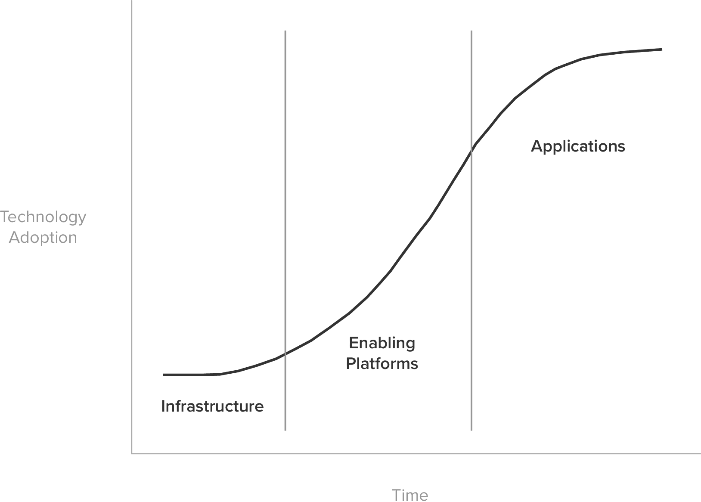
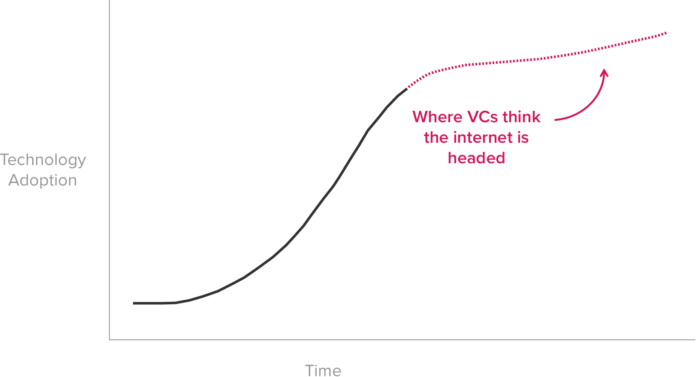
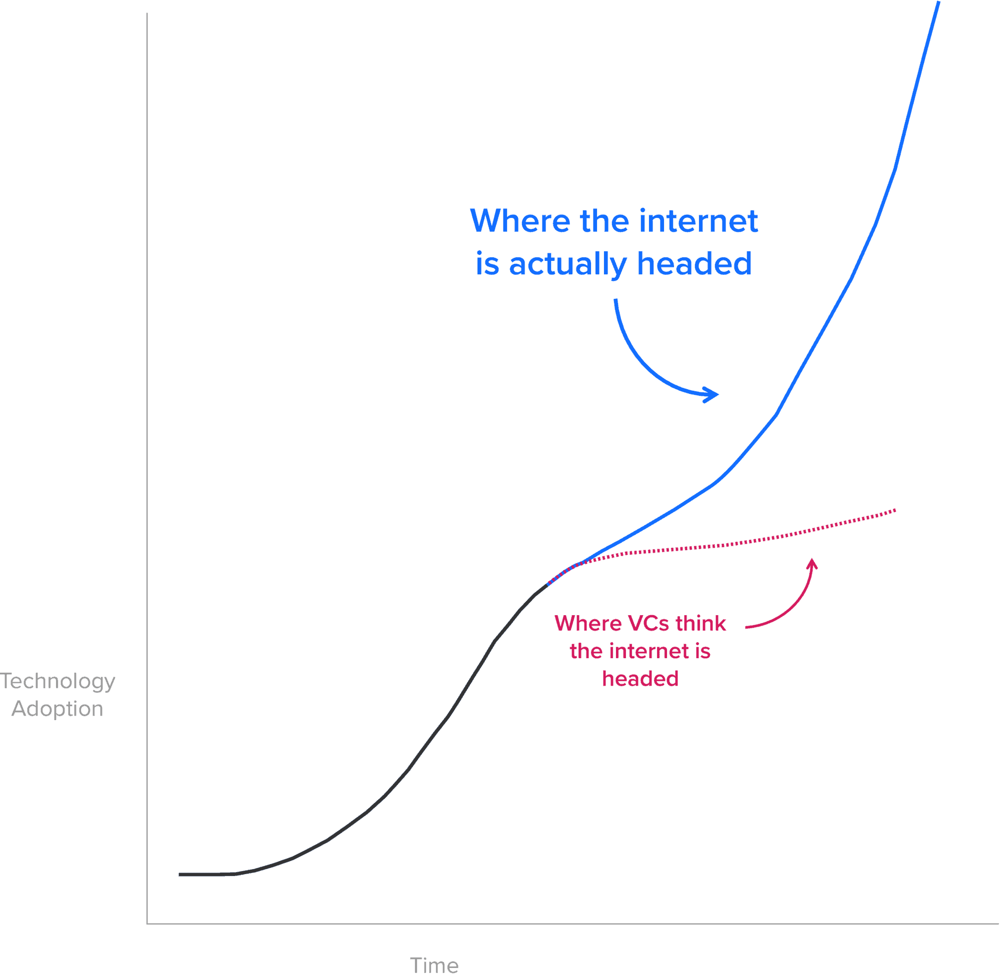
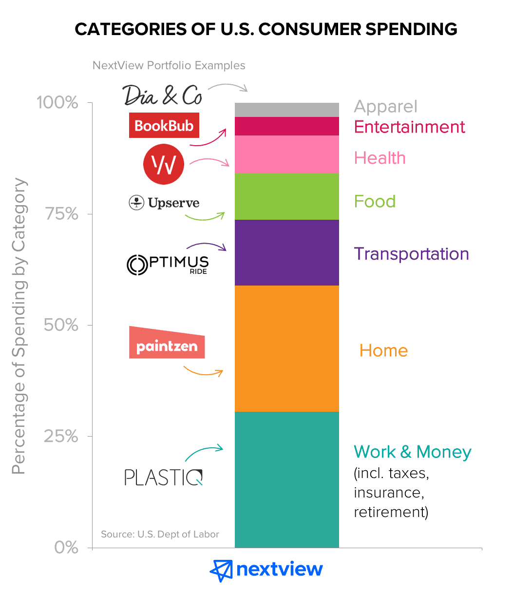

## Summary
[[NextViewVentures]] announces a $50 million third fund and an investment thesis centered on the [[EverydayEconomy]]: technology-enabled redesign of the home, transportation, food, work and money, health, apparel, and entertainment that people repeatedly experience. The firm argues that internet-connected computing is a civilization-shaping “supertechnology” whose infrastructure buildout enables decades of second-order product and service change, then turns that historical claim into three startup screens: redesign rather than incremental improvement, habitual or continuously experienced value, and eventual relevance to mass populations.

## Key Claims
- Ordinary innovation waves move from infrastructure through enabling platforms to applications, but electricity, railroads, automobiles, and internet-connected computing produce broader second-order changes over periods of 50 years or more.
- Broadband, search, mobile, cloud, and social infrastructure are treated as the internet’s laid “tracks”; the next opportunity is to use them to redesign daily products, services, and experiences rather than merely build another computing platform.
- The Everyday Economy spans home, transportation, food, work and money, health, apparel, and entertainment; the article claims that personal consumption represents about 70% of U.S. GDP and that each category exceeds $1 trillion.
- Digital transformation changes the product or service itself, not only discovery and purchase: ride-hailing reorganizes mobility, managed marketplaces and delivery change meals, and video communication changes work.
- The thesis includes consumer-facing businesses and B2B enablers such as restaurant software, because infrastructure used by operators can still change the end customer’s daily experience.
- NextView screens opportunities for step-function redesign, habitual use or persistent everyday presence, and an ambition to serve mass consumers or broad populations of business users; a narrow seed-stage beachhead can still be consistent with that ambition.
- The fund remains focused on seed and pre-seed investing before meaningful traction, with high-conviction participation, round leadership, and active portfolio support.

## Key Quotes
> “The internet has transitioned from just simplifying the marketing funnel to redefining the actual products and services we consume.” - on the shift from transaction convenience to experience redesign.

> “Improvement is linear and incremental. Redesigns look more like step-function shifts.” - on the first investment screen.

> “There are countless B2B startups that are enabling this digital transformation.” - on why the thesis is not limited to direct-to-consumer companies.

## Connections
- [[NextViewVentures]] - announces the firm’s $50 million third fund, early-stage focus, and Everyday Economy investment thesis.
- [[EverydayEconomy]] - the central framework joining large recurring spending categories with technology-enabled redesign of daily experience.
- [[TechnologyEnablerStack]] - broadband, search, mobile, cloud, social, smartphones, and location services form the enabling foundation beneath the application opportunity.
- [[MealPal]] - portfolio example of a managed marketplace changing the experience and economics of lunch.
- [[Uber]] - example of a company building on smartphones and real-time location rather than inventing a new base platform.
- [[Lyft]] - paired with Uber as evidence that existing infrastructure can reorganize mobility and car ownership.
- [[Slack]] - cited as a business product whose value is demonstrated through daily use.
- [[Dropbox]] - cited as another habitual product for business customers.

## Contradictions
- The article contests the view that the internet’s adoption cycle was nearing a terminal plateau and that venture investors therefore needed to find an unrelated successor platform. Its second-order-effects model instead predicts another, steeper application-era curve, but the source supplies a thesis diagram rather than longitudinal evidence sufficient to validate that forecast.

The first diagram divides a generic adoption S-curve into infrastructure, enabling-platform, and application phases. The next two make the disputed forecast explicit: conventional venture thinking extends the first curve into a shallow plateau, whereas NextView draws a second steep curve after the same point and attributes it to application-layer second-order effects.

The spending chart partitions nearly all consumer spending among the thesis’s seven categories and overlays NextView portfolio examples: Dia & Co and BookBub near apparel and entertainment, Vow near health, Upserve near food, Optimus Ride near transportation, Paintzen near home, and Plastiq near work and money. Its vertical axis is percentage of spending by category, not dollars or market growth, and the chart gives only approximate shares.

