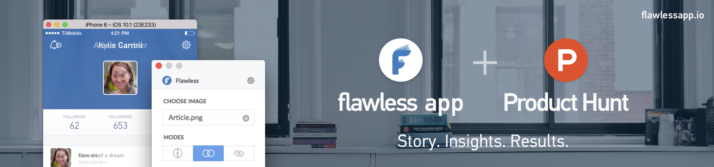

## Summary
[[FlawlessApp]]'s founders describe a zero-cash [[ProductHunt]] launch that paired a day-long outreach schedule with two years of prior relationship building, especially in iOS, macOS, design, and startup communities. They report finishing first with more than 1,300 upvotes, 3,200 launch-day site sessions, 35 same-day and 62 next-day trials, and nine sales across those two days, while stressing that the feedback was more valuable than the modest direct revenue or absent major-media coverage. The case supports audience-relevant community participation and live launch operations, but its single successful, founder-authored retrospective does not isolate which activities caused traffic, votes, trials, or sales.

## Key Claims
- The founders initially expected weak conversion because Product Hunt's most active audience seemed weighted toward startup founders, marketers, and designers rather than iOS developers.
- Preparation took about one week of strategy work and four days of asset production, but the usable support network had been built through roughly two years of helping beta users and participating in design, iOS, Product Hunt, and startup communities.
- Launch-day execution sequenced founder posts, product accounts, user email, relevant communities, incubators, collection outreach, live support, milestone creative, and personal thank-yous across the Product Hunt voting day.
- The authors distinguish relevant outreach from manipulation: they advise against bots, purchased votes, fake comments, mass messaging, random-group promotion, or indiscriminate appeals to prominent hunters.
- The launch reportedly held the number-one position for the day, exceeded 1,300 upvotes, and earned daily and weekly newsletter placement; the authors say most votes came from people they did not know personally.
- Reported commercial outcomes were 3,200 launch-day sessions, 35 launch-day trials, 62 next-day trials, three same-day sales, and six next-day sales, alongside substantial feedback on bugs, missing features, the website, and possible features.
- The authors conclude that Product Hunt was useful for this developer tool but not predictably repeatable: two founders worked 23 and 17 hours, targeted communities were their most valuable promotion, and a number-one finish did not itself produce major press coverage.

## Key Quotes
> "What’s the point of being #1 and not getting real feedback?" — on rejecting hollow launch-rank manipulation.

> "#1 at PH doesn’t bring you to the front page of CNN, but it is one of proof badges in your pocket." — Ruslan Nazarenko on launch rank as supporting social proof rather than automatic press distribution.

## Connections
- [[FlawlessApp]] - iOS developer tool and subject of the reported launch.
- [[ProductHunt]] - discovery and voting platform on which the launch took place.
- [[DeveloperMarketing]] - the case adds concentrated launch-day operations, relevant-community outreach, and post-launch outcome separation to developer-tool marketing practice.
- [[TechCommunityParticipation]] - two years of contribution and relationship building supplied a more relevant support base than indiscriminate promotion.
- [[SocialProof]] - the number-one ranking is framed as a credibility badge rather than proof of durable adoption or guaranteed media coverage.
- [[MarketingAttribution]] - the mixed outreach schedule and platform discovery prevent causal allocation of the reported traffic, trials, votes, and sales.
- [[DeveloperTooling]] - Flawless App is a technical product for comparing implemented iOS interfaces with original designs.

## Contradictions
- The outcome contradicted the founders' expectation that Product Hunt's audience would yield little traffic, trial activity, or developer feedback, but the account cannot determine whether Product Hunt discovery, existing followers, user email, or targeted external communities drove the result.
- More than 1,300 upvotes and a number-one ranking produced only nine reported sales across launch day and the next day and no major-media outreach, qualifying launch rank as attention and social proof rather than product-market fit or revenue proof.
- The zero-dollar claim excludes substantial labor: strategy, materials, two years of relationship building, and launch shifts of 23 and 17 hours.
- The source is a founder-authored success case with no attribution breakdown, baseline traffic, conversion denominator beyond sessions, retention, refunds, later revenue, unsuccessful comparison launch, or independent verification.
- Nine local image references were inspected. One high-resolution hero showing the product interface and launch context was retained; two duplicates, a decorative promo strip, two founder photos, and three 60-pixel analytics or Product Hunt screenshots were omitted because they were decorative, duplicative, or too low-resolution to add reliable evidence beyond the prose.
