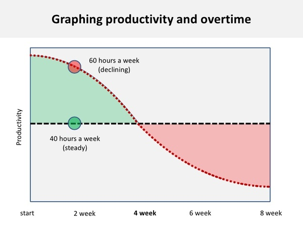

## Summary
[[PhilippeBourgau]] argues from personal observation that sustained interest in programming supports long-term learning and career development, while distinguishing varied learning outside paid work from repetitive overwork on one subject. He also exposes a constraint on that ideal: parents may simultaneously need income stability, family time, and continued technical growth, so passion cannot by itself create discretionary time or remove labor-market keyword filters. The essay is a reflective practitioner argument, not comparative evidence that extracurricular programming or passion is necessary for competence.

The article's overtime graphic contrasts a flat 40-hour productivity line with a declining 60-hour line that crosses below it around week four, visually reinforcing the difference between a short burst and sustainable output.

## Key Claims
- [[EngineeringExpertise]] can develop through sustained practice, but the author treats curiosity and continued learning as more important than simply extending hours on the same task.
- Passionate work can feel energizing and productive, although the essay offers the author's experience and observations rather than measured comparisons.
- Long sessions on one subject have diminishing returns; Bourgau reports that six to eight hours of intensive pair programming is his personal limit before his contribution can become harmful.
- Books, side projects, articles, blogs, and meetups can diversify learning outside a main job without being equivalent to more hours of the same work.
- Sustainable pace and background incubation matter because time away from a problem can support creative solutions and prevent overtime from becoming net-negative.
- Parenthood makes extracurricular learning harder by combining family time, stable-income needs, career risk, and hiring systems that screen for current keywords.
- Loss of experienced developers may contribute to repeated technical reinvention and weak recognition of people skills, but the essay does not establish that passion or parenting causes occupational exit.

## Key Quotes
> "Most of the time, this does not make for more work, but rather for more learning." - on distinguishing varied professional development from repetitive overtime.

> "overworked workaholics usually aren't very productive" - on the limit to treating visible hours as skill or value.

## Connections
- [[PhilippeBourgau]] - author reflecting on passion, practice, sustainable effort, and parenthood in software careers.
- [[WorkLifeBalance]] - parenting and income stability constrain time for optional technical learning and risky job changes.
- [[EngineeringExpertise]] - continued practice and varied technical activity are presented as routes to stronger skill.
- [[DeliberatePractice]] - the essay invokes the 10,000-hour idea but also supplies reasons that practice quality, variety, and recovery matter more than elapsed time alone.
- [[SideProjectIncubation]] - optional projects can provide a different learning context from the main job, although caregivers may lack the necessary discretionary time.
- [[BurnoutPrevention]] - sustainable pace, topic switching, and time away from a problem qualify the appeal to hard work.
- [[TechCommunityParticipation]] - meetups, organizing, speaking, and blogging are listed as possible learning channels rather than formal job requirements.

## Contradictions
- The essay conflicts with [[i-am-a-9-to-5-developer-and-so-can-you-exception-not-found]] by suggesting that developers without sustained programming passion will struggle to remain successful, while the later source argues that strong engineers need not code, blog, speak, or maintain public projects outside paid work.
- Bourgau's claim that the great developers he knows are passionate and spend more than 40 hours programming is a selected personal observation. It does not separate passion from access to time, health, household support, workplace quality, prior opportunity, or survivorship.
- The overtime chart has no cited dataset, units, or method. It is retained as an evidence-bearing visualization of the article's model, not as measured proof of a universal four-week crossover.
- The essay repeats the popular 10,000-hour framing without examining its evidence or distinguishing ordinary repetition from feedback-rich [[DeliberatePractice]].
- The causal suggestion that lack of passion and parenthood help explain why people leave development is speculative and risks treating structural barriers or legitimate non-work priorities as deficits in individual commitment.
