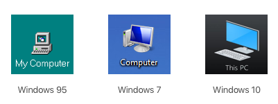
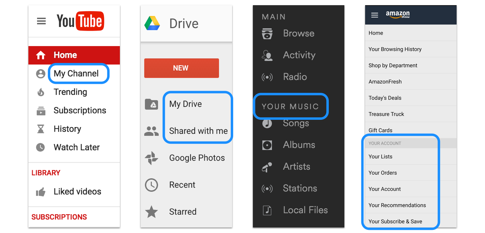

## Summary
[[JohnSaito]] argues that first- and second-person pronouns in product interfaces imply different relationships between a person and a product. “My” can frame the product as an extension of the user and emphasize ownership, privacy, personalization, or control; “your” can make the product sound like an assistant addressing and guiding the user. He recommends choosing perspective according to context, omitting possessives when clarity survives, and using “we” only when a real human team is meaningfully present.

## Key Claims
- “My” labels the interface from the user's point of view and can reinforce a sense of personal ownership, customization, privacy, or control.
- “Your” labels the interface from the product's point of view and can create a conversational, assistant-like relationship suited to questions, instructions, recommendations, and guided tasks.
- Removing “my” and “your” can make labels shorter, but neutral wording fails when the interface must distinguish the user's object from other people's objects or recommendations.
- For controls representing a user's own action, first-person wording can fit; for product-authored questions, instructions, and descriptions, second-person wording can fit. Neither should be added when the label is already clear.
- “We,” “our,” and “us” introduce the people behind a product and may humanize genuinely people-powered services, but can misrepresent automated processing.
- Perspective is a contextual design choice rather than a universal rule, and the intended emotional and relational effect should be evaluated with the complete interface.

The Windows sequence visually supports the ambiguity tradeoff: “My Computer” became “Computer” and later “This PC,” moving from user ownership to a neutral label and then to explicit object identification.

The product comparison shows that interface perspective was inconsistent across contemporary services: YouTube used “My Channel,” Google Drive used “My Drive” and “Shared with me,” Spotify used “Your Music,” and Amazon grouped account functions under “Your Account.”

## Key Quotes
> “By using ‘my’ in an interface, it implies that the product is an extension of the user.” — on first-person language and perceived ownership.

> “By using ‘your’ in an interface, it implies that the product is talking with you.” — on second-person language and assistant-like guidance.

## Connections
- [[JohnSaito]] - author of the contextual perspective guidelines.
- [[InterfaceCopywriting]] - gains a relationship-design dimension alongside clarity, specificity, context, and testing.
- [[Usability]] - neutral or possessive labels must still let users identify the intended object and action.
- [[UserTrustCapital]] - perspective can signal ownership, privacy, human involvement, or automation in ways that affect expectations.
- [[VoiceAssistantUX]] - “your” is framed as language a personal assistant might use while guiding a task.

## Contradictions
- No direct contradiction was found. The article qualifies any rigid style rule by making clarity and context decisive, while its emotional interpretations of “my,” “your,” and “we” remain practitioner hypotheses rather than measured effects.
