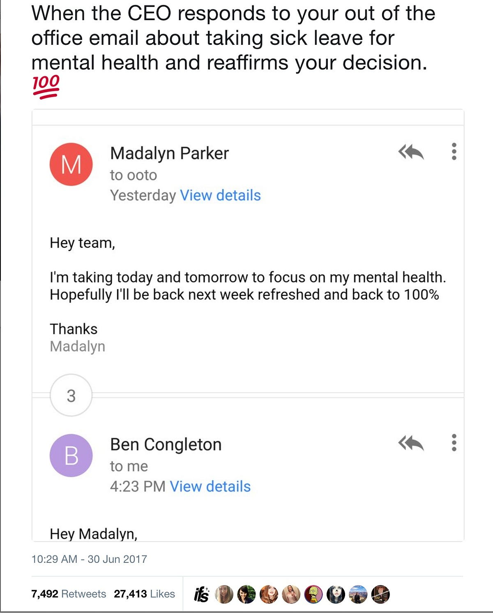

## Summary
[[BenCongleton]] recounts how [[MadalynParker]] openly took sick leave for her mental health and how his supportive reply as [[Olark]]'s CEO drew an unexpectedly large public response. He argues that naming mental health directly should be ordinary workplace behavior, that leaders are responsible for creating conditions where employees can care for their health, and that the praise he received exposed how uncommon such support remained. The supplied Markdown ends abruptly after “It’s,” so this note does not reconstruct the article's missing conclusion.

## Key Claims
- Even in a supportive workplace, an employee may find it difficult to name a mental-health need instead of saying only that they are unwell.
- A leader's explicit affirmation can help establish [[WorkplaceMentalHealthSupport]] by treating mental health as a normal health matter rather than a special exception.
- The public response to Congleton's email suggested that many workers did not expect a CEO to support mental-health leave as routine practice.
- Executives should treat employee health and motivation as part of organizational impact rather than as separate from business performance.
- The source cites one-in-six Americans taking psychiatric medication and 73% of full-time US employees having paid sick leave, but those linked statistics are historical and do not establish the article's broader workplace claims by themselves.

## Key Quotes
> "This should be business as usual. We have a lot of work to do." - on the gap between routine care and the exceptional praise the response received.

> "helping us normalize mental health as a normal health issue" - on why Congleton publicly affirmed Parker's direct disclosure.

## Connections
- [[BenCongleton]] - author and Olark CEO whose supportive reply became public.
- [[MadalynParker]] - employee who explicitly took sick leave to focus on her mental health.
- [[Olark]] - workplace context for the internal out-of-office exchange.
- [[WorkplaceMentalHealthSupport]] - the article's central argument for ordinary, explicit support of mental-health needs.
- [[PsychologicalSafety]] - direct disclosure depends partly on how colleagues and authority figures respond.
- [[CompassionateManagement]] - Congleton presents care for employees as a leadership responsibility.
- [[HumanResourcesGovernance]] - paid leave and norms around using it are organizational policy and governance questions.

## Contradictions
- No direct contradiction found. The source adds a concrete leadership interaction to the wiki's psychological-safety material but does not show that one supportive exchange proves organization-wide safety or improved health outcomes.
- The available document is incomplete, and its medication and paid-sick-leave figures are historical contextual claims rather than current prevalence estimates or causal evidence.

## Image Notes
The sole local image was opened and retained because it shows Parker's direct mental-health leave wording, Congleton as the respondent, and visible engagement of 7,492 retweets and 27,413 likes. The screenshot crops Congleton's reply after its greeting, so the image does not establish the full content of his response.
