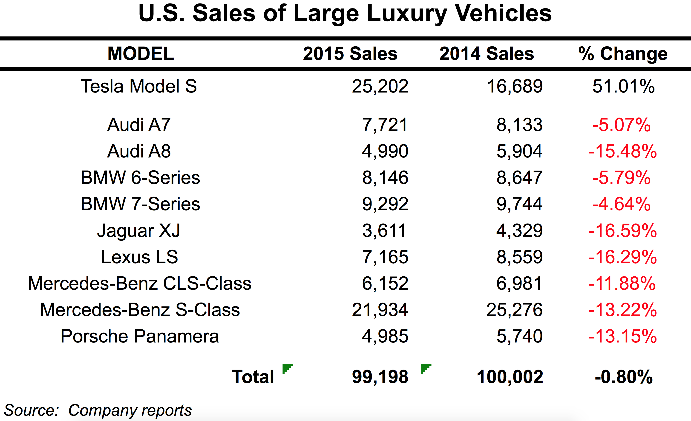

## Summary
[[BenThompson]] argues that [[Tesla]]'s extraordinary Model 3 reservations were better explained by premium product performance and accumulated [[BrandEquity]] than by low-end disruption. Using [[Apple]] and the iPhone as a comparison, he argues that [[ConsumerMarketDisruptionLimits]] arise when buyers value emotional, identity, design, and experience attributes that are difficult to document as a modular “good enough” specification. Tesla's high-end-to-lower-price path therefore shows a viable market-entry strategy outside classic disruption, while its funding, delivery, price, and scale constraints keep the 2016 conclusion prospective.

## Key Claims
- The 276,000 Model 3 reservations reported after three days were refundable $1,000 deposits, not completed vehicle sales, and fulfillment was likely years away.
- Tesla generated unusual demand before many customers had seen the Model 3, suggesting that its name already carried product, performance, sustainability, and cultural meaning.
- Classic low-end disruption assumes rational buyers, measurable attributes, and modular alternatives that become good enough; Thompson argues those assumptions are less reliable in consumer markets.
- Tesla's high-end sequence from Roadster through Model S and Model X to Model 3 lowered price while building a premium reputation, rather than entering through an inferior low-cost vehicle.
- High-end vehicle sales did not fund the master plan by themselves: Thompson notes that research and development also depended on equity issuance and debt while Tesla reported annual losses.
- The inspected sales table shows the Model S leading the listed U.S. large-luxury models in 2015 at 25,202 units, up 51.01% from 2014, while every listed rival declined.

- A clean-sheet electric drivetrain and organizational dependence on making electric vehicles work helped Tesla build a differentiated product, while its brand could earn patience for later or more expensive delivery.

## Key Quotes
> "Tesla means something" — Thompson's summary of the reputation created by performance, sustainability, and Silicon Valley identity.

> "they assume that disruption is the only viable strategy to enter a new market" — the article's criticism of treating one theory as a complete market-entry doctrine.

## Connections
- [[BenThompson]] — Stratechery author comparing Tesla, Apple, consumer choice, and disruption theory.
- [[Tesla]] — central company and Model 3 reservation case.
- [[ElonMusk]] — CEO whose 2006 master plan described moving from premium sports cars toward affordable family cars.
- [[Apple]] — comparison case for a premium integrated product that resisted low-end-disruption predictions.
- [[ConsumerMarketDisruptionLimits]] — concept capturing the article's boundary on low-end disruption in consumer categories.
- [[BrandEquity]] — accumulated meaning used to explain sight-unseen reservations and possible customer patience.
- [[SmartphonePlatformDisruption]] — adjacent concept distinguishing the iPhone's platform transition from a simple low-end attack.

## Contradictions
- The article rejects the prediction that Tesla needed a low-end neighborhood electric vehicle to enter the market, but it agrees that Tesla was a sustaining rather than classic disruptive innovation.
- The Model 3 demand evidence consists of refundable reservations rather than deliveries, revenue, profit, retention, or durable mass-market share.
- The article's view that Tesla would receive customer grace for delays and higher prices was a 2016 forecast, not an observed outcome within the source.
- The luxury-sales table is sourced to company reports and compares a selected U.S. large-luxury segment; it does not establish total-market leadership or isolate brand as the cause of Tesla's growth.
