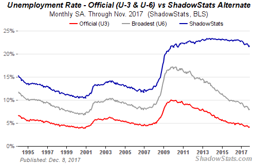
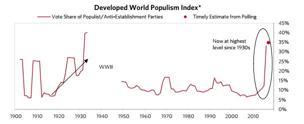
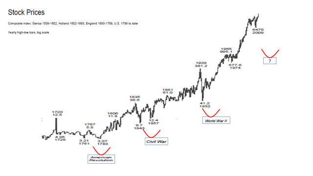

## Summary
[[DanielCarter]] argues that the post-2008 economy and political climate of late 2017 resembled 1937 through weak recovery, very low interest rates and inflation, rising populism, geopolitical rivalry, and vulnerability to a stock-market decline. The article treats a ShadowStats alternative unemployment series as evidence that official headline unemployment understated distress, although the accompanying chart separately shows official U-3 and broader U-6 measures and does not validate the alternative methodology.

Its strongest political evidence is an attributed [[RayDalio]] chart placing the developed world's late-2010s populist vote share near its 1930s peak, but the source does not supply the index construction needed to assess comparability.

Carter presents the analogy as an overlooked portfolio-risk scenario rather than a precise sell instruction; a separate centuries-long stock-price chart visually associates major wars with drawdowns but offers neither a complete event sample nor a causal test.

## Key Claims
- The slow post-2008 recovery, low rates, low inflation, high populism, and geopolitical tension formed a pattern Carter considered broadly analogous to the late 1930s.
- Headline unemployment may conceal labor-market distress, but the article's 21.7% figure depends on ShadowStats rather than the official U-3 or U-6 series shown beside it.
- Near-zero short-term rates can weaken yield-curve inversion as a recession signal; the article cites six post-Depression recessions without a preceding inversion.
- Political shocks and market losses can reinforce one another as declining wealth worsens public mood and political conflict raises market risk.
- The 1937 selloff is used as a warning that a renewed downturn can arrive during an incomplete recovery and persist alongside geopolitical escalation.
- Historical resemblance should widen a portfolio's scenario set, not be mistaken for proof that the same sequence or outcome will recur.

## Key Quotes
> "History may not perfectly repeat, but it does rhyme." - Carter's premise for comparing 1937 with 2017.

> "No, I'm not telling you to sell all your stocks" - the article's boundary between risk awareness and a direct market call.

## Connections
- [[DanielCarter]] - author of the historical market-risk argument.
- [[RayDalio]] - supplies the quoted 1937 analogy, populism definition, and developed-world populism chart.
- [[HistoricalAnalogyInInvesting]] - method used to turn cross-period resemblance into a portfolio-risk scenario.
- [[InvestmentRiskDiscipline]] - practical conclusion that investors should consider severe but uncertain political-market scenarios.
- [[MacroForecastingHumility]] - supplies the main qualification against turning the analogy into a confident forecast or trade.
- [[MarketTiming]] - the article warns of a possible crash while explicitly stopping short of a sell instruction.

## Contradictions
- Tensions with [[MacroForecastingHumility]]: the article uses a broad macro-political analogy to infer elevated market danger without a tested prediction rule, base rate, or disconfirming cases.
- Qualifies rather than directly contradicts [[MarketTiming]]: Carter raises a timing-relevant warning but does not specify when to exit, re-enter, or distinguish a true historical rhyme from a false one.
