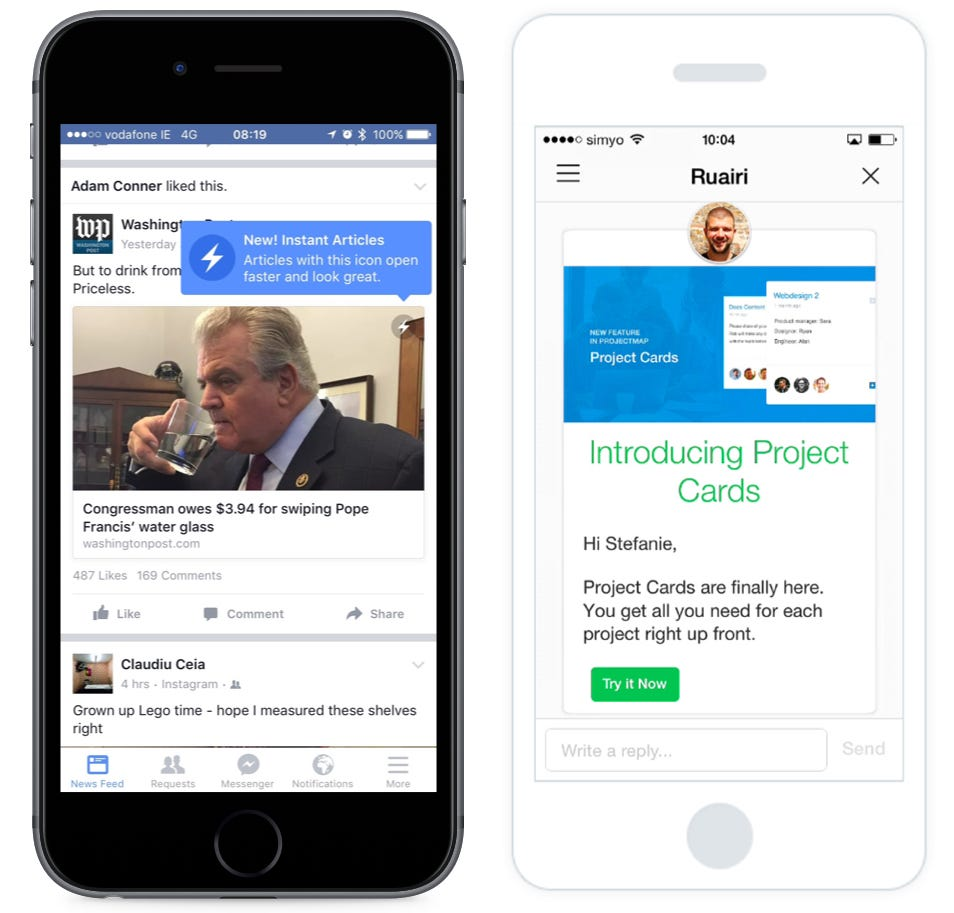

## Summary
[[ColmDoyle]] argues that App Store release notes are a poor primary communication channel for consumer software because feature flags, entitlements, APIs, and varied usage mean users may receive different experiences from the same installed build. He proposes contextual in-app tutorials or notifications as a more relevant alternative because they can show a feature where it is used and support measurement and feedback. The claim is a short 2016 practitioner argument, explicitly excludes APIs and SDKs, and provides no comparative evidence that in-app communication improves discovery, comprehension, or adoption.

## Key Claims
- Generic notes such as “bug fixes and various improvements” communicate little about the change or its value.
- One build no longer implies one user experience when server-controlled features, feature flags, payment entitlements, and usage differences determine what each person can see.
- An unformatted App Store text block is a weak place to introduce a feature that users need to understand or try.
- Contextual in-app tutorials and notifications can present a feature closer to use while giving teams opportunities to measure response and collect feedback.
- Auto-update defaults on the two major mobile platforms reduce the likelihood that users will encounter App Store release notes before using the changed product.
- Time spent polishing low-read store notes may have lower value than final product testing and refinement.

## Key Quotes
> “Bug fixes and various improvements” - the generic release-note formula the essay criticizes.

> “No two users are alike” - on why a single build-level summary may not match each user's available experience.

## Connections
- [[ColmDoyle]] - author of the 2016 practitioner argument.
- [[ReleaseCommunication]] - the source shifts feature explanation from store metadata toward contextual in-product communication.
- [[ContinuousDelivery]] - flags and server-controlled behavior weaken a simple one-build, one-release narrative.
- [[ProductUserSegmentation]] - entitlements and feature exposure make release communication audience-specific.
- [[ConversionRateOptimization]] - in-app prompts make response measurable, although the source reports no results.
- [[MobilePlatformDiscovery]] - auto-update behavior changes whether App Store metadata becomes a meaningful discovery surface.

## Contradictions
- The argument applies to consumer-facing software and explicitly excludes APIs and SDKs, where versioned change documentation may remain essential.
- The source treats auto-update defaults as reducing release-note visibility but gives no view or readership data and does not address disabled auto-updates, staged operating-system delivery, enterprise controls, or users who inspect update histories.
- Feature flags and entitlements make a single build note less representative, but they can also increase the need for precise, audience-specific records for support, accessibility, compliance, troubleshooting, and accountability.
- In-app prompts can be contextual and measurable, but they can also interrupt users; clicks and conversion do not by themselves prove understanding, usefulness, or durable adoption.
- Both unique local JPEGs were opened. The full-size comparison image was retained as evidence of contextual feature communication; the 60-by-57-pixel file was omitted as a duplicate thumbnail, as was the repeated second reference to the full-size image.
