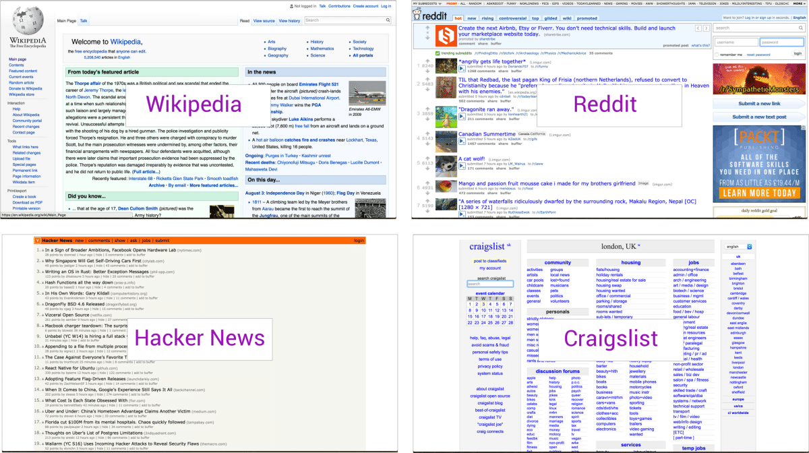
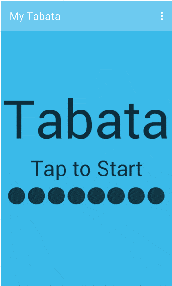
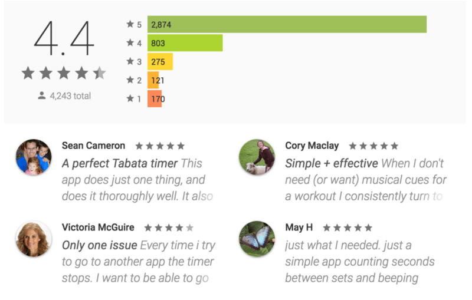
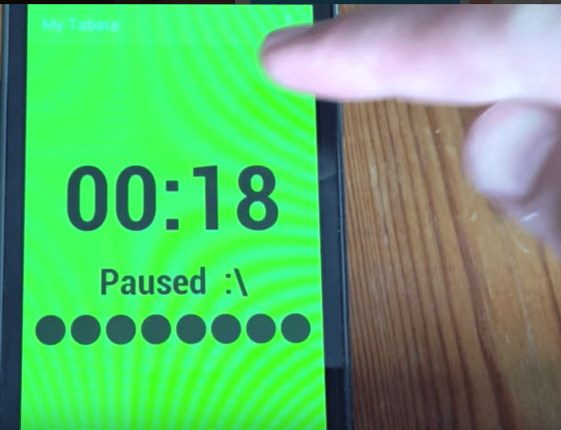
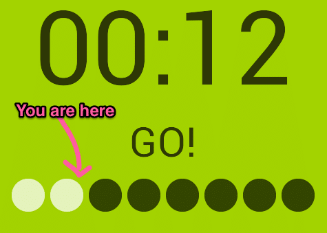
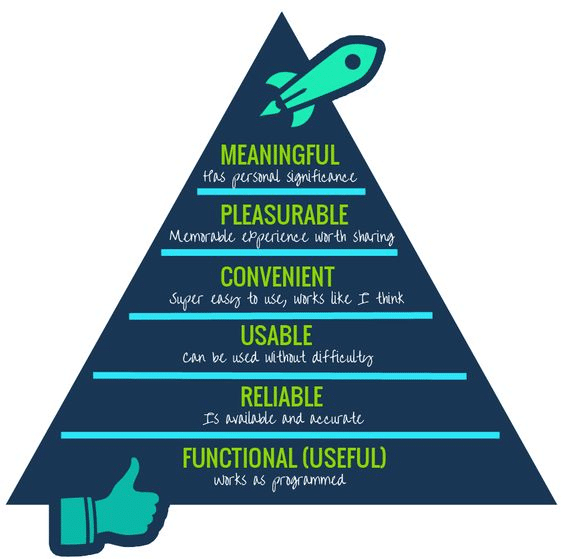

## Summary
This practitioner essay argues that visual refinement cannot compensate for a product that fails to solve its intended problem reliably and easily. Using popular visually plain websites and the [[MyTabata]] interval timer, it shows how context-sensitive controls, minimal navigation, selective audio, and visible progress can create a useful experience despite weak aesthetics. The article’s durable contribution is a layered view of product quality in which function, reliability, and usability support convenience, pleasure, and meaning rather than competing with them.

The comparison visually grounds the article’s opening claim that several popular sites retained dense, dated-looking interfaces while serving recognizable information or community jobs. Their popularity does not isolate usability or prove that aesthetics are irrelevant.

## Key Claims
- Visual polish is secondary when a product does not first provide useful, reliable, and usable behavior.
- A product that solves one well-bounded problem can succeed despite an aesthetically weak interface, although this case does not establish that aesthetics never affect adoption or satisfaction.
- Interaction design should reflect the user’s physical and attentional context; a large tap-anywhere pause target helps during strenuous exercise.
- Minimal navigation can make the first useful action immediate, while infrequently changed settings remain outside the active task.
- Audio is valuable when visual attention is unavailable, as with countdown cues near the end of an exercise interval.
- A visible timer and interval indicator help users recover their place and assess progress through a multi-step session.
- The reported 4.4 rating and 4,243-review distribution are historical platform evidence of approval, not a controlled comparison or proof that the named design choices caused it.

The animation shows a sparse one-screen flow: a tap-to-start prompt, eight interval markers, and a completion state. It supports the claim that the product keeps its primary session on one screen, but it does not expose every intermediate state or audio cue.

The captured review panel reports 2,874 five-star, 803 four-star, 275 three-star, 121 two-star, and 170 one-star reviews. Selected comments praise focus and simplicity, while one notes that switching apps stops the timer; the screenshot is a curated historical snapshot rather than a representative usability study.

The paused state and finger demonstrate the large-context interaction described in the prose: the active screen itself acts as the pause target rather than requiring a small dedicated control.

The timer combines remaining seconds, current activity, and eight dots whose color indicates completed and remaining intervals. The annotation clarifies the intended progress meaning, although no user test is reported.

The hierarchy depicts functional usefulness, reliability, and usability as foundations beneath convenience, pleasure, and meaning. It is a prescriptive model credited to Growth Engineering, not empirical evidence that product qualities always develop in this exact order.

## Key Quotes
> “Don’t fall into the trap of sacrificing context for visual finesse.” — the article’s closing design warning

## Connections
- [[MyTabata]] — case-study product whose one-screen interval timer illustrates context-sensitive usability.
- [[Usability]] — gains concrete interaction patterns for physical context, nonvisual attention, and progress visibility.
- [[UtilityOrientedUX]] — the article prioritizes task value and justified interaction burden over visual polish.
- [[Microinteractions]] — tap-to-pause, countdown cues, timer state, and interval dots provide task-level triggers and feedback.
- [[InformationHierarchy]] — the product keeps timer, activity, and progress information prominent during the session.

## Contradictions
- The article’s “ugly but popular” examples do not show that visual design is unimportant: popularity can reflect content, network effects, familiarity, switching costs, brand, or market position, and the source supplies no comparative experiment.
- My Tabata is one selected 2016 case. Its review snapshot is observational and curated, and the source reports no task-success, error, retention, accessibility, or competing-app measurements.
- The six-level UX hierarchy is useful as a dependency heuristic, but pleasure, meaning, trust, accessibility, and perceived quality can affect whether people try or persist with a product before its functional value is fully experienced.
