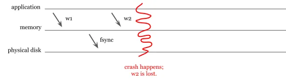
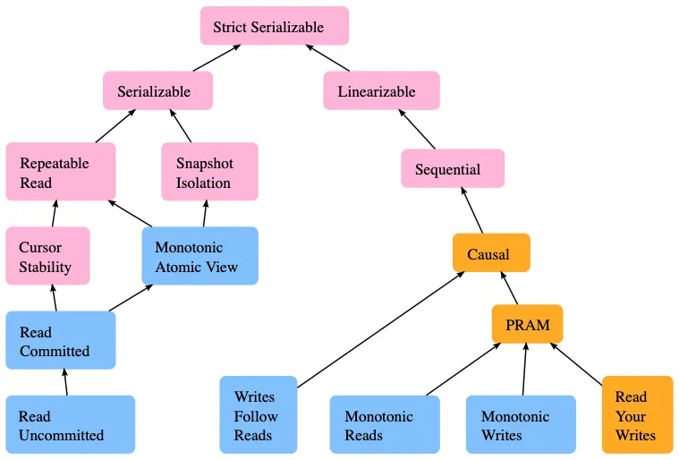
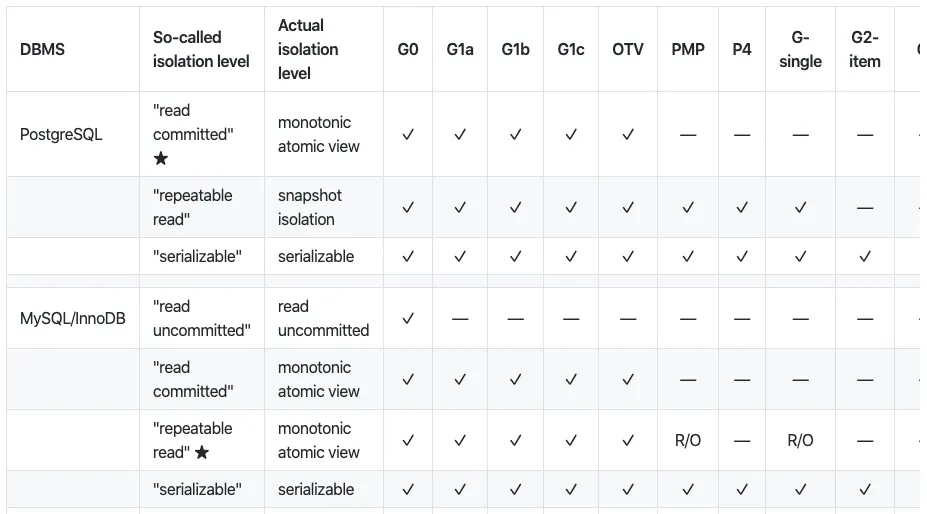
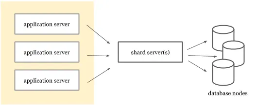
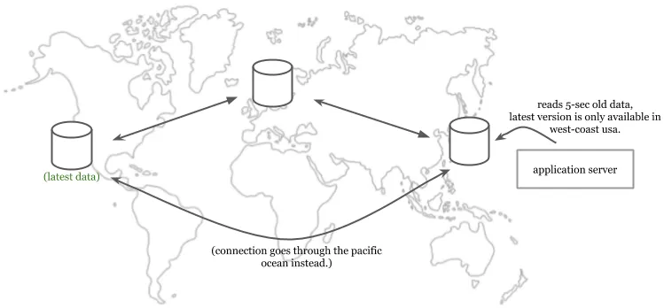
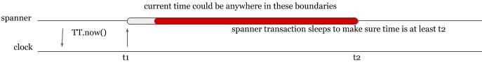

## Summary
Jaana Dogan presents database use as an application-design discipline in which advertised guarantees are only a starting point: developers must understand concrete durability, isolation, ordering, timing, latency, and migration behavior. The article connects transaction correctness with distributed-system failure modes and argues that performance should be evaluated per critical operation rather than through aggregate database claims. Its examples also show how sharding layers, stale reads, query plans, and staged migrations can expose or manage system tradeoffs.

## Key Claims
- [[DatabaseEngineeringTradeoffs]] require developers to reason about network faults, coordination costs, clock uncertainty, workload growth, and implementation-specific guarantees rather than treating a database as a black box.
- ACID is a useful problem taxonomy but not a uniform implementation contract; durability and failure behavior must be checked for the selected database and configuration.

- [[DatabaseTransactionIsolation]] levels trade anomaly prevention against coordination and contention, and nominally similar levels can behave differently across database engines.

- Optimistic version checks can replace held locks for some updates, while serializability, schema design, or constraints may be needed to prevent write skew across related records.
- Transaction arrival order can differ from application call order, nested transaction semantics can be surprising, and retryable transactions should not depend on mutable application state.
- A proxy layer can own application-aware sharding so routing strategy can change without redeploying every application server.

- Auto-incremented identifiers can require coordination or create partition hotspots; ID design should be evaluated with indexing, replication, partitioning, and access patterns.
- MVCC snapshots can make tolerably stale reads lower-latency and lock-free, including when a nearby replica serves an older version instead of crossing regions for the newest value.

- Clock uncertainty can be represented explicitly, but waiting for a confidence interval to pass turns temporal correctness into transaction latency.

- Database latency must be separated from client-observed network latency, and performance requirements should be specified and tested per critical query or transaction.
- Query plans, online dual-running migrations, and capacity behavior under growth require direct observation because estimators, new releases, data distribution, and scale can invalidate earlier assumptions.

## Key Quotes
> "Transactions shouldn't maintain application state." - warning about retry-sensitive mutable state.

> "Evaluate performance requirements per transaction." - recommendation to test critical operations separately.

## Connections
- [[JaanaDogan]] - author drawing on database-related data loss and outage experience.
- [[DatabaseEngineeringTradeoffs]] - synthesis of the article's reliability, performance, scaling, and migration guidance.
- [[DatabaseTransactionIsolation]] - consistency models, optimistic locking, write skew, and engine-specific behavior.
- [[DistributedConsensus]] - clock uncertainty, coordination, partitions, and ordering shape distributed database guarantees.
- [[LatencyHierarchy]] - client latency combines database work with network paths and should be decomposed.
- [[ParallelRunning]] - online migration temporarily operates old and new databases together through dual writes and fallback reads.
- [[ServiceObservability]] - query plans, slow-query logs, tracing, and operation-level metrics diagnose database behavior.
- [[MongoDB]] - historical durability example used to show that an ACID label does not settle persistence behavior.
- [[PostgreSQL]] - example used for MVCC, vacuuming, and engine-specific transaction behavior.
- [[MySQL]] - example used for replication-sensitive auto-increment configuration and Vitess-backed sharding.

## Contradictions
- No direct contradiction was found. The article broadens [[DatabaseTransactionIsolation]] beyond SQLite by showing that names such as serializable and repeatable read do not guarantee identical engine behavior.
- Product defaults and capabilities described in this 2020 article, especially the MongoDB journaling example, are historical and should not be treated as current configuration guidance without verification.
