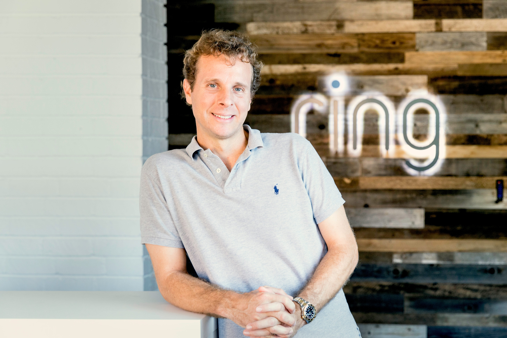

## Summary
In a 2017 [[DFJ]] interview, [[JamieSiminoff]] connects [[Ring]]'s development to a long prehistory of small businesses and inventions, a garage experiment prompted by his inability to hear the doorbell, and a failed [[SharkTank]] pitch that nevertheless produced a large burst of customer sales. He distinguishes solution-oriented invention from love of technology for its own sake and argues that venture-scale outcomes require independent judgment about unconventional founders and ideas. The account is useful as a founder-origin and investor-groupthink case, but its growth figures, causal explanations, and general claims are retrospective and largely unverified within the supplied article.

## Key Claims
- Siminoff describes childhood factory work, side businesses, hands-on building, six startups before DoorBot, and repeated unsuccessful investor outreach as a long apprenticeship preceding [[Ring]].
- DoorBot was not one of his 300 written startup ideas; he says he built a Wi-Fi doorbell because he could not hear the doorbell from his garage, emphasizing a concrete problem and solution over technology for its own sake.
- [[SharkTank]]'s judges declined his request for $700,000 for 10%, but Siminoff says the broadcast generated at least $5 million in sales and enough cash to hire engineers and develop the next product without an immediate financing round.
- The article reports that by 2017 Ring had about one million customers, estimated prior-year sales of $155 million, and more than $200 million raised from investors including DFJ, Richard Branson, and Goldman Sachs.
- Siminoff argues that founder-investor trust can accumulate across failed ventures and that showing character during failure may improve access to capital for a later company.
- He attributes venture breakouts to nonlinear founders and unusual ideas, while arguing that Silicon Valley homogeneity and social conformity can produce groupthink and more conventional returns.

## Key Quotes
> "For me, new technology allows you to create solutions that weren't there previously."

> "Big breakouts only happen when people think differently."

## Connections
- [[JamieSiminoff]] - interview subject and Ring founder describing his development as an inventor and entrepreneur.
- [[Ring]] - DoorBot's later name and the hardware company at the center of the interview.
- [[SharkTank]] - rejected the requested investment but, according to Siminoff, supplied decisive customer exposure.
- [[DFJ]] - investor and publisher framing the interview around unconventional venture bets.
- [[FounderOriginStories]] - the DoorBot story combines long apprenticeship with a specific problem encountered in a garage.
- [[VentureCapitalBlindSpots]] - Siminoff's account links homogeneous founder expectations and investor groupthink to missed unconventional opportunities.

## Contradictions
- The source complicates clean idea-first origin stories: DoorBot arose from a concrete garage problem, but Siminoff's ability to act on it followed years of building, selling, founding companies, and developing investor relationships.
- The Shark Tank episode separates financing rejection from commercial response; the judges' refusal did not prevent the broadcast from becoming a reported sales and runway event.
- This is an edited founder interview published by an investor in the company. It supplies no underlying sales, customer, financing, application, or counterfactual data, so the reported figures and claims about television exposure, unconventional founders, homogeneity, and breakout returns remain attributed historical testimony rather than independently established effects.
