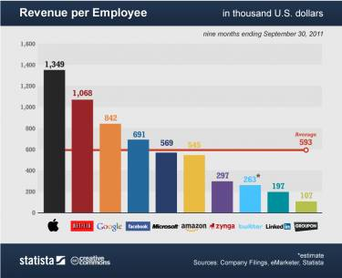
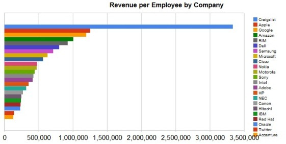

## Summary
[[JasonLemkin]] proposes a quick [[RevenuePerEmployee]] heuristic for estimating the revenue of private SaaS and web-services competitors from [[LinkedIn]] headcount, then adjusting the multiplier for funding, growth, and business model. His examples make the method a range estimate rather than a financial statement: selected Marketo, [[HubSpot]], and YouSendIt figures appear directionally plausible, but the article mixes ARR with GAAP revenue and supplies no systematic validation sample. The two inspected charts reinforce the broader benchmark while also showing why calibration matters: mature technology companies' revenue per employee varies widely by company and sector.

## Key Claims
- For SaaS companies beyond a few million dollars in ARR, the article's default estimate is employee count multiplied by $150,000 for a well-funded company or $200,000 for a modestly funded one.
- The suggested range widens to roughly $100,000 per employee for heavily funded, fast-growing companies and as much as $300,000 for self-funded or mainly freemium businesses.
- Funding, stage, growth rate, and business model are adjustments to the heuristic rather than independent measurements of revenue.
- The method depends on LinkedIn company profiles being a reasonably complete headcount proxy, an assumption asserted rather than tested in the article.
- A 368-person Marketo estimate produces $55.2 million at the well-funded multiplier and $73.6 million at the modestly funded multiplier; the author considers the lower figure more plausible.
- A 468-person HubSpot estimate produces $70.2 million, while the article cites $29 million in 2011 GAAP revenue and later updates the comparison with a reported $60 million ARR figure.
- A freemium-adjusted estimate for YouSendIt produces about $58.8 million from 235 employees, matching a later reported revenue figure cited by the article.

## Key Quotes
> "it just gives you a range" - Lemkin's qualification on the estimate's precision.

> "move the revenue number back and forth based on funding, stage, and business model" - the required calibration step.

## Connections
- [[JasonLemkin]] - author of the private-company revenue-estimation heuristic.
- [[RevenuePerEmployee]] - central proxy that converts observed headcount into a revenue range.
- [[CompetitiveIntelligence]] - the estimate uses public workforce data to infer a competitor's commercial scale.
- [[LinkedIn]] - proposed source for competitor employee counts.
- [[HubSpot]] - worked example that exposes the difference between estimated ARR and historical GAAP revenue.
- [[SaaStr]] - publication and SaaS operating-advice context for the article.
- [[SaaSOperatingTransparency]] - direct company disclosures provide stronger comparison data when available.

## Contradictions
- No direct contradiction with existing wiki content was found. The article extends [[CompetitiveIntelligence]] from product and behavioral signals to public workforce-based financial estimation.
- The examples do not establish general predictive accuracy: they are selected retrospectively, use shifting multipliers, mix ARR with GAAP revenue, and do not report error across a defined company sample.
- The 2011 mature-technology charts are broad cross-sector comparisons rather than validation of the article's private-SaaS multipliers; their large spread instead qualifies any universal revenue-per-employee benchmark.
