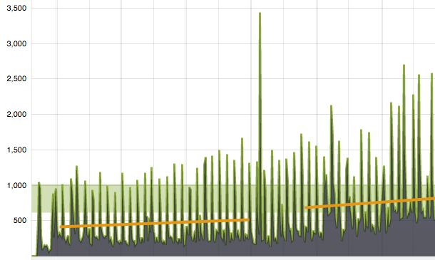

## Summary
[[DavidKadavy]] uses changes in his own podcast downloads to argue that [[ProductHunt]] had been a meaningful podcast-discovery channel before it stopped accepting podcast submissions in early 2017. He reports that omitting one episode submission produced a drop, submitting it several days later produced a rebound, and the section's shutdown coincided with an immediate 20–30% decline in downloads. The case supports a real [[PodcastDiscovery]] and [[PlatformDistributionDependence]] problem, but it is a single creator's observational account whose download metric may include bots and does not establish unique listeners, listening completion, retention, or a controlled causal effect.

## Key Claims
- Kadavy submitted each podcast episode to Product Hunt and believed the channel contributed to steady audience growth.
- One omitted submission was followed by lower downloads, while a delayed submission of that episode was followed by a visible recovery.
- Kadavy distinguishes Product Hunt exposure from “Twitter bombing,” in which bots request directly tweeted MP3 links and inflate download counts without demonstrating listening.
- Product Hunt told Kadavy that episode MP3 files were not automatically loaded on every page view; he also observed real-user upvotes, although he acknowledges possible bot traffic.
- Product Hunt's podcast section stopped updating around the beginning of February 2017 and later formally stopped accepting podcast submissions because podcasts did not fit the platform's product-discovery strategy.
- Kadavy reports an immediate 20–30% fall in downloads after the section shut down and interprets it as evidence of unmet listener demand for podcast discovery.
- He proposes a podcast-discovery application as a product opportunity, but the source does not measure the size of the broader market or compare alternative discovery channels.

## Key Quotes
> "The shutdown of Product Hunt Podcasts lead to an immediate drop of 20–30% in downloads." — Kadavy's reported channel-loss effect

> "My experience suggests that there are plenty of people out there who are looking for podcasts to listen to, but who don't know where to find them." — the source's inference from one show's experience

## Connections
- [[DavidKadavy]] - podcast creator and author interpreting his own download history.
- [[ProductHunt]] - discovery platform whose podcast section supplied and then withdrew a distribution surface.
- [[PodcastDiscovery]] - the source treats listener-show matching as an unmet product need.
- [[PlatformDistributionDependence]] - the reported download decline followed the loss of a platform-controlled acquisition channel.
- [[MarketingAttribution]] - before-and-after downloads and a delayed submission are suggestive channel evidence without a controlled counterfactual.
- [[VanityMetrics]] - bot requests can make downloads rise without corresponding human listening or sponsor value.

## Contradictions
- The reported omission, delayed submission, and platform shutdown form suggestive natural comparisons, but the source supplies no raw time series, episode controls, seasonality adjustment, referral data, unique-listener count, or alternative-channel baseline.
- Product Hunt's statement that page views did not automatically load MP3s rules out one inflation mechanism, not bots, repeat requests, partial downloads, or non-listening human traffic.
- Upvotes establish some human interaction but do not show that the same people downloaded, listened to, retained, or recommended the podcast.
- The 20–30% decline is a self-reported estimate from one show, so it does not quantify the total podcast-discovery market or prove that a standalone discovery app would retain users or become a viable business.
- Twelve local image references were opened. The three stained-glass hero variants were decorative, and one readable long-run download chart was retained. Eight 60-pixel chart or interface thumbnails were omitted because their labels and values were not reliably legible; their recoverable high-level comparisons are stated in the prose, and no unreadable visual detail was used as evidence.
