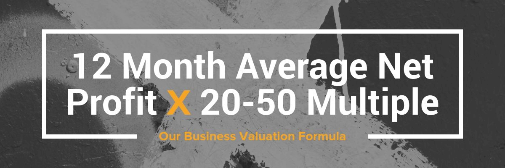

## Summary
[[GregElfrink]] presents [[EmpireFlippers]]' historical framework for [[WebsiteBusinessValuation]]: multiply rolling 12-month average net profit by a monthly multiple, then judge that multiple through growth, operating history, transferability, concentration risk, buyer effort, and defensibility. The article argues that organic search attracts a wide buyer pool but also identifies dependence on Google, one monetization path, one supplier, or one product as a critical failure point. Its practical advice is to improve profit without stripping out systems that make the business easier for a buyer to operate.

## Key Claims

- The article's baseline valuation is rolling 12-month average net profit multiplied by a monthly multiple; it reports a historical 20-50 range for healthy online businesses and a lower 12-18 range for declining ones.
- Profit and the length and direction of earnings history are the two largest multiple drivers in the framework.
- Legitimate add-backs can normalize discretionary or nonessential expenses, but cutting necessary fulfillment, staff, or systems can raise accounting profit while reducing buyer appeal.
- Organic search is presented as unusually attractive because traffic can persist without daily ad spend, yet exclusive reliance on Google is also treated as a critical point of failure.
- Diversified traffic, monetization, suppliers, and products reduce the chance that one policy, algorithm, counterparty, or product change destroys earnings.
- Transferability improves when the owner reduces required hours through automation, a capable team, third-party operations, and standard operating procedures.
- A deeper moat can come from niche authority, differentiated products, community or brand, and transferable exclusive commercial terms rather than an easily copied site alone.
- Sellers should compare the expected proceeds with their alternatives and set a minimum acceptable price before negotiation.

## Key Quotes
> "Would I ever buy my business? Why? Why not?" - the article's buyer-perspective test for valuation readiness.

## Connections
- [[WebsiteBusinessValuation]] - combines normalized profit with buyer judgments about durability, risk, transferability, and upside.
- [[GregElfrink]] - author who presents the valuation and exit-readiness framework.
- [[EmpireFlippers]] - online-business brokerage whose historical pricing practice and sales experience ground the article.
- [[StartupDefensibility]] - the article associates harder-to-copy businesses with stronger multiples.
- [[PlatformDistributionDependence]] - Google, Amazon, and social-platform reliance can make revenue vulnerable to unilateral changes.
- [[ConversionRateOptimization]] - high-traffic businesses may appeal to buyers who see unrealized conversion upside.
- [[FounderTimeLeverage]] - owner hours, delegation, systems, and documented processes affect how readily a buyer can operate the asset.

## Contradictions
- No direct contradiction with an existing wiki claim was found. The source contains its own qualification: SEO can widen buyer demand without automatically raising value, and a business dependent only on Google organic traffic remains fragile.
- The appended discussion challenges the headline 50x figure as aggressive; Elfrink replies that 24-35x was more typical in his experience and acknowledges that online businesses are volatile and buyers can lose their entire investment.
