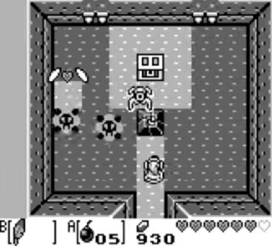
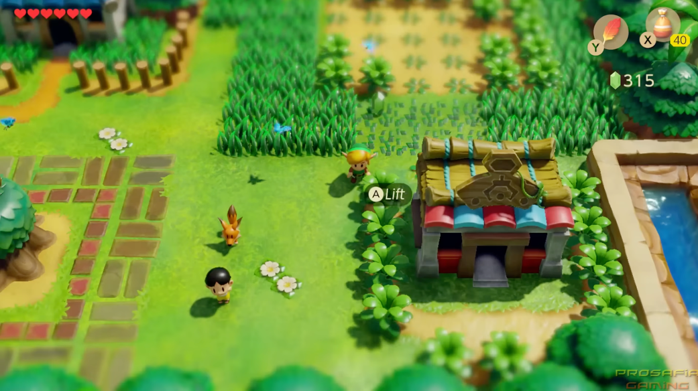

## Summary
[[Piglei]] uses the 1993 Game Boy release and 2019 Switch remake of [[TheLegendOfZeldaLinksAwakening|The Legend of Zelda: Link's Awakening]] to argue that a software product's durable value lies in the quality of its conceptual structure, not only in its presentation or implementation technology. Through [[FrederickBrooks]]'s distinction between essential and accidental complexity, the essay frames programming as “building a maze” of concepts, components, modules, and functions whose usefulness still requires human creativity, product judgment, and empathy even when AI agents make code production dramatically faster. The game analogy is suggestive rather than empirical, and the source does not show that gameplay continuity alone caused the remake's reported commercial success.

The original Game Boy screenshot shows a compact monochrome dungeon room in which enemies, a door, floor structure, player state, and item controls must communicate through a 160-by-144-pixel display.

The Switch screenshot shows the remake's high-definition 3D presentation and more explicit contextual control prompt, visually supporting the article's contrast between modernized expression and a preserved game identity. Because the two screenshots show different locations, they illustrate the generational change but do not independently prove one-to-one map or dungeon fidelity.

## Key Claims
- [[EssentialAndAccidentalComplexity]] separates the interdependent conceptual structure required by a problem from the particular machinery used to express and implement that structure.
- [[TheLegendOfZeldaLinksAwakening|Link's Awakening]] preserved its map, dungeons, items, and exploration design across a major graphics and control modernization, making it an example of durable conceptual value rather than merely durable pixels or code.
- A software product's root value comes from solving its essential problem well; presentation quality and interaction smoothness still matter, but they do not substitute for a compelling underlying model.
- AI coding agents can sharply reduce implementation time while leaving product definition, conceptual design, user understanding, verification, and commercial judgment unresolved.
- Programmers “build mazes” by arranging concepts, components, modules, and functions into systems that users explore and future developers maintain.
- Human creativity and empathy remain necessary to decide what should be built and whether the conceptual maze is coherent, useful, and worth inhabiting.

## Key Quotes
> "一款软件的根本价值，取决于它是否很好地解决了根本问题。" - on the source's criterion for durable software value.

> "程序员最重要的工作，就是调度海量的组件、模块和函数，用虚构的概念构建起规模庞大的迷宫。" - on software design as conceptual maze building.

> "软件开发的根本问题依然存在，根本复杂度也从未消失。" - on the limit of treating AI as a silver bullet.

## Connections
- [[Piglei]] - author of the software-as-maze analogy and the human-led AI argument.
- [[FrederickBrooks]] - originator of the essential-versus-accidental complexity distinction used by the essay.
- [[TheLegendOfZeldaLinksAwakening]] - the original-and-remake case through which the article separates durable game structure from changing presentation.
- [[EssentialAndAccidentalComplexity]] - central analytical distinction between conceptual difficulty and implementation machinery.
- [[DigitalProductTimelessness]] - the game case suggests that a stable conceptual core can survive platform, graphics, and control changes.
- [[SoftwareEngineering]] - broader discipline responsible for turning conceptual structures into useful, maintainable, and operable software.
- [[AICodingPractice]] - AI-generated implementation speed does not settle product quality, design coherence, or user value.
- [[HumanCodeResponsibility]] - human judgment remains accountable for what is built and whether it works as intended.
- [[Nintendo]] - publisher and platform company behind the Game Boy original and Switch remake discussed in the source.
- [[GameBoy]] - constrained original platform whose visual limits did not prevent the game's later recognition and remake.

## Contradictions
- The essay directly qualifies [[hu-tu-shuo-yin-dan-fei-guo-xian-feng-da-sha]], which predicts that large language models may be software development's silver bullet. Piglei accepts major implementation gains but argues that good problem framing, conceptual design, and value judgment remain irreducible responsibilities.
- The source's essential-versus-secondary classification is analytical rather than fixed. Graphics, controls, accessibility, performance, and operational quality can become essential to whether a particular audience can use or value software.
- The reported six-million-plus Switch sales figure and the causal link from preserved dungeon design to those sales are not independently documented in the supplied article.
